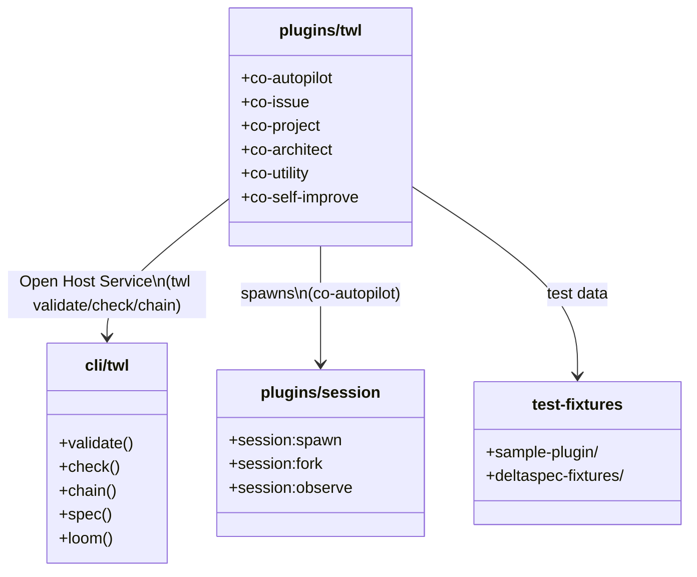

## Core Domain Model

コンポーネント間の依存関係と役割を定義する。

## 依存方向制約

| From | To | 許可 |
|------|----|------|
| plugins/\* | cli/twl | YES（Open Host Service） |
| plugins/twl | plugins/session | YES（spawns） |
| plugins/\* | test-fixtures | YES（test data のみ） |
| cli/twl | plugins/\* | **NO**（CLI はプラグインを知らない） |
| plugins/session | plugins/twl | **NO**（循環禁止） |
