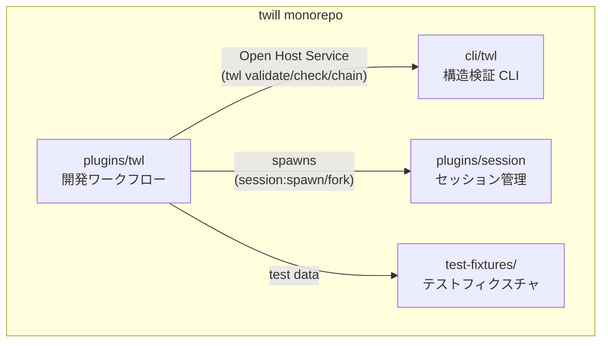
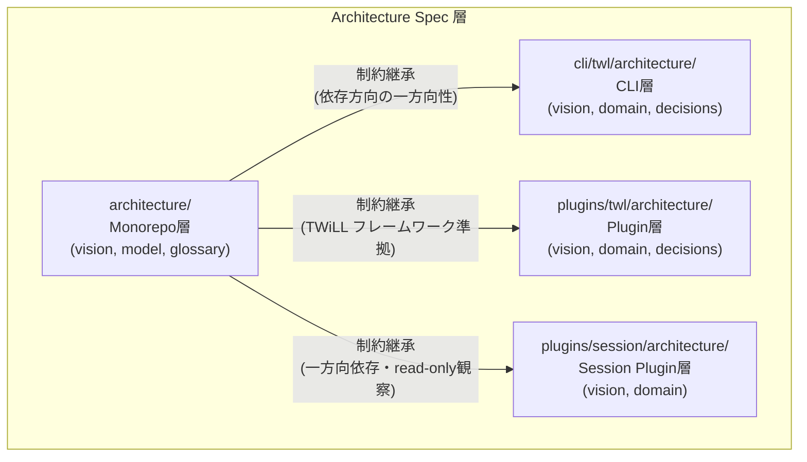

## Context Map

## Architecture Spec 三層継承関係

| 層 | パス | 役割 |
|----|------|------|
| Monorepo | `architecture/` | モノリポ全体の上位制約・コンポーネント間依存ルール |
| CLI | `cli/twl/architecture/` | twl CLI 固有の設計制約・型システム・検証ルール |
| Plugin | `plugins/twl/architecture/` | ワークフロープラグイン固有の設計制約・autopilot 仕様 |
| Session Plugin | `plugins/session/architecture/` | tmux セッション操作の抽象化層。spawn/fork/observe の3概念を定義 |

## 依存方向ルール

| From | To | 関係 | 備考 |
|------|-----|------|------|
| plugins/twl | cli/twl | Open Host Service | PostToolUse hook, chain generate 等で呼び出し |
| plugins/twl | plugins/session | Spawns | co-autopilot が tmux セッション管理に利用 |
| plugins/twl | test-fixtures | Test Data | テスト用の固定データ |

**禁止方向**: cli/ → plugins/（CLI はプラグインを知らない）
