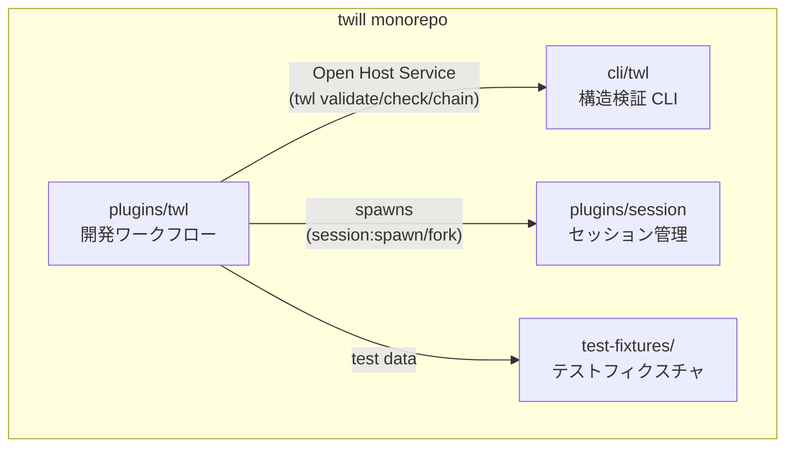

## Context Map

## 依存方向ルール

| From | To | 関係 | 備考 |
|------|-----|------|------|
| plugins/twl | cli/twl | Open Host Service | PostToolUse hook, chain generate 等で呼び出し |
| plugins/twl | plugins/session | Spawns | co-autopilot が tmux セッション管理に利用 |
| plugins/twl | test-fixtures | Test Data | テスト用の固定データ |

**禁止方向**: cli/ → plugins/（CLI はプラグインを知らない）
