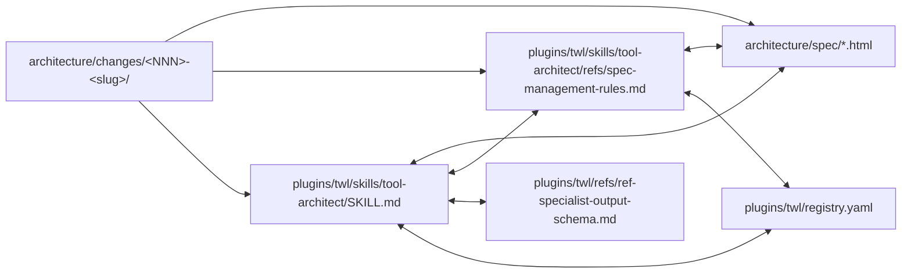

# Structure Steering: twill plugin

twill plugin の dir 構造 + R-N 適用範囲 + contributor guide。

## Dir 構造

```
twill/main/                          ← bare repo の main worktree
├── architecture/                    ← architecture spec + rule + history
│   ├── spec/                        ← 現状の正式仕様 (Diátaxis Reference、R-14 現在形 declarative)
│   ├── changes/                     ← 進行中の変更提案 (OpenSpec lifecycle、R-17)
│   │   └── <NNN>-<slug>/            ← change package (proposal/design/tasks/spec-delta)
│   ├── archive/                     ← 完了 change package + 旧資産 (rollback 保持)
│   │   ├── changes/                 ← 完了 change package (YYYY-MM-DD-<NNN>-<slug>)
│   │   ├── migration/               ← 旧 architecture/migration/ 統合先 (D3 / Z1)
│   │   ├── research/                ← 旧 research/ 資産
│   │   └── decisions/               ← 旧 ADR (旧 monorepo)
│   ├── decisions/                   ← 現 architecture ADR (Markdown only)
│   ├── steering/                    ← project-wide 規約 (本 dir、Spec Kit 方式)
│   └── research/                    ← 調査 / 実験 / dig-report (experiment-index.html 含む)
├── plugins/twl/                     ← TWL plugin 本体
│   ├── agents/                      ← specialist-spec-* + specialist-exp-reviewer (Phase F + agent invoke)
│   ├── commands/                    ← user-facing commands
│   ├── skills/                      ← tool-architect / phaser-impl / etc.
│   ├── refs/                        ← shared reference doc (ref-specialist-* 等)
│   ├── scripts/                     ← hook handler + automation script
│   │   ├── hooks/                   ← PreToolUse / PostToolUse hook (Claude Code 標準)
│   │   └── lib/                     ← shared bash function (mailbox.sh / spawn-tmux.sh 等)
│   ├── tests/bats/                  ← plugin component test (5 dir)
│   ├── architecture/decisions/      ← TWL plugin 専用 ADR
│   └── registry.yaml                ← components / glossary / chains / hooks-monitors SSoT (v4.0+)
├── cli/twl/                         ← TWL CLI engine (Python)
│   └── src/twl/mcp_server/          ← MCP server (tools.py + tools_<domain>.py)
├── plugins/session/                 ← session 管理 plugin
└── scripts/                         ← project-root script (spec-anchor-link-check.py 等)
```

## R-N 適用範囲

| R-N | 範囲 | 主検証 |
|---|---|---|
| R-1〜R-10 | spec/ + migration/ + research/ 等 dir 配置 + structural rule | manual + bats + CI (broken/orphan) |
| R-11 | agents/specialist-spec-*.md 命名 + 配置 | bats (registry-yaml-specialists / tool-architect-deployment) |
| R-12 | Phase C/F MUST NOT SKIP | bats (tool-architect-7phase) + PR review |
| R-13 | Phase F specialist model=opus 固定 | bats (agent frontmatter model 検証) |
| **R-14〜R-20** (本 task) | spec/ content semantic + changes/ lifecycle + ReSpec markup + 多層 hook chain + MCP tool | L1 skill / L2 bats / L3 hook+MCP / L4 pre-commit / L5 CI |

## Contributor Guide

### 新規 contributor (AI agent / human)

1. **本 file (`architecture/steering/structure.md`) を読む** — dir 構造の overview
2. **`architecture/steering/product.md`** — product vision + goals
3. **`architecture/steering/tech.md`** — 技術選択 + 言語 constraint
4. **`plugins/twl/CLAUDE.md`** — plugin-specific 編集フロー
5. **`plugins/twl/skills/tool-architect/SKILL.md`** — spec edit 主 entry
6. **`plugins/twl/skills/tool-architect/refs/spec-management-rules.md`** — R-1〜R-20 詳細

### spec/ 編集

spec/ 編集は **tool-architect** 専任 (R-7、`TWL_TOOL_CONTEXT=tool-architect` env MUST)。

- 新 file 追加 / 編集 / rename / delete: 7-phase multi-agent PR cycle (Phase A-G)
- Phase C (Clarifying) と Phase F (Quality Review) は MUST NOT SKIP (R-12)
- Phase F は 4 並列固定 (vocabulary / structure / ssot / temporal、opus 固定 R-13)

### 変更提案

spec/ への変更は **change package** で管理 (R-17):

1. `architecture/changes/<NNN>-<slug>/` 配下に `proposal.md` + `design.md` + `tasks.md` 配置
2. 実装中 `tasks.md` の checklist 更新
3. 完了後 `architecture/archive/changes/YYYY-MM-DD-<NNN>-<slug>/` に `git mv`

### ADR

architecture decision は **`architecture/decisions/ADR-NNNN-<slug>.md`** で永続化:

- Status: Proposed / Accepted / Superseded / Withdrawn の lifecycle
- 過去 ADR (旧 monorepo) は `archive/decisions/` に保持

### PR Review

PR は **L1-L5 多層防御** を全層通過 MUST (R-19):

| Layer | 検出 timing | bypass policy |
|---|---|---|
| L1 skill | LLM 編集中 | self-check |
| L2 bats | local test run | run 必須 |
| L3 hook + MCP | AI write 前 | caller marker enforce (R-7) |
| L4 pre-commit | git commit 前 | `--no-verify` 時は intervention-log MUST |
| L5 CI | PR merge 前 | warning mode → error mode 段階移行 |

## SSoT 関係 (6 軸 cross-ref)



各軸の責務:

| 軸 | 役割 |
|---|---|
| SKILL.md (1) | 7-phase workflow + agent invoke template + R-N サマリ |
| spec/*.html (2) | 現状の正式仕様 (Reference) |
| spec-management-rules.md (3) | R-1〜R-20 詳細 + checklist + HTML template |
| ref-specialist-output-schema.md (4) | specialist 共通出力 schema (category enum) |
| registry.yaml (5) | components / glossary / hooks-monitors / integrity_rules SSoT |
| changes/<NNN>-<slug>/ (6) | 変更提案 (How-to)、本 task で 6 軸目として新設 |

各軸が独立 SSoT、双方向 cross-ref で drift 防止。

## 命名規約

| 対象 | format | 例 |
|---|---|---|
| spec file | `<slug>.html` (kebab-case) | `tool-architecture.html` |
| change package | `<NNN>-<slug>/` (3 桁連番 + kebab-case ≤20 字) | `001-spec-purify/` |
| ADR | `ADR-NNNN-<slug>.md` (4 桁連番) | `ADR-0013-spec-clean-architecture.md` |
| agent | `specialist-<role>-<name>.md` | `specialist-spec-review-temporal.md` |
| skill | `<name>/SKILL.md` (kebab-case) | `tool-architect/SKILL.md` |
| hook script | `<event>-<purpose>.sh` | `pre-tool-use-spec-write-boundary.sh` |

## 参照

- `architecture/steering/product.md` — product vision + goals
- `architecture/steering/tech.md` — 技術選択
- `plugins/twl/skills/tool-architect/SKILL.md` — spec edit entry
- `plugins/twl/skills/tool-architect/refs/spec-management-rules.md` — R-1〜R-20 詳細
- `architecture/decisions/ADR-0013-spec-clean-architecture.md` — 本 steering を確立した ADR
- `architecture/changes/001-spec-purify/` — 本 steering を反映する change package
