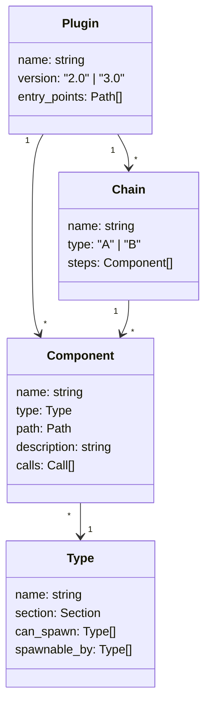

## Core Domain Model

## 集約

- **Plugin**: deps.yaml 全体。ルート集約
- **Component**: 個別コンポーネント（controller, workflow, atomic, composite, specialist, reference, script）
- **Type**: types.yaml で定義される型ルール
- **Chain**: v3.0 のステップ順序定義
