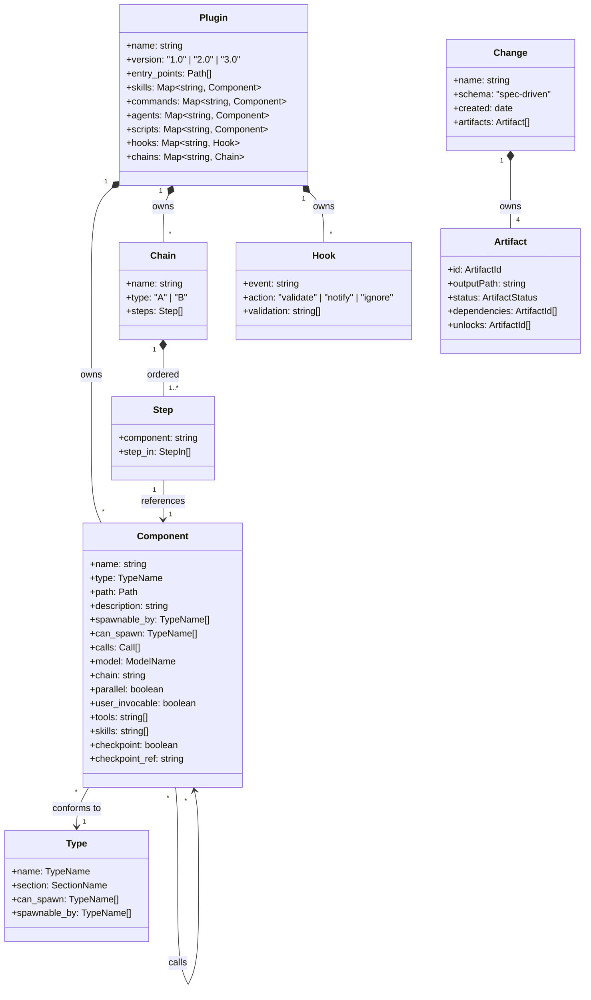
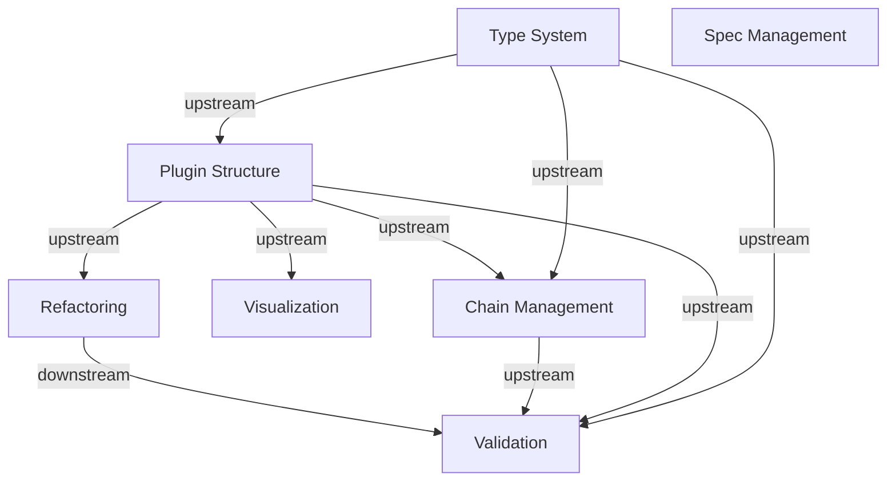

## Core Domain Model

## 集約

### Plugin（ルート集約）
deps.yaml 全体に対応。全てのエンティティへのアクセスは Plugin 経由で行う。

- **境界内エンティティ**: Component, Chain, Step, Hook
- **アクセスルール**: Component は Plugin のセクション（skills/commands/agents/scripts）を経由して参照。直接のグローバルアクセスは禁止

### Type（独立集約）
types.yaml に対応。Plugin とは独立してロードされ、型検証ルールを提供する。

- **境界内エンティティ**: なし（Type 自身がルートかつ唯一のエンティティ）
- **アクセスルール**: TypeName で索引。Plugin の Component が Type を参照する（逆方向の参照なし）

### Change（独立集約）
openspec/changes/<name>/ に対応。Plugin とは独立したライフサイクルを持つ。

- **境界内エンティティ**: Artifact
- **アクセスルール**: Change 名で索引。Artifact は Change 経由でアクセス。Plugin 集約との直接参照なし

## 値オブジェクト

| 値オブジェクト | 型 | 説明 |
|--------------|------|------|
| Path | string | ファイルパス（plugin_root からの相対パス） |
| SectionName | "skills" \| "commands" \| "agents" \| "scripts" | deps.yaml のトップレベルセクション名 |
| TypeName | "controller" \| "workflow" \| "atomic" \| "composite" \| "specialist" \| "reference" \| "script" | コンポーネント型名 |
| Call | {skill: string} \| {command: string} \| {agent: string} \| {composite: string} \| {external: string} | 呼び出し先の参照 |
| StepIn | string | chain step 内のサブステップ参照 |
| ModelName | "sonnet" \| "opus" \| "haiku" \| string | AI モデル指定 |
| ArtifactId | "proposal" \| "design" \| "specs" \| "tasks" | Artifact 識別子 |
| ArtifactStatus | "ready" \| "blocked" \| "done" | Artifact の完了状態 |

## Context Map

**凡例**: 矢印は upstream → downstream の関係。upstream Context のエンティティを downstream Context が参照する。

**Spec Management** は現時点では独立した Context（他との依存なし）。openspec/ ディレクトリを操作対象とし、Plugin Structure とはデータを共有しない。
