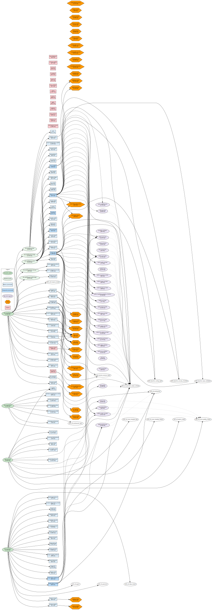
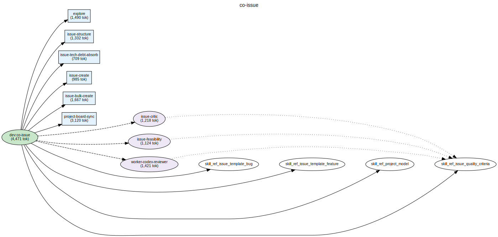
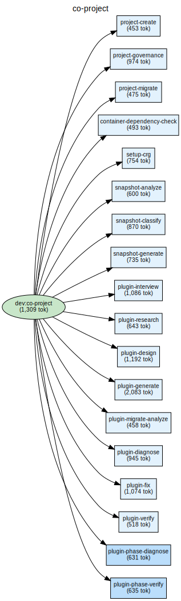
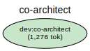
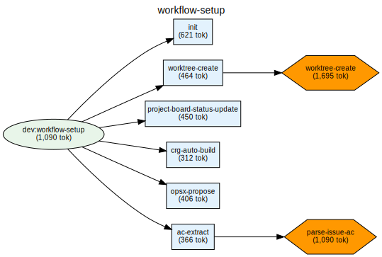
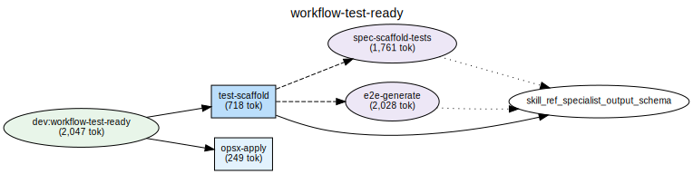
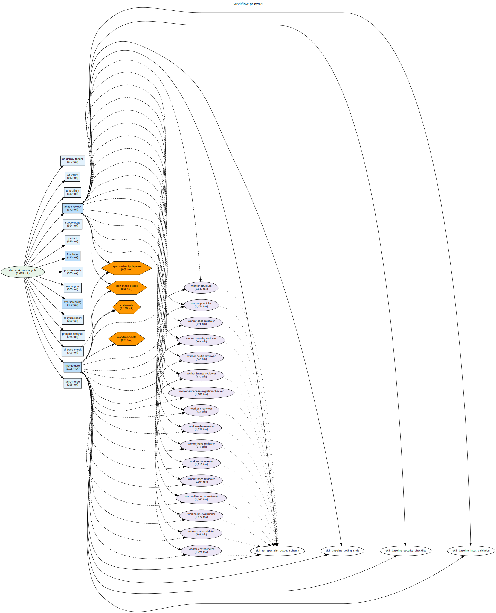
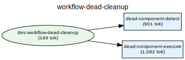
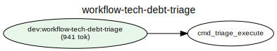

# loom-plugin-dev

Claude Code dev plugin（chain-driven + autopilot-first）。claude-plugin-dev の後継として新規構築。

## 設計哲学

**LLM は判断のために使う。機械的にできることは機械に任せる。**

- **Chain-driven**: ワークフローは chain（step の連鎖）として定義。各 step は atomic command として独立実行可能
- **Autopilot-first**: 単一 Issue も co-autopilot 経由で実装。手動介入を最小化

## Entry Points

### Controllers

| Controller | 役割 |
|---|---|
| co-autopilot | 依存グラフに基づく Issue 群一括自律実装オーケストレーター |
| co-issue | 要望を GitHub Issue に変換するワークフロー |
| co-project | プロジェクト管理（create / migrate / snapshot） |
| co-architect | 対話的アーキテクチャ構築ワークフロー |

### Workflows

| Workflow | 役割 |
|---|---|
| workflow-setup | 開発準備（worktree 作成 → OpenSpec → テスト準備） |
| workflow-test-ready | テスト生成と準備確認 |
| workflow-pr-cycle | PR サイクル（verify → review → test → fix → visual → report → merge） |
| workflow-dead-cleanup | Dead Component 検出結果に基づく確認付き削除 |
| workflow-tech-debt-triage | tech-debt Issue の棚卸し |

## Components

| カテゴリ | 数 | 内訳 |
|---|---|---|
| Skills | 9 | controller 4 + workflow 5 |
| Commands | 87 | atomic 78 + composite 9 |
| Agents | 26 | specialist 26 |
| Refs | 15 | reference 15 |
| Scripts | 27 | script 27 |
| **合計** | **164** | |

## 使い方

Issue 起点の開発フロー:

```bash
# 1. 開発準備（worktree 作成 + OpenSpec propose）
/dev:workflow-setup #<issue-number>

# 2. 実装（tasks.md に沿って実装）
/dev:opsx-apply <change-id>

# 3. PR サイクル（レビュー + テスト + 修正）
/dev:workflow-pr-cycle

# 4. アーカイブ + worktree 削除
/dev:opsx-archive
/dev:worktree-delete
```

Autopilot で複数 Issue を一括実装:

```bash
/dev:co-autopilot
```

## Architecture

<!-- DEPS-GRAPH-START -->

<!-- DEPS-GRAPH-END -->

<!-- DEPS-SUBGRAPHS-START -->
<details>
<summary>co-autopilot</summary>


</details>

<details>
<summary>co-issue</summary>


</details>

<details>
<summary>co-project</summary>


</details>

<details>
<summary>co-architect</summary>


</details>

<details>
<summary>workflow-setup</summary>


</details>

<details>
<summary>workflow-test-ready</summary>


</details>

<details>
<summary>workflow-pr-cycle</summary>


</details>

<details>
<summary>workflow-dead-cleanup</summary>


</details>

<details>
<summary>workflow-tech-debt-triage</summary>


</details>
<!-- DEPS-SUBGRAPHS-END -->
