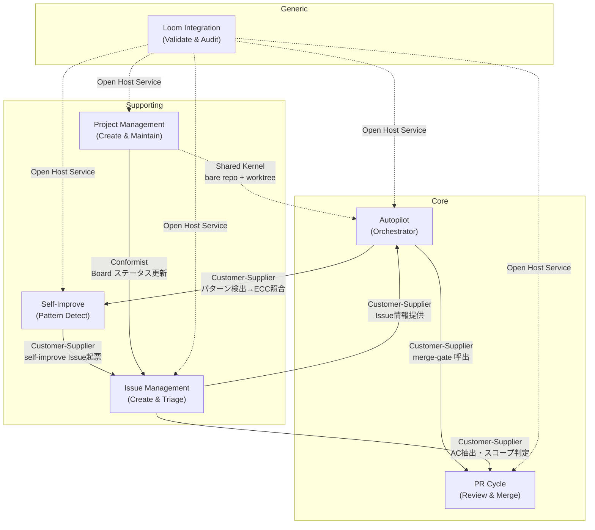

# Context Map

## 概要

6 Bounded Context 間の依存関係を定義する。

## Context 分類

| 種類 | Context | 役割 |
|------|---------|------|
| Core | Autopilot | セッション管理、Phase実行、計画生成のオーケストレーター |
| Core | PR Cycle | レビュー、テスト、マージの品質ゲート |
| Supporting | Issue Management | Issue作成、トリアージ、精緻化 |
| Supporting | Project Management | プロジェクト作成、移行、スナップショット |
| Supporting | Self-Improve | パターン検出、ECC照合 |
| Generic | Loom Integration | loom CLI連携、validate/audit/chain |

## 依存関係図

## 関係の詳細

| Upstream | Downstream | パターン | インターフェース |
|----------|-----------|---------|--------------|
| Autopilot | PR Cycle | Customer-Supplier | Contract: contracts/autopilot-pr-cycle.md |
| Autopilot | Self-Improve | Customer-Supplier | session.json patterns → ECC照合 |
| Issue Mgmt | Autopilot | Customer-Supplier | gh issue view による Issue 情報取得 |
| Issue Mgmt | PR Cycle | Customer-Supplier | ac-extract による AC 抽出 |
| Self-Improve | Issue Mgmt | Customer-Supplier | self-improve Issue 起票 |
| Project Mgmt | Issue Mgmt | Conformist | Board ステータス更新 |
| Project Mgmt | Autopilot | Shared Kernel | bare repo + worktree 構造 |
| Loom Integration | 全 Context | Open Host Service | validate/audit/chain 結果 |

## Issue → Context マッピング

| Context | Primary Issues | Secondary Issues |
|---------|---------------|-----------------|
| Autopilot | #5, #6, #11, #15, #17 | #7, #8, #16 |
| PR Cycle | #7, #10, #16 | #11 |
| Issue Management | — | #8, #9 |
| Project Management | — | #4, #8, #9, #11 |
| Self-Improve | — | #8, #9 |
| Loom Integration | #4 | #6, #7, #9, #10, #15 |
| Cross-cutting | #1, #2, #3, #8, #9, #12, #13, #14 | — |
