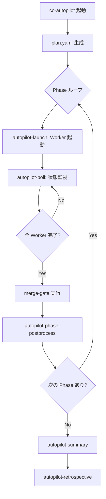
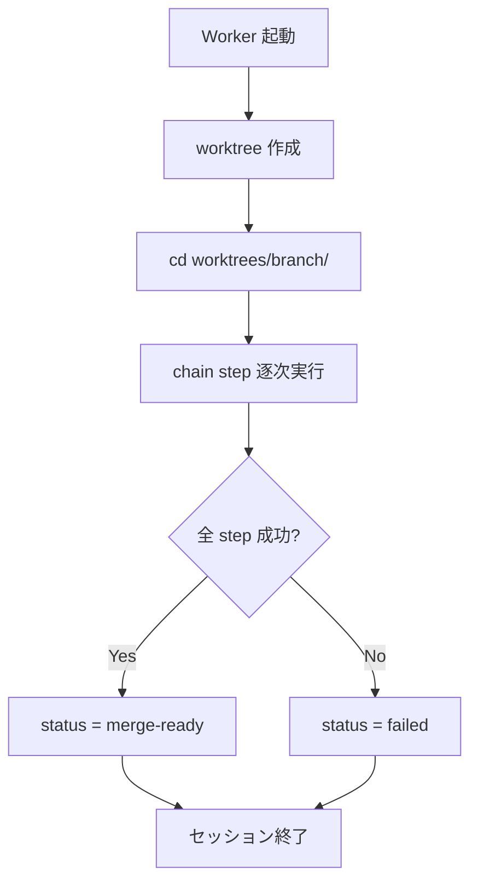
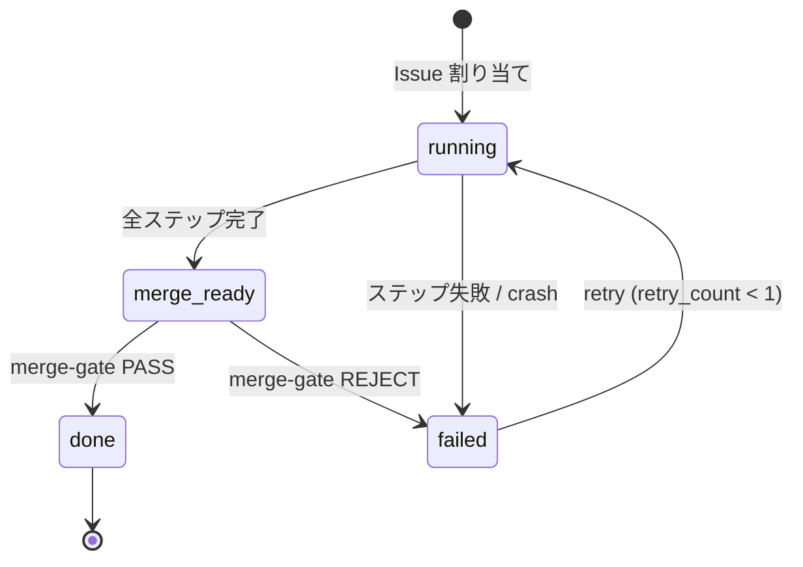

# Autopilot

## Responsibility

セッション管理、Phase 実行、計画生成、cross-issue 影響分析、パターン検出。
Issue の実装は常に co-autopilot 経由で行い（Autopilot-first 原則）、Worker の起動・監視・マージ判定を Pilot が統括する。

## Key Entities

### SessionState (session.json)
per-autopilot-run の状態ファイル。

| フィールド | 型 | 説明 |
|---|---|---|
| session_id | string | セッション一意識別子 |
| plan_path | string | plan.yaml のパス |
| current_phase | number | 現在の Phase 番号 |
| phase_count | number | 全 Phase 数 |
| cross_issue_warnings | { issue, target_issue, file, reason }[] | cross-issue 警告 |
| phase_insights | { phase, insight, timestamp }[] | Phase 完了時の知見 |
| patterns | { [name]: { count, last_seen } } | 検出パターン集約 |
| self_improve_issues | number[] | 自己改善で起票された Issue 番号 |

### IssueState (issue-{N}.json)
per-issue の状態ファイル。

| フィールド | 型 | 説明 |
|---|---|---|
| issue | number | GitHub Issue 番号 |
| status | `running` \| `merge-ready` \| `done` \| `failed` | 現在の状態 |
| branch | string | worktree のブランチ名 |
| pr | null \| number | PR 番号 |
| window | string | tmux ウィンドウ名（例: `ap-#42`） |
| started_at | string (ISO 8601) | 開始時刻 |
| current_step | string | chain の現在ステップ名 |
| retry_count | number (0-1) | merge-gate リトライ回数 |
| fix_instructions | null \| string | fix-phase 用修正指示テキスト |
| merged_at | null \| string (ISO 8601) | マージ完了時刻 |
| files_changed | string[] | 変更されたファイルパス配列 |
| failure | null \| { message, step, timestamp } | 失敗情報 |

### AutopilotPlan (plan.yaml)
autopilot セッションの実行計画。

| フィールド | 型 | 説明 |
|---|---|---|
| phases | Phase[] | 依存順に並んだ Phase の配列 |

### Phase
plan.yaml 内の実行単位。

| フィールド | 型 | 説明 |
|---|---|---|
| number | number | Phase 番号（1-indexed） |
| issues | number[] | この Phase で並行実行する Issue 番号リスト |
| status | `pending` \| `running` \| `completed` \| `failed` | Phase の状態 |

### CrossIssueWarning
同一 Phase 内の Issue 間で変更ファイルが重複した場合の警告。

## Key Workflows

### Autopilot セッションフロー



### Worker 実行フロー



### 状態遷移



- `done` は完全終端状態（逆行不可）
- `failed (確定)` からの復帰は Pilot による手動介入のみ

## Constraints

### 不変条件（9件）

旧プラグインの実装分析から導出。autopilot の再現性・安全性・品質を保証する制約。

| ID | 不変条件 | 概要 |
|----|----------|------|
| **A** | 状態の一意性 | issue-{N}.json の `status` は常に `running`, `merge-ready`, `done`, `failed` のいずれか1つ。定義された遷移パスのみ許可 |
| **B** | Worktree 削除 pilot 専任 | Worker は worktree を作成するが削除しない。削除は常に Pilot (main/) が merge 成功後に実行 |
| **C** | Worker マージ禁止 | Worker は `merge-ready` を宣言するのみ。マージ判断・実行は Pilot が merge-gate 経由で行う |
| **D** | 依存先 fail 時の skip 伝播 | Phase N で fail した Issue に依存する Phase N+1 以降の全 Issue は自動 skip |
| **E** | merge-gate リトライ制限 | merge-gate リジェクト後のリトライは最大1回。2回目リジェクト = 確定失敗 |
| **F** | merge 失敗時 rebase 禁止 | squash merge 失敗時は停止のみ。自動 rebase は行わない（LLM 判断を要する操作を機械化しない） |
| **G** | クラッシュ検知保証 | Worker の crash/timeout は必ず検知され、issue-{N}.json の status が `failed` に遷移する |
| **H** | deps.yaml 変更排他性 | 同一 Phase 内で deps.yaml を変更する複数 Issue は separate Phase に分離して sequential 化 |
| **I** | 循環依存拒否 | plan.yaml 生成時に循環依存を検出した場合、計画を拒否してエラー終了 |

### 旧プラグインから除外した不変条件（3件）と理由

- **.fail window クローズ禁止**: 不変条件 G（クラッシュ検知保証）に包含。推奨事項として残す
- **Compaction 耐性**: 統一状態ファイルで構造的に改善。不変条件 A（状態の一意性）に包含
- **後処理順序不変**: chain-driven 設計により実行順序が deps.yaml chains で機械的に保証されるため不要

### 並行性の制約

- 同一プロジェクトでの複数 autopilot セッションの同時実行は禁止（検出: session.json の存在チェック）
- session.json は単一ファイルで排他制御不要
- issue-{N}.json は per-issue のため同一セッション内の複数 Issue 並行処理は安全
- Pilot と Worker 間の issue-{N}.json アクセス: **Pilot = read only, Worker = write**

## Rules

### Pilot / Worker 役割分担

**Pilot (CWD = main/)**:
- Issue 選択（Project Board クエリ）
- Worker の起動（tmux new-window）・監視（ポーリング）
- merge-gate 実行（PR レビュー・テスト・判定）
- Worktree 削除（merge 成功後）
- tmux window kill

**Worker (CWD = worktrees/{branch}/)**:
- Worktree 作成・ブランチ作成
- 実装（chain ステップの逐次実行）
- テスト実行
- `merge-ready` 宣言（issue-{N}.json の status 更新）
- セッション終了（worktree 削除は行わない）

### ライフサイクル概要

```
Pilot (CWD = main/)
  -> tmux new-window -c "PROJECT/main" "cld ..."
  -> Worker: worktree 作成 -> cd -> 実装 -> merge-ready -> セッション終了
  -> Pilot: merge-gate -> merge -> worktree 削除 -> window kill
```

### Worktree ライフサイクル安全ルール

**鉄則: Worker は自分の worktree を削除しない。削除は常に Pilot (main/) が行う。**（不変条件 B）

| フェーズ | 実行者 | 操作 | CWD |
|----------|--------|------|-----|
| 作成 | Worker | `worktree-create.sh` で worktree + ブランチ作成 | main/ → worktrees/{branch}/ |
| 使用 | Worker | chain ステップ逐次実行、テスト、PR 作成 | worktrees/{branch}/ |
| merge-ready 宣言 | Worker | issue-{N}.json の status を `merge-ready` に更新 | worktrees/{branch}/ |
| セッション終了 | Worker | cld セッション終了。worktree は残す | worktrees/{branch}/ |
| merge-gate | Pilot | PR レビュー → squash merge | main/ |
| 削除 | Pilot | worktree-delete.sh で worktree + ブランチ削除 | main/ |
| window kill | Pilot | tmux window を kill | main/ |

**禁止事項**:
- Worker が `git worktree remove` を実行してはならない
- Worker が main/ の worktree を操作してはならない
- Pilot が Worker の worktree 内で作業してはならない

**失敗時の挙動**:
- merge-gate REJECT: worktree は残す。fix-phase で再利用
- Worker crash: worktree は残す。Pilot がクリーンアップを判断
- merge 失敗: worktree は残す。自動 rebase は行わない（不変条件 F）

### Emergency Bypass

co-autopilot 障害時のみ手動パスを許可する。

**許可条件**:
- co-autopilot 自体の障害（SKILL.md のバグ、セッション管理の故障等）
- co-autopilot の SKILL.md 自体の修正（bootstrap 問題: main/ で直接編集 -> commit -> push）

**禁止事項**:
- trivial change（タイポ等）であっても原則 co-autopilot 経由
- bypass の拡大解釈は禁止

**義務**:
- Emergency bypass 使用時は、セッション後に retrospective で理由を記録する

### Controller 操作カテゴリ

| カテゴリ | 定義 | 該当 Controller | 経路 |
|---|---|---|---|
| Implementation | コード変更・PR 作成を伴う操作 | co-autopilot のみ | autopilot パイプライン経由 |
| Non-implementation | Issue 作成・設計・プロジェクト管理 | co-issue, co-project, co-architect | ユーザーが直接呼び出し |

- Non-implementation controller (co-issue, co-project, co-architect) は autopilot パイプラインを経由しない

### Claude Code ツール活用ルール

**TaskCreate/TaskList/TaskUpdate の活用**:
- Phase 開始時: TaskCreate で Phase タスクを登録（status: in_progress）
- Issue 完了時: TaskUpdate で対応タスクを completed に更新
- メリット: ユーザーが CLI 上でリアルタイム進捗確認可能
- 不使用箇所: specialist 内部処理、atomic コマンド内部（短命タスクはオーバーヘッド）

**AskUserQuestion の構造化**:
- ユーザー確認が必要な判断ポイントでは、必ず選択肢形式で提示
- 例: `[A] 承認 [B] 修正 [C] キャンセル`
- 自由形式プロンプトは探索フェーズ（Phase 1: 問題探索）のみに限定

## Dependencies

- **Downstream -> PR Cycle**: merge-gate を呼び出してマージ判定。Contract: autopilot-pr-cycle.md
- **Upstream <- Issue Management**: Issue 情報を取得（gh issue view）
- **Downstream -> Self-Improve**: パターン検出時に ECC 照合を自動追加（session.json patterns）
- **Shared Kernel <- Project Management**: bare repo + worktree 構造を共有
