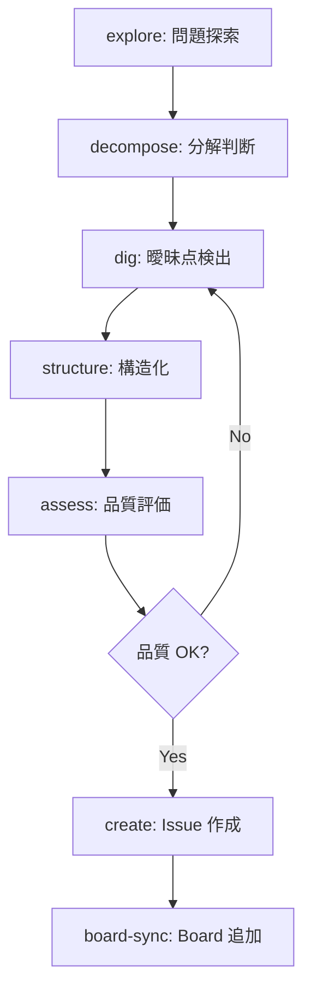
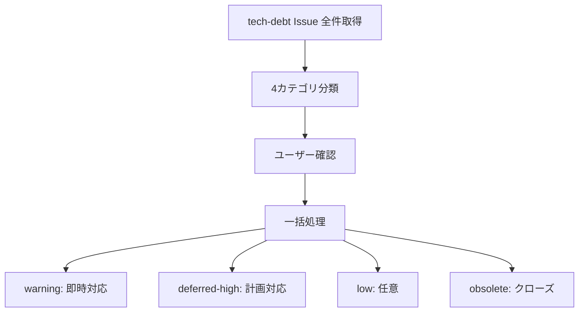
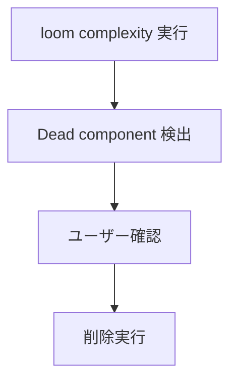

# Issue Management

## Responsibility

Issue の作成、トリアージ、精緻化、tech-debt 管理。
要望を構造化 Issue に変換するワークフローを提供し、AC（Acceptance Criteria）の機械検証可能性を保証する。

## Key Entities

### Issue
GitHub Issue。プロジェクトの作業単位。

| フィールド | 型 | 説明 |
|---|---|---|
| number | number | GitHub Issue 番号 |
| title | string | タイトル |
| body | string | 本文（テンプレート準拠） |
| labels | string[] | ラベル（5軸ラベル体系） |
| milestone | string \| null | マイルストーン |
| ac | AcceptanceCriteria[] | 受け入れ基準 |
| related_issues | number[] | 関連 Issue 番号 |

### AcceptanceCriteria
テスト可能な条件のリスト。機械検証可能であるべき。

| フィールド | 型 | 説明 |
|---|---|---|
| description | string | 条件の記述 |
| testable | boolean | 機械的にテスト可能か |

### IssueTemplate
Issue 作成テンプレート。必須フィールドを定義する。

| テンプレート | 用途 |
|---|---|
| bug.md | バグ報告 |
| feature.md | 機能要望 |

### TechDebtCategory
tech-debt Issue のトリアージカテゴリ。

| カテゴリ | 意味 | 対応 |
|---|---|---|
| warning | 即時対応が必要 | 即時対応 |
| deferred-high | 計画的に対応 | 計画対応 |
| low | 任意で対応 | 任意 |
| obsolete | 不要になった | 除去 |

## Key Workflows

### Issue 作成フロー (co-issue)

### Tech-debt triage フロー

### Dead component cleanup フロー

## Constraints

- Issue 作成前に必ず品質評価 (issue-assess) を通過すること
- tech-debt Issue は定期的にトリアージすること
- project-board-sync は Issue 作成成功後に自動実行。失敗時は警告のみ（autopilot をブロックしない）

## Rules

- **Non-implementation controller**: co-issue はコード変更を伴わない。chain-driven 不要（順序は co-issue SKILL.md で自然言語定義）
- **DeltaSpec 適用**: 常に propose -> apply パス。direct パス廃止（軽微変更 <10行 のみ例外）
- **AC の機械検証可能性**: AcceptanceCriteria は可能な限り機械的にテスト可能な条件として記述する

## Dependencies

- **Downstream -> Autopilot**: Issue 情報を提供（gh issue view）
- **Downstream -> PR Cycle**: AC 情報を提供（ac-extract）
- **Upstream <- Self-Improve**: self-improve Issue を受け取る
- **Upstream <- Project Management**: Board ステータス更新
