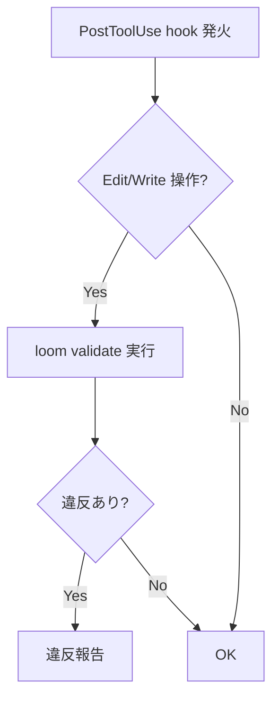
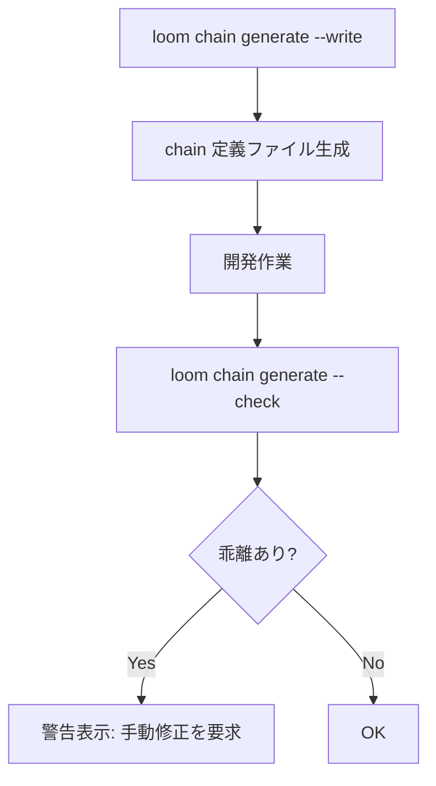
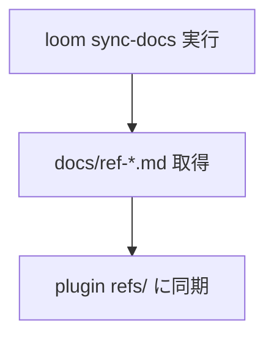

# Loom Integration

## Responsibility

loom CLI との連携。validate、audit、chain generate の呼び出しと結果の消費。
全 Context に対する Open Host Service として機能し、loom CLI の出力形式変更が他 Context に波及しないよう結果を標準化して提供する。

## Key Entities

### ValidationResult
loom validate / deep-validate / check の出力。

| フィールド | 型 | 説明 |
|---|---|---|
| severity | `error` \| `warning` \| `info` | 深刻度 |
| component | string | 対象コンポーネント名 |
| message | string | 違反内容 |

### AuditReport
loom audit の出力。5 セクション構成のレポート。

| セクション | 内容 |
|---|---|
| Controller Size | controller の肥大化検出 |
| Inline Implementation | インライン実装の検出 |
| Step 0 Routing | Step 0 ルーティングの検証 |
| Tools Accuracy | ツール宣言の正確性 |
| Self-Contained | 自己完結性の検証 |

### ChainDefinition
deps.yaml v3.0 の chains セクション。ステップ順序を機械的に管理する。

| 構成 | 説明 |
|---|---|
| Chain A | workflow + atomic の組み合わせ |
| Chain B | atomic + composite の組み合わせ |

### DepsYaml
deps.yaml v3.0 の構造定義。プラグイン構成の SSOT。

| セクション | 内容 |
|---|---|
| skills | controller, workflow, atomic, composite, specialist, reference |
| commands | atomic, composite コマンド |
| agents | エージェント定義 |
| scripts | スクリプト定義 |
| chains | チェーン定義 |
| entry_points | エントリポイント一覧 |

## Key Workflows

### validate フロー

PostToolUse hook により、Edit/Write 後に自動実行される。

### chain-driven フロー

### sync-docs フロー

## Constraints

- **loom CLI バージョン互換性**: deps.yaml v3.0 + chain サブコマンド必須
- **chain generate --check 乖離検出時**: 自動修正せず警告のみ。手動修正を要求
- **PostToolUse hook 必須**: Edit/Write 操作後の自動 validate は省略不可

## Rules

- **Anti-Corruption Layer 役割**: loom CLI の出力形式変更が他 Context に波及しないよう、結果を標準化して提供する
- **共通出力スキーマ準拠**: 全 specialist は SpecialistOutput スキーマに準拠（PR Cycle Context と共有ルール）
- **loom audit/check 結果の消費**: worker-structure, worker-principles, worker-architecture は PR Cycle の specialist として動作するが、loom audit/check 結果を入力に使う
- **deps.yaml = SSOT**: プラグイン構成の唯一の情報源。編集フロー: コンポーネント編集 -> deps.yaml 更新 -> loom --check -> loom --update-readme

## Component Mapping

本 Context が担う controller/workflow/command の対応:

| 種別 | コンポーネント | 役割 |
|------|--------------|------|
| **atomic** | loom-validate | PostToolUse hook: Edit/Write 後の自動 validate |
| **atomic** | schema-update | Zod スキーマ更新 + OpenAPI 再生成 |
| **atomic** | evaluate-architecture | アーキテクチャパターン評価 |
| **atomic** | dead-component-detect | loom complexity による Dead component 検出 |
| **atomic** | dead-component-execute | Dead component 削除実行 |
| **specialist** | worker-structure | loom audit/check 結果を消費するレビュー specialist |
| **specialist** | worker-architecture | アーキテクチャパターン検証 specialist |
| **reference** | ref-types | deps.yaml 型ルールリファレンス |
| **reference** | ref-deps-format | deps.yaml フォーマットリファレンス |
| **reference** | ref-architecture-spec | architecture/ 仕様リファレンス |

### loom CLI コマンドと使用コンポーネントの対応表

| loom CLI コマンド | 使用する plugin コンポーネント | 使用場面 |
|---|---|---|
| `loom validate` | PostToolUse hook, merge-gate | Edit/Write 後の自動検証、PR レビュー時 |
| `loom deep-validate` | worker-structure (specialist) | merge-gate 内の詳細検証 |
| `loom check` | PostToolUse hook, dev:check | セッション開始時、PR 準備確認 |
| `loom audit` | worker-structure (specialist) | PR レビュー時の構造監査 |
| `loom chain generate --write` | workflow-setup | chain 定義ファイル初期生成 |
| `loom chain generate --check` | PostToolUse hook | deps.yaml 変更時の乖離検出 |
| `loom chain validate` | dev:loom-validate | chain 整合性検証 |
| `loom rename` | co-project (migrate) | co-* naming 保守 |
| `loom promote` | (手動) | 型昇格/降格 |
| `loom graph` / `update-readme` | dev:plugin-verify | README SVG 埋め込み更新 |
| `loom tree` | (開発時参照) | 構造確認 |
| `loom orphans` | dead-component-detect | Dead component 検出 |
| `loom complexity` | dead-component-detect | fan-out/fan-in 監視 |
| `loom sync-docs` | (手動/CI) | refs/ ドキュメント同期 |
| `loom rules` | (開発時参照) | types.yaml 型テーブル表示 |

## loom CLI コマンド依存マップ

| カテゴリ | コマンド | lpd での使用箇所 | 依存度 |
|---|---|---|---|
| **検証** | `validate` | PostToolUse hook, merge-gate plugin gate | Critical |
| **検証** | `deep-validate` | merge-gate specialist review | Critical |
| **検証** | `check` | PostToolUse hook, セッション開始時 | Critical |
| **検証** | `audit` | worker-structure specialist | High |
| **Chain** | `chain generate --write` | chain-driven ステップ管理 (B-4/B-5) | Critical |
| **Chain** | `chain generate --check` | CI/hook での乖離検出 (loom#30) | High |
| **Chain** | `chain validate` | deps.yaml chain 整合性検証 | Critical |
| **構造** | `rename` | co-* naming 保守 (loom#28) | High |
| **構造** | `promote` | 型昇格/降格 | Medium |
| **可視化** | `graph` / `update-readme` | README SVG 埋め込み | Medium |
| **可視化** | `tree` | 開発時構造確認 | Low |
| **保守** | `orphans` | dead component 検出 | Medium |
| **保守** | `complexity` | fan-out/fan-in 監視 | Medium |
| **同期** | `sync-docs` | refs/ ドキュメント同期 | Medium |
| **同期** | `rules` | types.yaml 型テーブル表示 | Low |

## 型システム (types.yaml) と lpd の対応

| 型 | section | lpd での用途 | 想定コンポーネント数 |
|---|---|---|---|
| controller | skills | co-autopilot, co-issue, co-project, co-architect | 4 |
| workflow | skills | workflow-setup, workflow-pr-cycle 等 | 5+ |
| atomic | commands | ac-extract, autopilot-init 等 | 78+ |
| composite | commands | merge-gate, phase-review 等 | 7+ |
| specialist | agents | worker-code-reviewer 等 | 27 |
| reference | skills | ref-types, ref-architecture-spec 等 | 11 |
| script | scripts | autopilot-plan.sh 等 (loom#31 完了後) | 18 |

## loom Issue 完了 → lpd ブロック解除マップ

| loom Issue | 完了で解除される lpd Issue | ブロック理由 | 優先度 |
|---|---|---|---|
| **#31** (scripts) | #4 (B-2), #9 (C-2a), #11 (C-4) | deps.yaml v3.0 scripts セクション必須 | **Must-1st** |
| **#28** (rename) | #4 (B-2) | co-* naming に path/dir rename 必要 | **Must-2nd** |
| **#30** (--check/--all) | #6 (B-4), #7 (B-5) | chain-driven 乖離検出 | **Must-3rd** |
| **#29** (model) | #10 (C-3) | specialist model 宣言の品質保証 | **Must-4th** |
| **#34** (JSON, Phase 1) | #7 (B-5) | merge-gate plugin gate の JSON 消費 | **Must-5th** |
| #32 (Template B) | — | 便利だが blocking ではない | Should |
| #33 (output schema) | — | C-3 品質向上だが blocking ではない | Should |
| #35 (Arch Spec) | — | ドキュメント整備のみ | Could |

**クリティカルパス**: loom#31 → loom#28 → lpd#4 (B-2) → lpd#5 (B-3) → lpd#6 (B-4) → lpd#7 (B-5)

## Dependencies

- **Open Host Service -> 全 Context**: validate / audit / chain 結果を提供
- **Downstream -> PR Cycle**: merge-gate の plugin gate で validate 結果を消費
