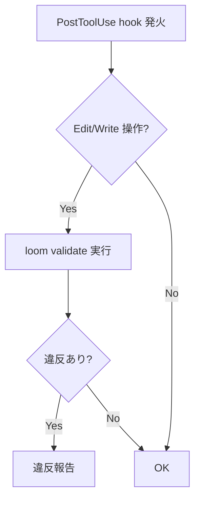
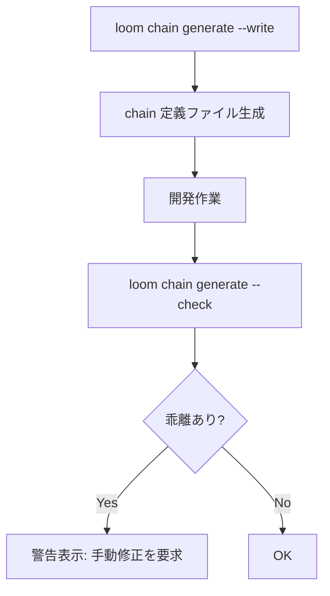
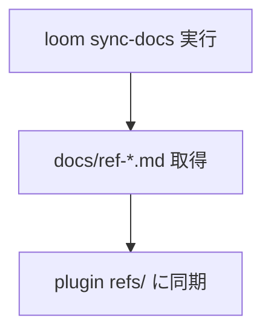

# Loom Integration

## Responsibility

loom CLI との連携。validate、audit、chain generate の呼び出しと結果の消費。
全 Context に対する Open Host Service として機能し、loom CLI の出力形式変更が他 Context に波及しないよう結果を標準化して提供する。

## Key Entities

### ValidationResult
loom validate / deep-validate / check の出力。

| フィールド | 型 | 説明 |
|---|---|---|
| severity | `error` \| `warning` \| `info` | 深刻度 |
| component | string | 対象コンポーネント名 |
| message | string | 違反内容 |

### AuditReport
loom audit の出力。5 セクション構成のレポート。

| セクション | 内容 |
|---|---|
| Controller Size | controller の肥大化検出 |
| Inline Implementation | インライン実装の検出 |
| Step 0 Routing | Step 0 ルーティングの検証 |
| Tools Accuracy | ツール宣言の正確性 |
| Self-Contained | 自己完結性の検証 |

### ChainDefinition
deps.yaml v3.0 の chains セクション。ステップ順序を機械的に管理する。

| 構成 | 説明 |
|---|---|
| Chain A | workflow + atomic の組み合わせ |
| Chain B | atomic + composite の組み合わせ |

### DepsYaml
deps.yaml v3.0 の構造定義。プラグイン構成の SSOT。

| セクション | 内容 |
|---|---|
| skills | controller, workflow, atomic, composite, specialist, reference |
| commands | atomic, composite コマンド |
| agents | エージェント定義 |
| scripts | スクリプト定義 |
| chains | チェーン定義 |
| entry_points | エントリポイント一覧 |

## Key Workflows

### validate フロー

PostToolUse hook により、Edit/Write 後に自動実行される。

### chain-driven フロー

### sync-docs フロー

## Constraints

- **loom CLI バージョン互換性**: deps.yaml v3.0 + chain サブコマンド必須
- **chain generate --check 乖離検出時**: 自動修正せず警告のみ。手動修正を要求
- **PostToolUse hook 必須**: Edit/Write 操作後の自動 validate は省略不可

## Rules

- **Anti-Corruption Layer 役割**: loom CLI の出力形式変更が他 Context に波及しないよう、結果を標準化して提供する
- **共通出力スキーマ準拠**: 全 specialist は SpecialistOutput スキーマに準拠（PR Cycle Context と共有ルール）
- **loom audit/check 結果の消費**: worker-structure, worker-principles, worker-architecture は PR Cycle の specialist として動作するが、loom audit/check 結果を入力に使う
- **deps.yaml = SSOT**: プラグイン構成の唯一の情報源。編集フロー: コンポーネント編集 -> deps.yaml 更新 -> loom --check -> loom --update-readme

## Dependencies

- **Open Host Service -> 全 Context**: validate / audit / chain 結果を提供
- **Downstream -> PR Cycle**: merge-gate の plugin gate で validate 結果を消費
