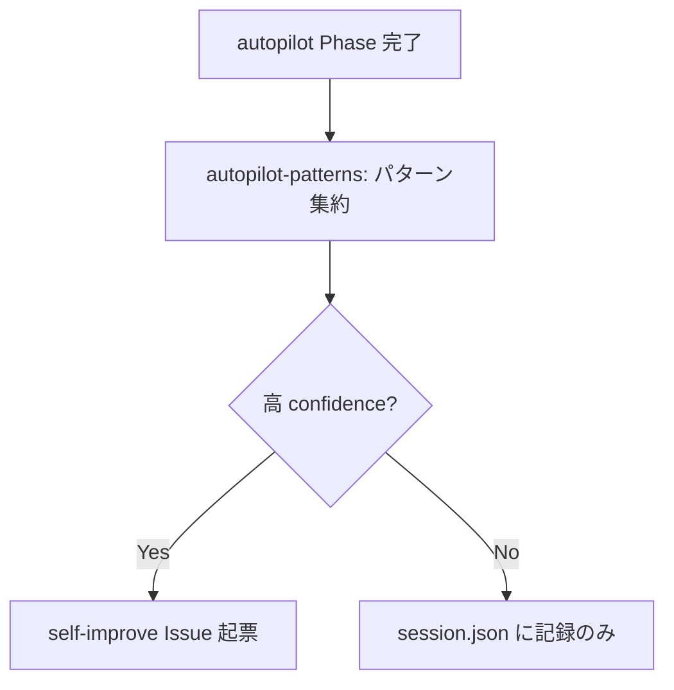
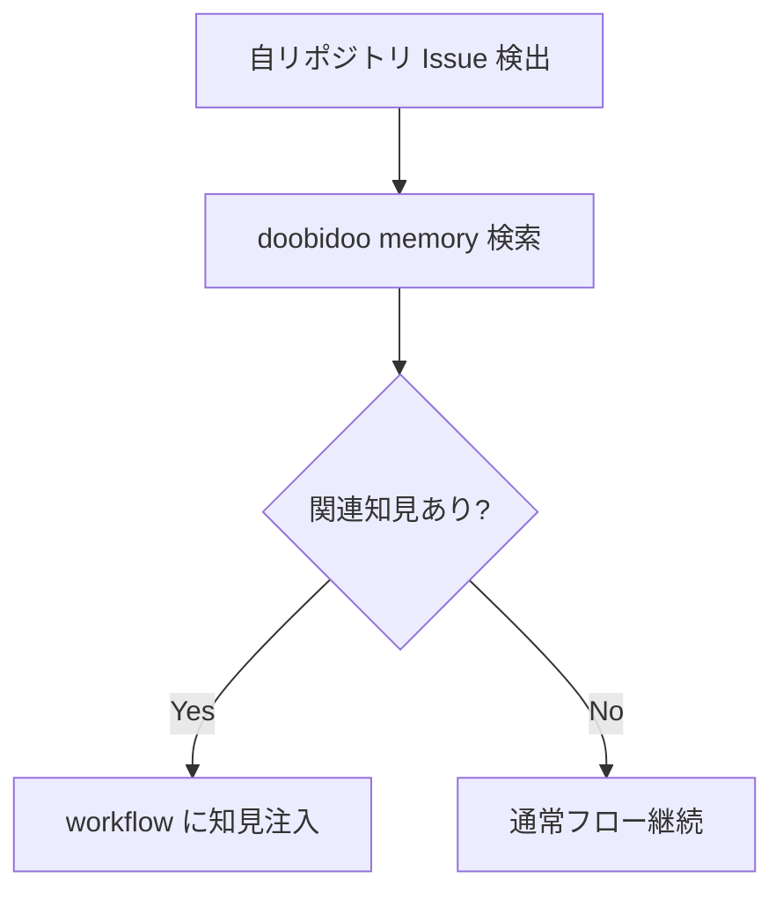
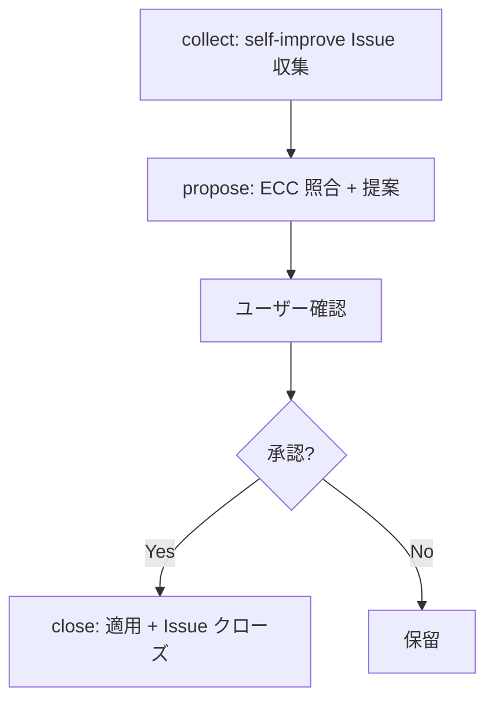

# Self-Improve

## Responsibility

開発セッション中のパターン検出、ECC (External Context Cache) との照合、改善 Issue の起票。
co-autopilot に吸収されており、独立 controller は存在しない。

## Key Entities

### Pattern
検出されたパターン。merge-gate findings やセッション失敗から抽出される。

| フィールド | 型 | 説明 |
|---|---|---|
| name | string | パターン名 |
| count | number | 検出回数 |
| last_seen | string (ISO 8601) | 最後に検出された時刻 |
| source | `merge-gate findings` \| `session failures` | 検出元 |

### ECCReference
外部知識ソース。doobidoo memory に保存された過去の知見。

| フィールド | 型 | 説明 |
|---|---|---|
| hash | string | memory のハッシュ |
| content | string | 知見の内容 |
| quality | number | 品質スコア |

### SelfImproveIssue
通常 Issue + self-improve-format テンプレートで構造化された改善 Issue。

| フィールド | 型 | 説明 |
|---|---|---|
| detection_source | string | 検出元の情報 |
| confidence | `HIGH` \| `MEDIUM` \| `LOW` | 改善の確信度 |
| pattern_name | string | 対応する Pattern 名 |

## Key Workflows

### パターン検出フロー

### ECC 照合フロー

### 改善適用フロー

## Constraints

- **cooldown 判定**: 同一パターンの重複 Issue 起票を防止。pattern name + 時間窓でチェック
- **co-autopilot 内で自動起動**: セッション完了時の retrospective で検出
- **ECC ソースの優先度**: doobidoo memory > openspec > git log

## Rules

- **独立 controller なし**: co-autopilot の後処理として統合。「別概念にしない」（設計判断 #2: 旧 controller-self-improve の吸収）
- **confidence 閾値**: HIGH 以上でのみ Issue 起票推奨。MEDIUM 以下は session.json patterns に記録のみ
- **self-improve-format テンプレート準拠**: 起票時は refs/self-improve-format.md の共通フォーマットに従う

## Dependencies

- **Upstream <- Autopilot**: パターン検出データ（session.json patterns）
- **Downstream -> Issue Management**: self-improve Issue 起票
