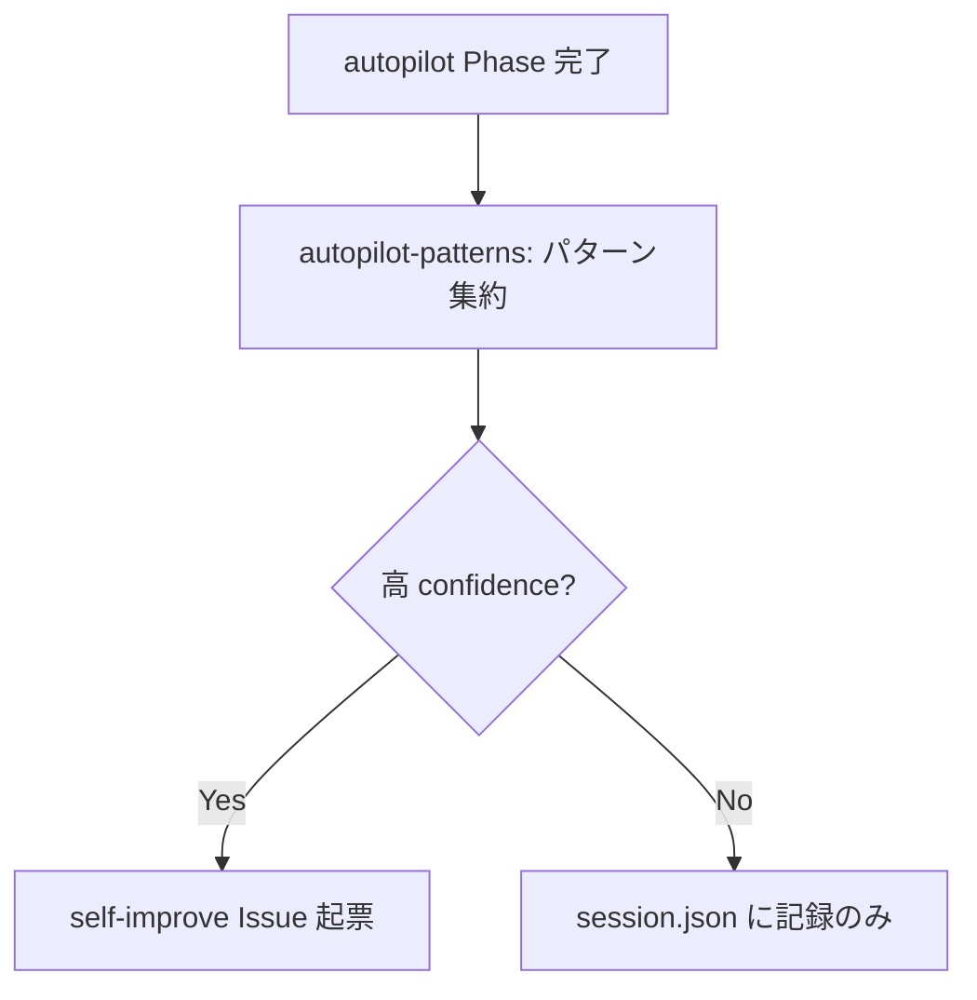
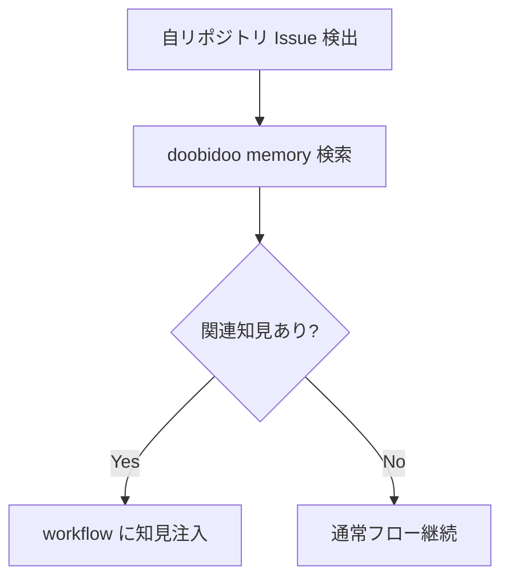
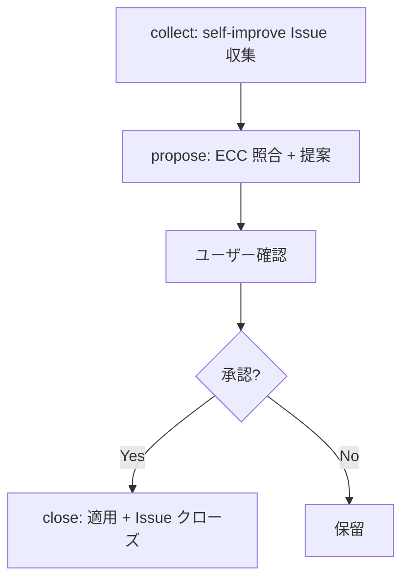
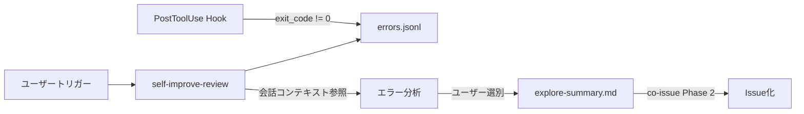

# Self-Improve

## Responsibility

開発セッション中のパターン検出、ECC (External Context Cache) との照合、改善 Issue の起票。
co-autopilot に吸収されており、独立 controller は存在しない。

## Key Entities

### Pattern
検出されたパターン。merge-gate findings やセッション失敗から抽出される。

| フィールド | 型 | 説明 |
|---|---|---|
| name | string | パターン名 |
| count | number | 検出回数 |
| last_seen | string (ISO 8601) | 最後に検出された時刻 |
| source | `merge-gate findings` \| `session failures` | 検出元 |

### ECCReference
外部知識ソース。doobidoo memory に保存された過去の知見。

| フィールド | 型 | 説明 |
|---|---|---|
| hash | string | memory のハッシュ |
| content | string | 知見の内容 |
| quality | number | 品質スコア |

### SelfImproveIssue
通常 Issue + self-improve-format テンプレートで構造化された改善 Issue。

| フィールド | 型 | 説明 |
|---|---|---|
| detection_source | string | 検出元の情報 |
| confidence | `HIGH` \| `MEDIUM` \| `LOW` | 改善の確信度 |
| pattern_name | string | 対応する Pattern 名 |

### ErrorRecord
hook が自動記録する Bash エラー。

| フィールド | 型 | 説明 |
|---|---|---|
| timestamp | string (ISO 8601) | エラー発生時刻 |
| command | string | 実行されたコマンド |
| exit_code | number | 終了コード |
| stderr_snippet | string | stderr の先頭部分 |
| cwd | string | 実行時の作業ディレクトリ |

## Key Workflows

### パターン検出フロー

### ECC 照合フロー

### 改善適用フロー

### User-Triggered Review フロー（B-7）

- **機械層**: PostToolUse hook が Bash エラーを `.self-improve/errors.jsonl` に記録（サイレント）
- **判断層**: ユーザーが `/dev:self-improve-review` でトリガー。エラーサマリーから問題を選別
- **Issue化層**: 選別結果を `.controller-issue/explore-summary.md` に書き出し、co-issue のフローに接続

## Constraints

- **cooldown 判定**: 同一パターンの重複 Issue 起票を防止。pattern name + 時間窓でチェック
- **co-autopilot 内で自動起動**: セッション完了時の retrospective で検出
- **ECC ソースの優先度**: doobidoo memory > openspec > git log

## Rules

- **独立 controller なし**: co-autopilot の後処理として統合。「別概念にしない」（設計判断 #2: 旧 controller-self-improve の吸収）
- **confidence 閾値**: HIGH 以上でのみ Issue 起票推奨。MEDIUM 以下は session.json patterns に記録のみ
- **self-improve-format テンプレート準拠**: 起票時は refs/self-improve-format.md の共通フォーマットに従う

### Error Recording ルール
- PostToolUse hook は記録のみ。ブロック・アラート・自動対処を行わない
- errors.jsonl はセッションスコープ（.gitignore 対象）
- テスト実行のエラーも記録される（問題かどうかの判断は人間が行う）
- self-improve-review は co-issue の Phase 1 (explore) の代替として機能する

## Component Mapping

| 種別 | コンポーネント | 役割 |
|------|--------------|------|
| **(co-autopilot 内)** | autopilot-patterns | パターン検出・high confidence 時に Issue 起票 |
| **(co-autopilot 内)** | autopilot-retrospective | Phase 振り返り・知見生成 |
| **atomic** | self-improve-collect | self-improve Issue の収集・分類 |
| **atomic** | self-improve-propose | ECC 照合 + 改善提案生成 |
| **atomic** | self-improve-close | Issue クローズ処理 |
| **atomic** | self-improve-review | エラーログ分析（User-Triggered） |
| **atomic** | ecc-monitor | ECC リポジトリ変更検知 |
| **atomic** | pr-cycle-analysis | PR-cycle 結果からの改善機会検出 |
| **atomic** | session-audit | セッション JSONL 事後分析（5カテゴリ検出） |

**注意**: self-improve は独立 controller を持たない。co-autopilot の後処理として統合されている（ADR-002）。self-improve-review のみがユーザー直接トリガーで、co-issue フローに接続する。

## Dependencies

- **Upstream <- Autopilot**: パターン検出データ（session.json patterns）
- **Upstream <- PR Cycle**: pr-cycle-analysis でパターン検出
- **Downstream -> Issue Management**: self-improve Issue 起票
- **Downstream -> Issue Management**: self-improve-review が co-issue フローに接続（explore-summary.md 経由）
