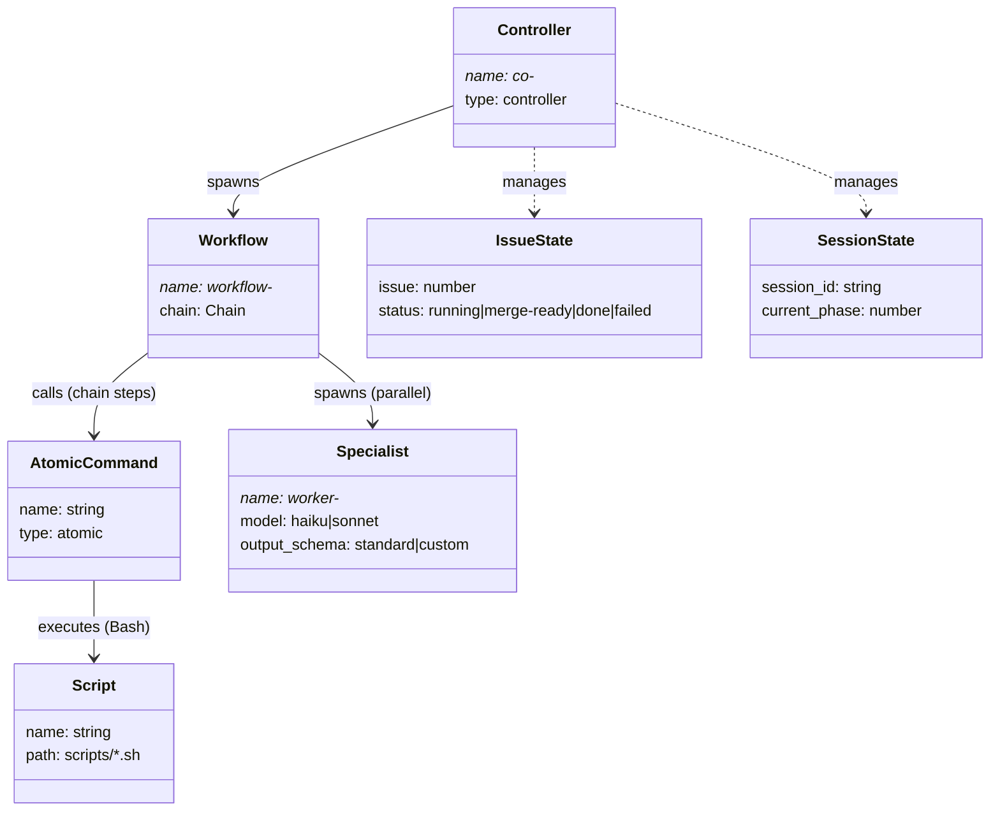

## Core Domain Model

```mermaid
classDiagram
    class Controller {
        name: co-*
        type: controller
    }
    class Workflow {
        name: workflow-*
        chain: Chain
    }
    class AtomicCommand {
        name: string
        type: atomic
    }
    class Specialist {
        name: worker-*
        model: haiku|sonnet
        output_schema: standard|custom
    }
    class Script {
        name: string
        path: scripts/*.sh
    }
    class IssueState {
        issue: number
        status: running|merge-ready|done|failed
    }
    class SessionState {
        session_id: string
        current_phase: number
    }
    Controller --> Workflow : spawns
    Workflow --> AtomicCommand : calls (chain steps)
    Workflow --> Specialist : spawns (parallel)
    AtomicCommand --> Script : executes (Bash)
    Controller ..> IssueState : manages
    Controller ..> SessionState : manages
```
