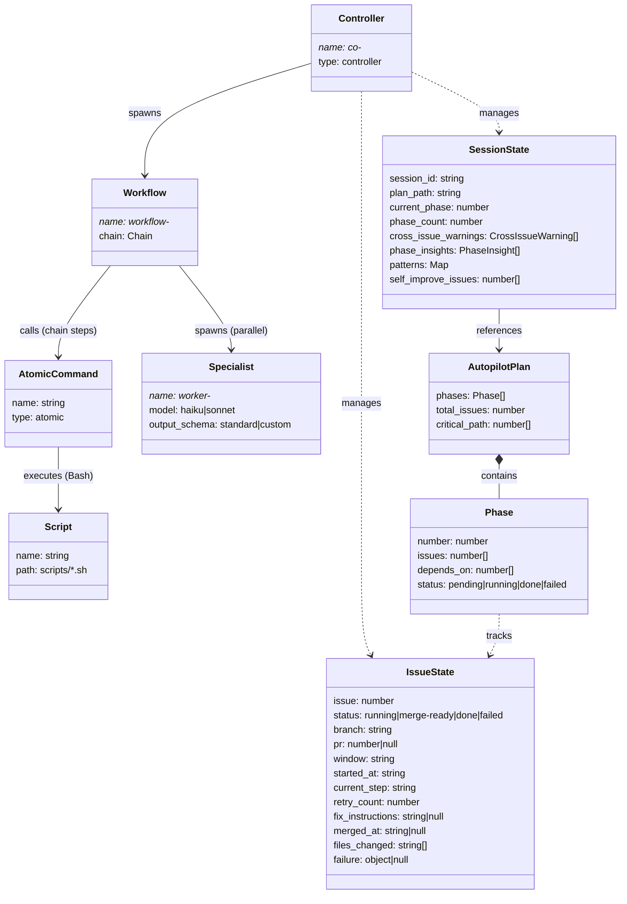
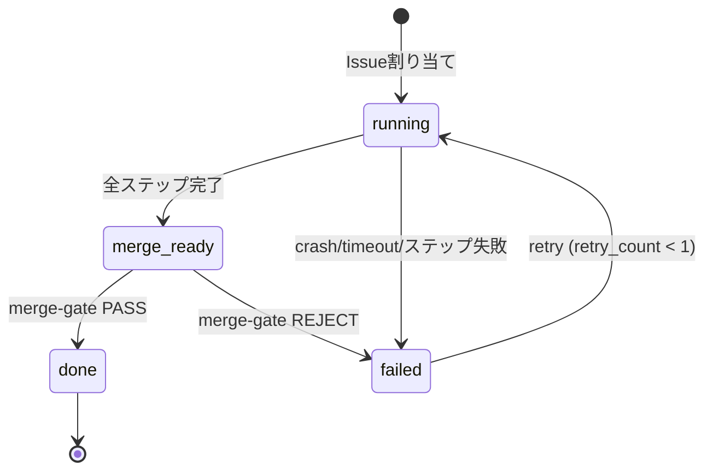

## Core Domain Model

### クラス図

### Issue 状態遷移図

#### 状態遷移表

| From | Event | To | 条件 |
|------|-------|----|------|
| (初期) | Issue 割り当て | running | -- |
| running | 全ステップ完了 | merge-ready | merge-gate に進む |
| running | ステップ失敗 / crash | failed | 不変条件 G: クラッシュは必ず検知 |
| merge-ready | merge-gate PASS | done | 終端状態 |
| merge-ready | merge-gate REJECT | failed | review findings あり |
| failed | retry 判定 | running | retry_count < 1（不変条件 E） |
| failed | retry 上限到達 | failed (確定) | retry_count >= 1、Pilot に報告 |

- `done` は完全終端状態（逆行不可）
- `failed (確定)` からの復帰は Pilot による手動介入のみ
- merge 失敗時に rebase は試みない（停止のみ、不変条件 F）
