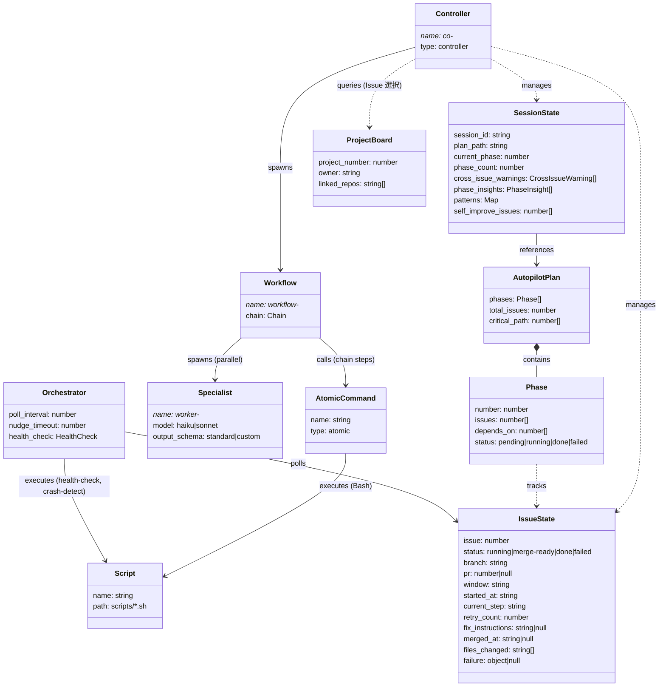
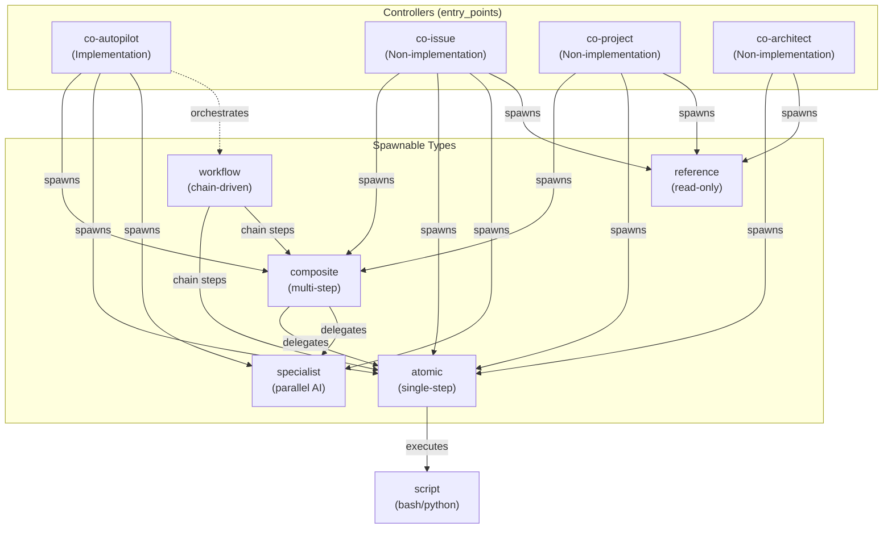
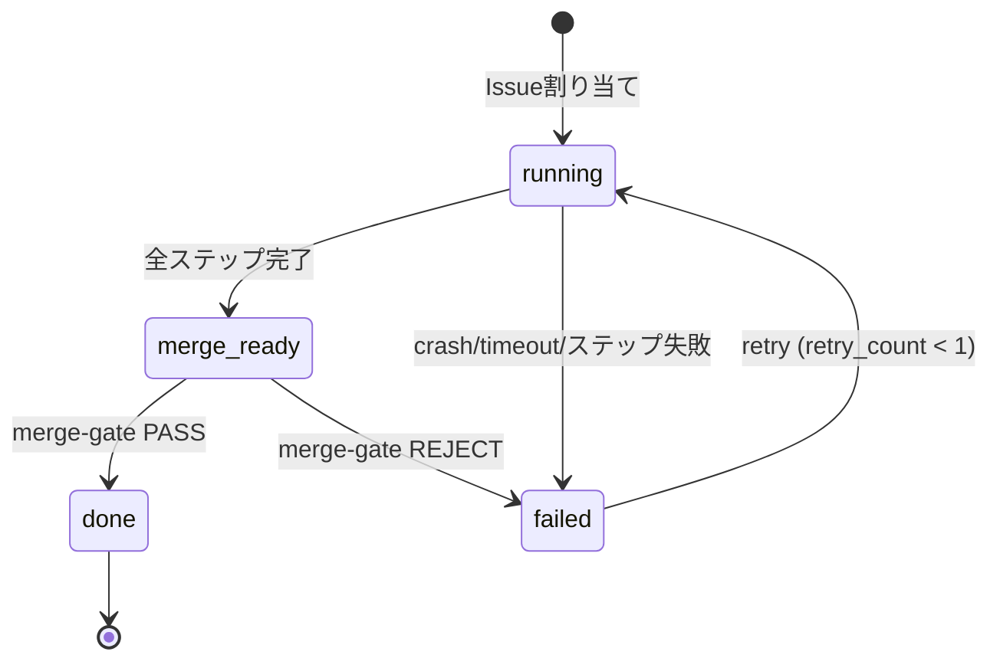
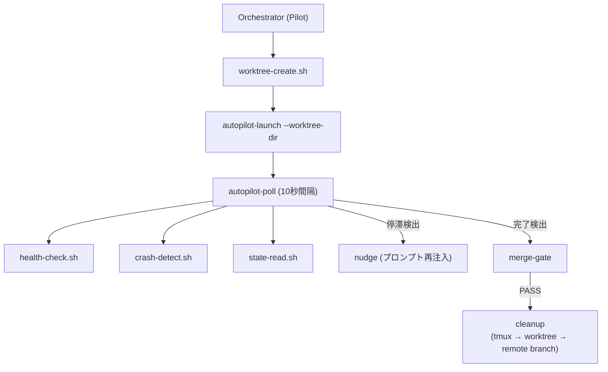
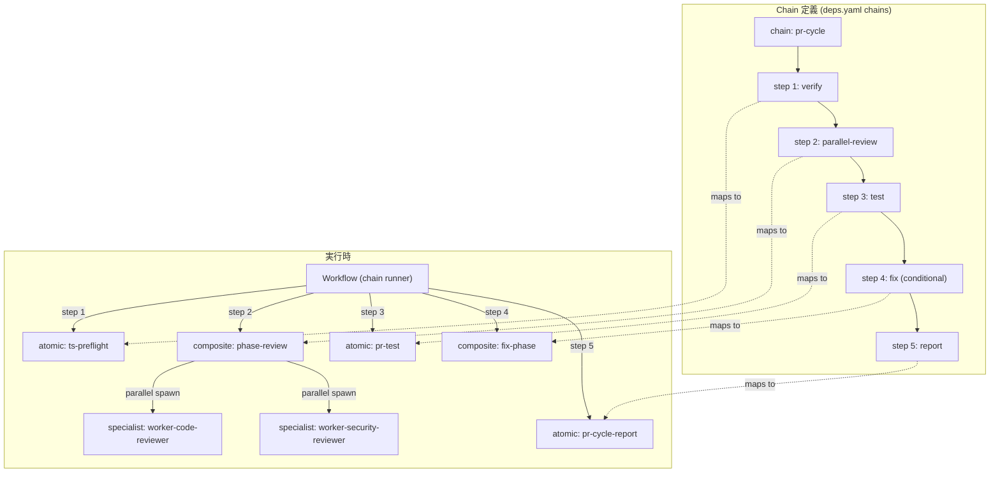
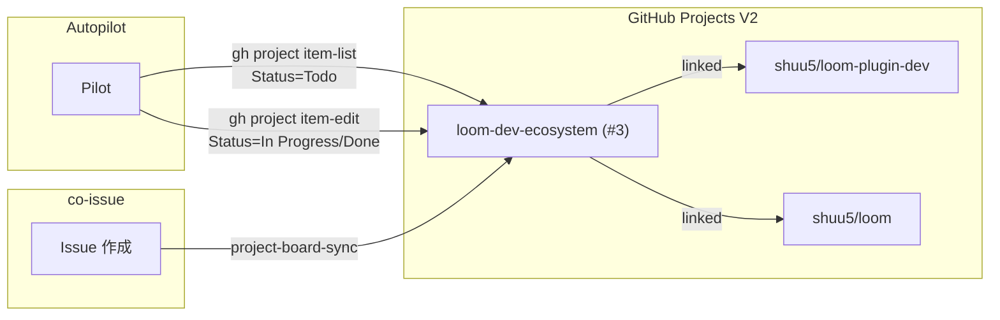

## Core Domain Model

### クラス図

### Controller Spawning 関係図

**Spawning ルール**:
- co-autopilot のみが workflow を orchestrate できる（Implementation 操作のレビュー・テスト）
- co-issue は specialist を spawn できる（issue-critic, issue-feasibility, worker-codex-reviewer）
- co-project は composite + atomic（構成変更の最小単位で操作）
- co-architect は atomic + reference のみ（設計情報の参照・評価）

### Issue 状態遷移図

#### 状態遷移表

| From | Event | To | 条件 |
|------|-------|----|------|
| (初期) | Issue 割り当て | running | -- |
| running | 全ステップ完了 | merge-ready | merge-gate に進む |
| running | ステップ失敗 / crash | failed | 不変条件 G: クラッシュは必ず検知 |
| merge-ready | merge-gate PASS | done | 終端状態 |
| merge-ready | merge-gate REJECT | failed | review findings あり |
| failed | retry 判定 | running | retry_count < 1（不変条件 E） |
| failed | retry 上限到達 | failed (確定) | retry_count >= 1、Pilot に報告 |

- `done` は完全終端状態（逆行不可）
- `failed (確定)` からの復帰は Pilot による手動介入のみ
- merge 失敗時に rebase は試みない（停止のみ、不変条件 F）

### 統一状態ファイルスキーマ

#### issue-{N}.json（per-Issue）

| フィールド | 型 | 必須 | 説明 |
|---|---|---|---|
| issue | number | Yes | GitHub Issue 番号 |
| status | `running` \| `merge-ready` \| `done` \| `failed` | Yes | 状態遷移図の状態値 |
| branch | string | Yes | worktree のブランチ名 |
| pr | null \| number | Yes | PR 番号（未作成時は null） |
| window | string | Yes | tmux ウィンドウ名（例: `ap-#42`） |
| started_at | string (ISO 8601) | Yes | 開始時刻 |
| current_step | string | Yes | chain の現在ステップ名 |
| retry_count | number (0-1) | Yes | merge-gate リトライ回数 |
| fix_instructions | null \| string | Yes | fix-phase 用修正指示テキスト |
| merged_at | null \| string (ISO 8601) | Yes | マージ完了時刻 |
| files_changed | string[] | Yes | 変更されたファイルパス配列 |
| failure | null \| { message, step, timestamp } | Yes | 失敗情報 |

**アクセスルール**: Pilot = read only, Worker = write。同一 Issue の並行書き込みは発生しない（per-Issue ファイル）。

#### session.json（per-autopilot-run）

| フィールド | 型 | 必須 | 説明 |
|---|---|---|---|
| session_id | string | Yes | セッション一意識別子 |
| plan_path | string | Yes | plan.yaml のパス |
| current_phase | number | Yes | 現在の Phase 番号 |
| phase_count | number | Yes | 全 Phase 数 |
| cross_issue_warnings | { issue, target_issue, file, reason }[] | Yes | cross-issue 警告 |
| phase_insights | { phase, insight, timestamp }[] | Yes | Phase 完了時の知見 |
| patterns | { [name]: { count, last_seen } } | Yes | 検出パターン集約 |
| self_improve_issues | number[] | Yes | 自己改善で起票された Issue 番号 |

**排他制御**: session.json は Pilot のみが書き込む。複数 autopilot セッションの同時実行は禁止（session.json 存在チェックで排他）。

### Orchestrator パターン

Pilot 内で Issue 実行ループを管理するコンポーネント。

**Orchestrator の責務**:
- Worktree 事前作成（Worker 起動前に worktree-create.sh を実行、不変条件 B）
- Worker の起動（worktree ディレクトリで cld セッション開始、`--worktree-dir`）
- 状態ポーリング（state-read.sh で issue-{N}.json を監視）
- クラッシュ検知（crash-detect.sh で tmux window 消失を検出）
- ヘルスチェック（health-check.sh で chain_stall を検出）
- nudge（停滞 Worker へのプロンプト再注入）
- クリーンアップ（merge-gate 成功後: tmux kill-window → worktree-delete → git push --delete）

### Chain 定義と実行フロー

**Chain の役割**: deps.yaml の chains セクションがステップ順序を宣言的に定義する。Workflow は chain 定義を読み取り、各ステップに対応する atomic/composite コマンドを逐次実行する。順序変更は deps.yaml の編集のみで完結し、Workflow のコード変更は不要。

### Project Board 統合

**二層構造**: ローカル状態ファイル（即時性）+ Project Board（永続化・可視化）。
Board 同期失敗は autopilot をブロックしない（WARNING のみ）。
