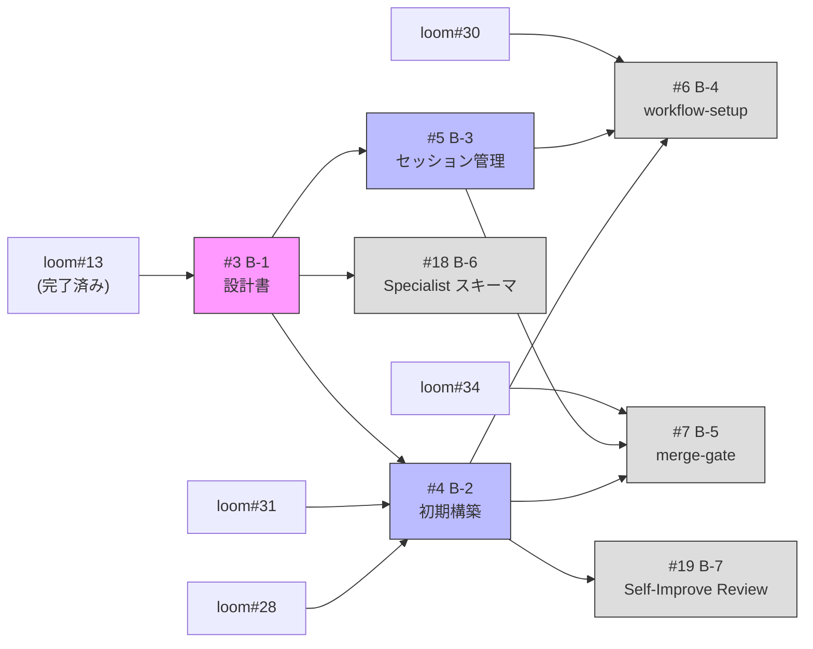

## Phase 1: Architecture & Core

chain-driven + autopilot-first の設計・構築。

## Scope

GitHub Parent Issue: #1

## Issues

| # | タイトル | Context | 依存 (lpd) | 依存 (loom) | Status |
|---|---------|---------|------------|-------------|--------|
| #3 | B-1: アーキテクチャ設計書 | 全体 | — | loom#13 (完了済み) | Done |
| #14 | Architecture Spec 精緻化 | 全体 | #3 | — | In Progress |
| #4 | B-2: プロジェクト初期構築 | Loom Integration | #3 | loom#28, loom#31 | Not Started |
| #5 | B-3: Autopilot セッション管理再設計 | Autopilot | #3 | — | Not Started |
| #18 | B-6: Specialist 共通出力スキーマ定義 | PR Cycle | #3 | — | Not Started |
| #19 | B-7: Self-Improve Review | Self-Improve | #4 | — | Not Started |
| #6 | B-4: workflow-setup chain-driven 再構築 | Autopilot | #4, #5 | loom#30 | Not Started |
| #7 | B-5: workflow-pr-cycle + merge-gate 再構築 | PR Cycle | #4, #5 | loom#34 | Not Started |

## 依存グラフ



## 外部依存（loom リポジトリ）

| loom Issue | 内容 | ブロック先 | 優先度 |
|---|---|---|---|
| loom#31 | deps.yaml v3.0 scripts セクション | #4 (B-2) | Must-1st |
| loom#28 | rename コマンド（co-* naming） | #4 (B-2) | Must-2nd |
| loom#30 | chain generate --check/--all | #6 (B-4) | Must-3rd |
| loom#34 | JSON 出力 Phase 1 | #7 (B-5) | Must-5th |

## 並列化

- **B-2 と B-3 と B-6 は並列実行可能**: 全て B-1 のみに依存し、互いに依存しない（ただし B-2 は loom#28, loom#31 にブロック）
- B-4 と B-5 は B-2 + B-3 の両方が完了してから着手
- #14 は B-1 完了後に着手可能（B-2 以降とも並列可）

## クリティカルパス

```
loom#31 → B-2 → B-4 → (Phase 2)
                  ↑
B-1 → B-3 -------┘
```

B-2 が loom#31 にブロックされるため、loom#31 の完了が Phase 1 全体のボトルネック。
