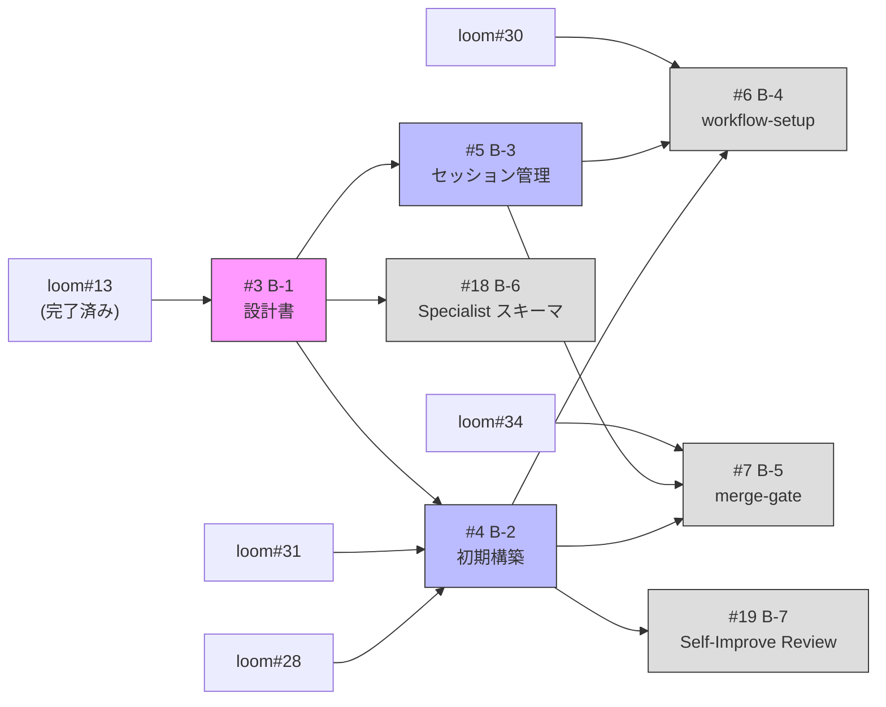

## Phase 1: Architecture & Core

chain-driven + autopilot-first の設計・構築。

## Scope

GitHub Parent Issue: #1

## Issues

| # | タイトル | Context | 依存 |
|---|---------|---------|------|
| #3 | B-1: アーキテクチャ設計書 | 全体 | loom#13 (完了済み) |
| #4 | B-2: プロジェクト初期構築 | Loom Integration | B-1, loom#28, loom#31 |
| #5 | B-3: Autopilot セッション管理再設計 | Autopilot | B-1 |
| #6 | B-4: workflow-setup chain-driven 再構築 | Autopilot | B-2, B-3, loom#30 |
| #7 | B-5: workflow-pr-cycle + merge-gate 再構築 | PR Cycle | B-2, B-3, loom#34 |
| #18 | B-6: Specialist 共通出力スキーマ定義 | PR Cycle | B-1 |
| #19 | B-7: Self-Improve Review | Self-Improve | B-2 |

## 依存グラフ



## 並列化

- **B-2 と B-3 は並列実行可能**: 両方とも B-1 のみに依存し、互いに依存しない
- B-4 と B-5 は B-2 + B-3 の両方が完了してから着手

## クリティカルパス

```
loom#31 → B-2 → B-4 → (Phase 2)
                  ↑
B-1 → B-3 -------┘
```

B-2 が loom#31 にブロックされるため、loom#31 の完了が Phase 1 全体のボトルネック。
