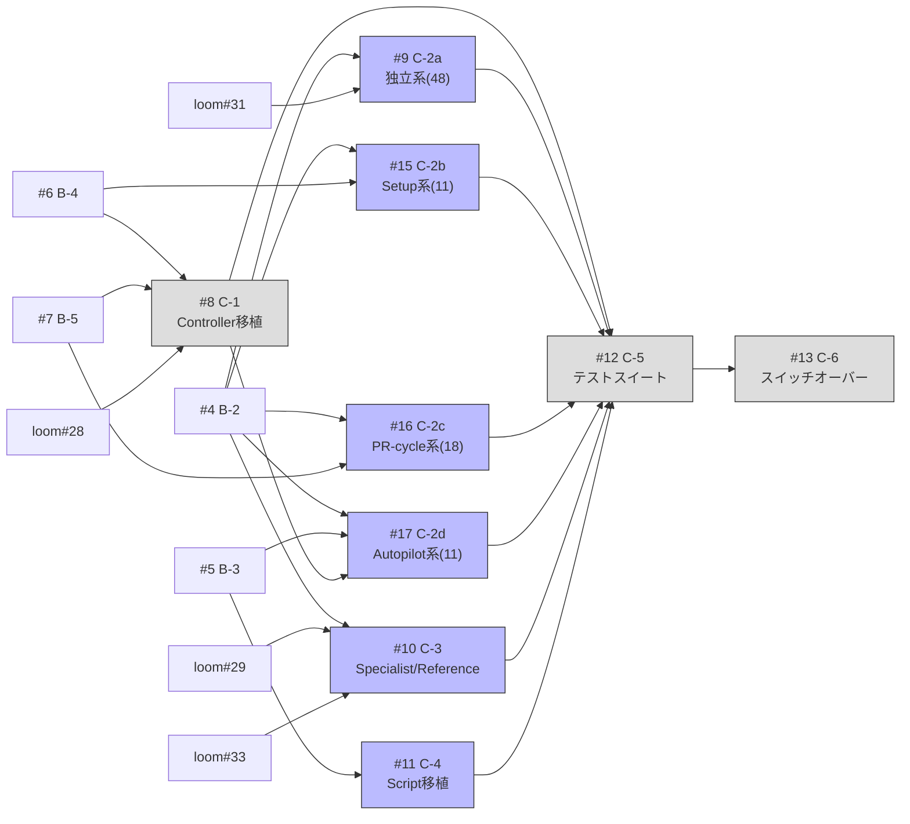

## Phase 2: Migration & Switchover

旧 plugin からの移植と切替。

## Scope

GitHub Parent Issue: #2

## Issues

| # | タイトル | Context | 依存 |
|---|---------|---------|------|
| #8 | C-1: Controller 移植（9→4 co-*） | 全体 | B-4, B-5, loom#28 |
| #9 | C-2a: 独立系コンポーネント移植（48個） | Cross-cutting | B-2, loom#31 |
| #15 | C-2b: Setup系コンポーネント移植（11個） | Autopilot | B-2, B-4 |
| #16 | C-2c: PR-cycle系コンポーネント移植（18個） | PR Cycle | B-2, B-5 |
| #17 | C-2d: Autopilot系コンポーネント移植（11個） | Autopilot | B-2, B-3, C-1 |
| #10 | C-3: Specialist/Reference 移植 | PR Cycle | B-2, loom#29, loom#33 |
| #11 | C-4: Script 移植 | Autopilot, PR Cycle | B-3, loom#31 |
| #12 | C-5: テストスイート新規構築 | 全体 | C-1〜C-4 |
| #13 | C-6: スイッチオーバー手順 | 全体 | C-5 |

## 依存グラフ



## 並列化

- **C-2a, C-3, C-4 は Phase 1 完了後に並列実行可能**: 互いに依存しない
- C-2b は B-2 + B-4 が必要
- C-2c は B-2 + B-5 が必要
- C-2d は B-2 + B-3 + C-1 が必要（Controller 移植完了後）
- C-1 は B-4 + B-5 の両方が必要（Phase 1 の最後に完了する Issue に依存）
- C-5 は C-1, C-2a~d, C-3, C-4 全ての完了が必要（ボトルネック）

## クリティカルパス

```
B-4 → C-1 → C-2d → C-5 → C-6
B-5 ──┘        │
B-3 ───────────┘
```

C-1（Controller 移植）が B-4 と B-5 の両方を待ち、C-2d（Autopilot系）が C-1 を待つため、Phase 1 の完了がそのまま Phase 2 のボトルネックとなる。
