# plugin-twl

Claude Code twl plugin（chain-driven + autopilot-first）。claude-plugin-dev の後継として新規構築。

## 設計哲学

**LLM は判断のために使う。機械的にできることは機械に任せる。**

- **Chain-driven**: ワークフローは chain（step の連鎖）として定義。各 step は atomic command として独立実行可能
- **Autopilot-first**: 単一 Issue も co-autopilot 経由で実装。手動介入を最小化

## Entry Points

<!-- ENTRY-POINTS-START -->
### Controllers

| Controller | 説明 |
|---|---|
| co-autopilot | 依存グラフに基づくIssue群一括自律実装オーケストレーター |
| co-issue | 要望をGitHub Issueに変換するワークフロー（thin orchestrator）。refine フェーズは workflow-issue-refine に完全委譲（ADR-0010）。explore-summary 入力必須。DAG 依存解決 + level dispatch + aggregate |
| co-explore | 問題探索の独立コントローラー。explore-summary を .explore/<N>/summary.md に保存し Issue リンクで co-issue / co-architect に接続 |
| co-project | プロジェクト管理（create / migrate / snapshot / plugin-create / plugin-diagnose / prompt-audit） |
| co-architect | 対話的アーキテクチャ構築ワークフロー（explore-summary 入力、branch/PR + review フロー付き） |
| co-utility | standalone ユーティリティコマンドの統合エントリポイント |
| co-self-improve | ライブセッション観察と能動的 self-improvement framework のエントリポイント controller |

### Supervisors

| Supervisor | 説明 |
|---|---|
| su-observer | メタ認知レイヤー: 全 controller の監視・介入。hook プライマリ / polling フォールバックの Hybrid 検知（#570）。テストシナリオ実行は co-self-improve に委譲 |
<!-- ENTRY-POINTS-END -->

## Components

| カテゴリ | 数 | 内訳 |
|---|---|---|
| Skills | 12 | controller 5 + workflow 7 |
| Commands | 92 | atomic 83 + composite 9 |
| Agents | 29 | specialist 29 |
| Refs | 19 | reference 19（ref-invariants 含む） |
| Scripts | 28 | script 28 |
| **合計** | **180** | |

## 使い方

Issue 起点の開発フロー:

```bash
# 1. 開発準備（worktree 作成）
/twl:workflow-setup #<issue-number>

# 2. 実装・テスト（TDD サイクル）
/twl:workflow-test-ready

# 3. PR 検証
/twl:workflow-pr-verify

# 4. PR マージ
/twl:workflow-pr-merge
```

Autopilot で複数 Issue を一括実装:

```bash
/twl:co-autopilot
```

## Architecture

Notable scripts: `specialist-audit` (specialist completeness 監査 — merge-gate および su-observer から呼び出し、JSONL の specialist 実行数を期待集合と照合し JSON 形式で結果を出力)

<!-- DEPS-GRAPH-START -->
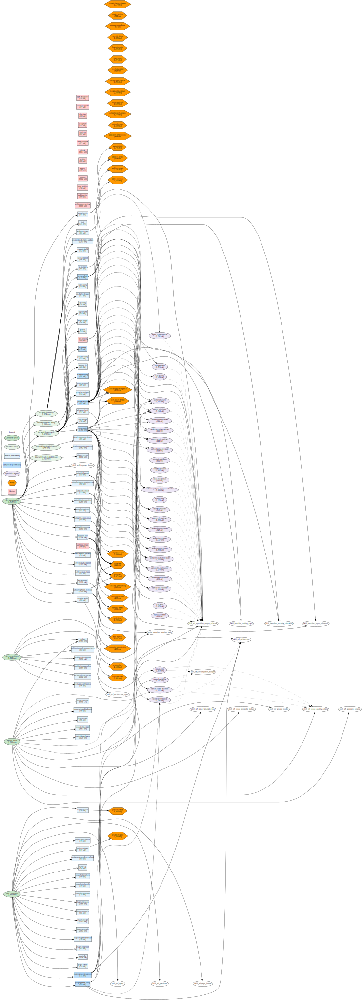
<!-- DEPS-GRAPH-END -->

<!-- DEPS-SUBGRAPHS-START -->
<details>
<summary>co-autopilot</summary>

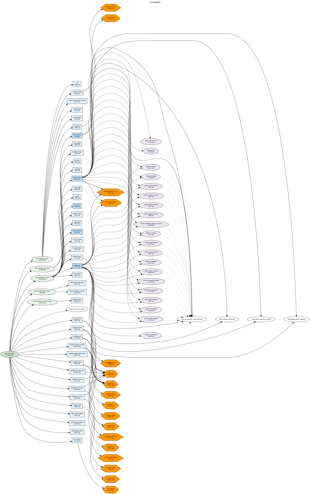
</details>

<details>
<summary>co-issue</summary>

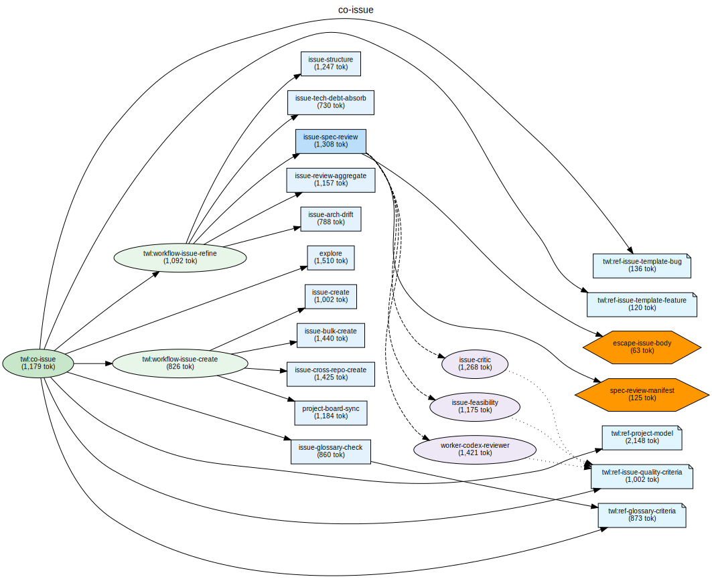
</details>

<details>
<summary>co-project</summary>

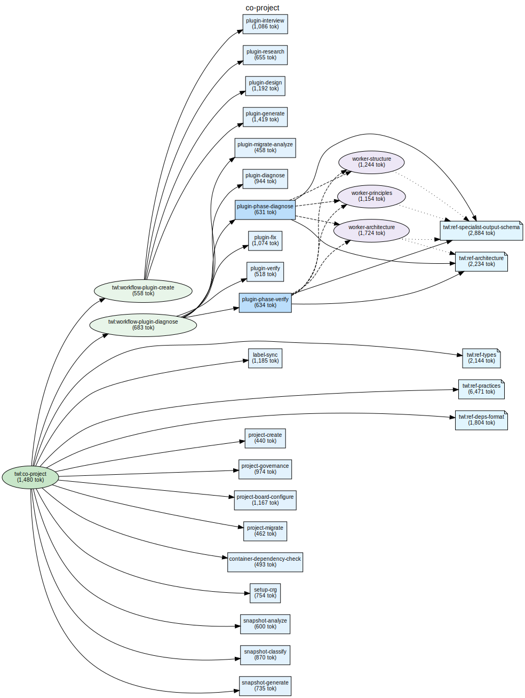
</details>

<details>
<summary>co-explore</summary>

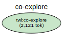
</details>

<details>
<summary>co-architect</summary>

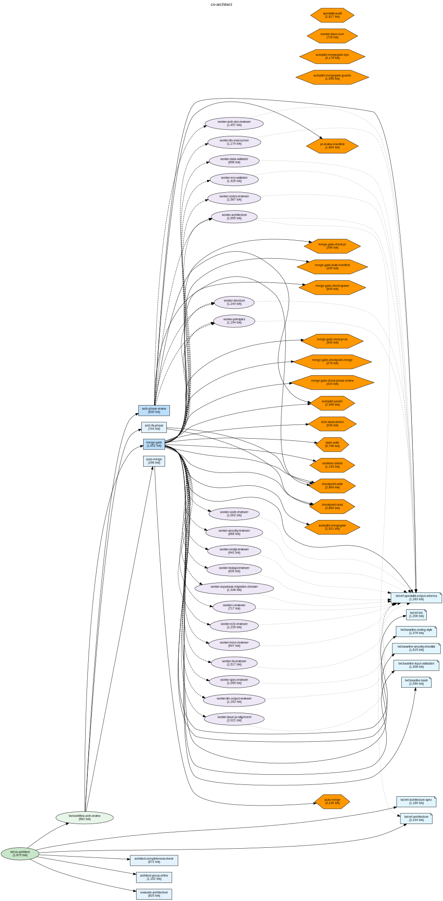
</details>

<details>
<summary>co-utility</summary>

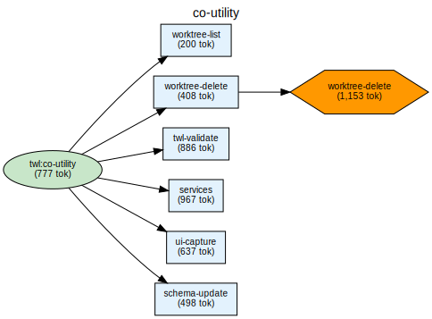
</details>

<details>
<summary>co-self-improve</summary>

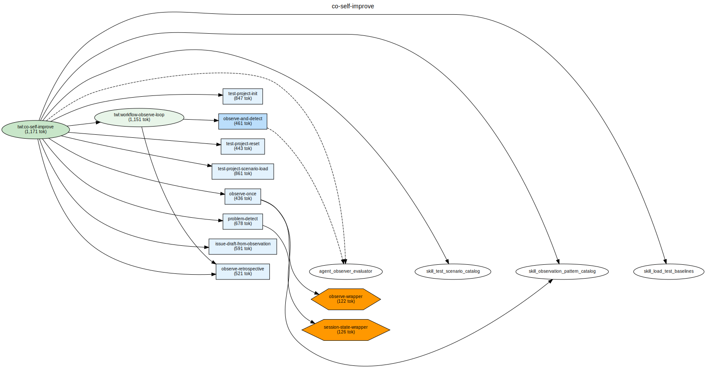
</details>

<details>
<summary>workflow-setup</summary>

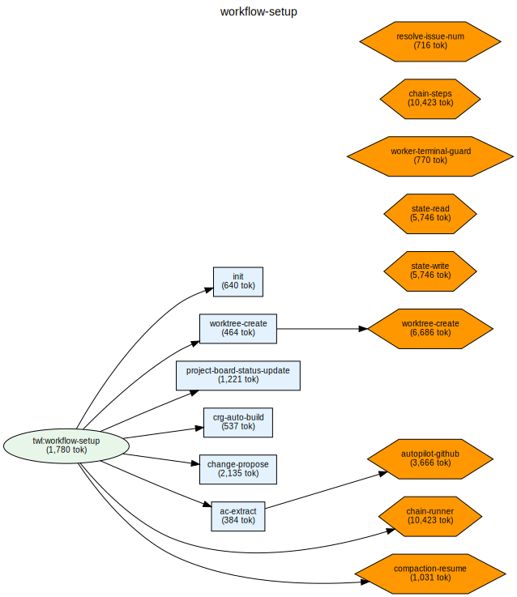
</details>

<details>
<summary>workflow-test-ready</summary>

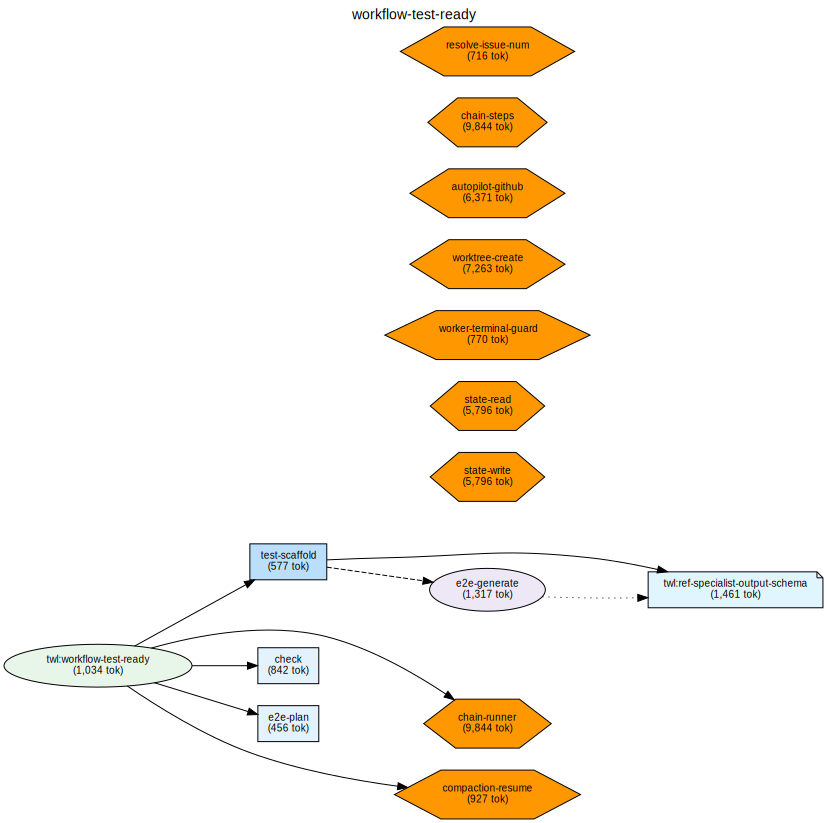
</details>

<details>
<summary>workflow-pr-verify</summary>

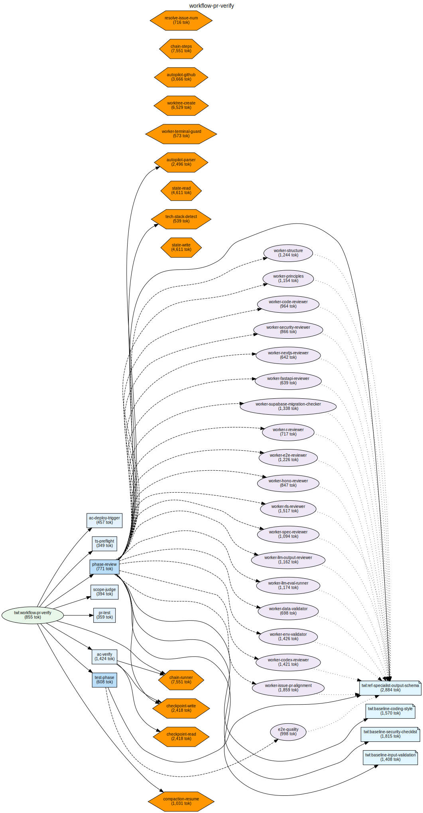
</details>

<details>
<summary>workflow-pr-fix</summary>

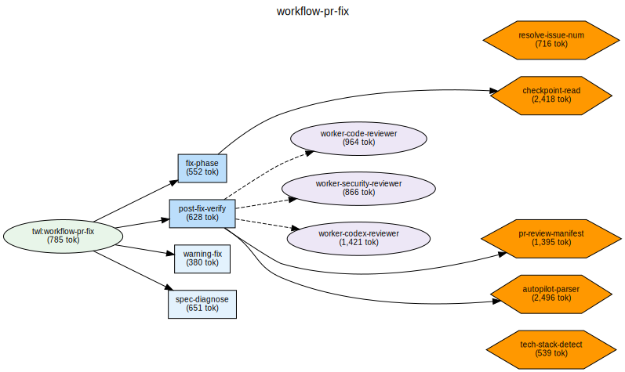
</details>

<details>
<summary>workflow-pr-merge</summary>

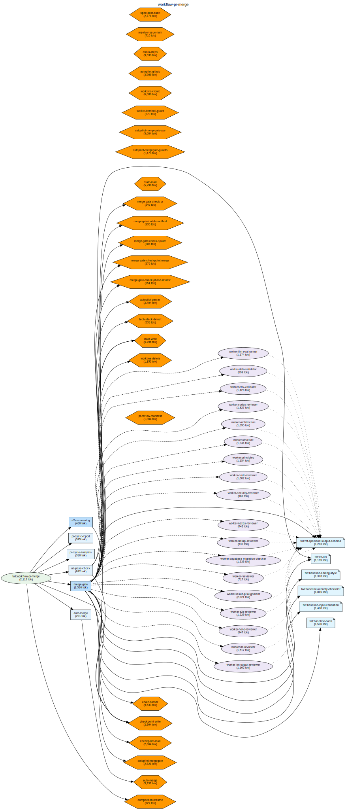
</details>

<details>
<summary>workflow-dead-cleanup</summary>

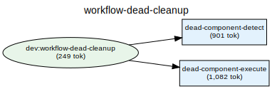
</details>

<details>
<summary>workflow-tech-debt-triage</summary>

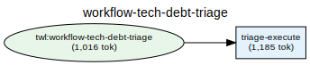
</details>

<details>
<summary>workflow-self-improve</summary>

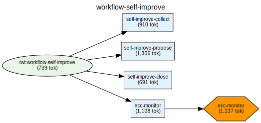
</details>

<details>
<summary>workflow-observe-loop</summary>

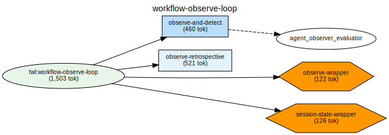
</details>

<details>
<summary>workflow-plugin-create</summary>

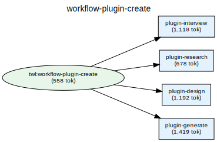
</details>

<details>
<summary>workflow-plugin-diagnose</summary>

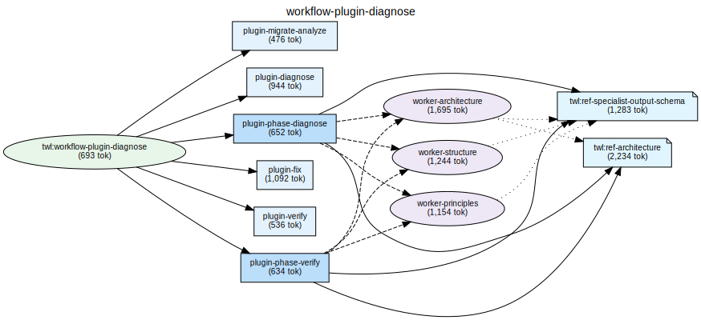
</details>

<details>
<summary>workflow-prompt-audit</summary>

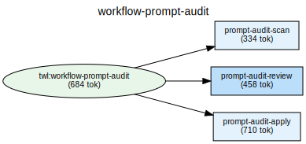
</details>

<details>
<summary>workflow-issue-lifecycle</summary>

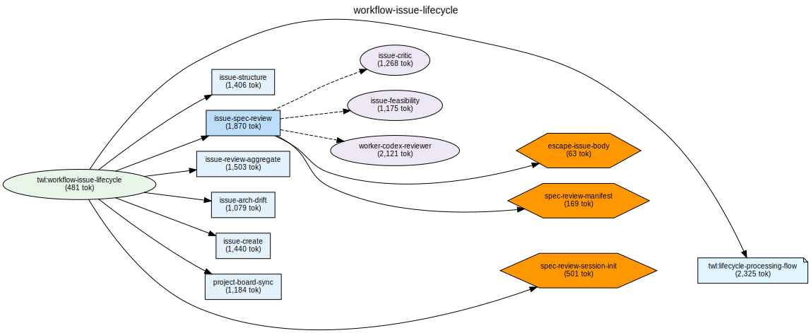
</details>

<details>
<summary>workflow-issue-refine</summary>

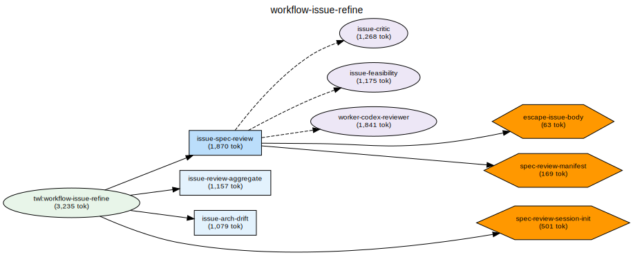
</details>

<details>
<summary>workflow-arch-review</summary>

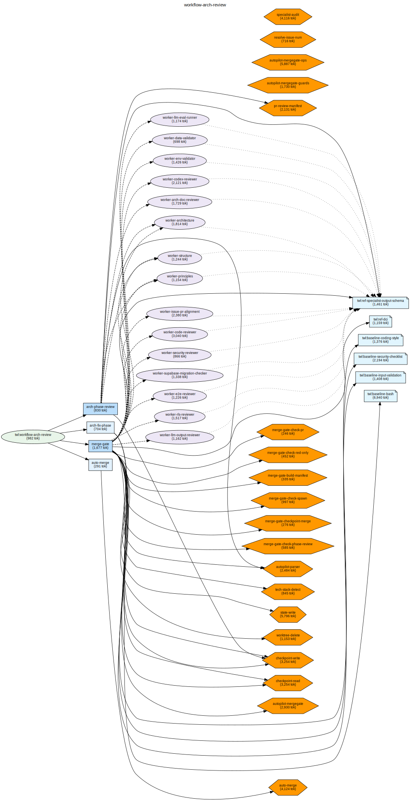
</details>
<!-- DEPS-SUBGRAPHS-END -->
