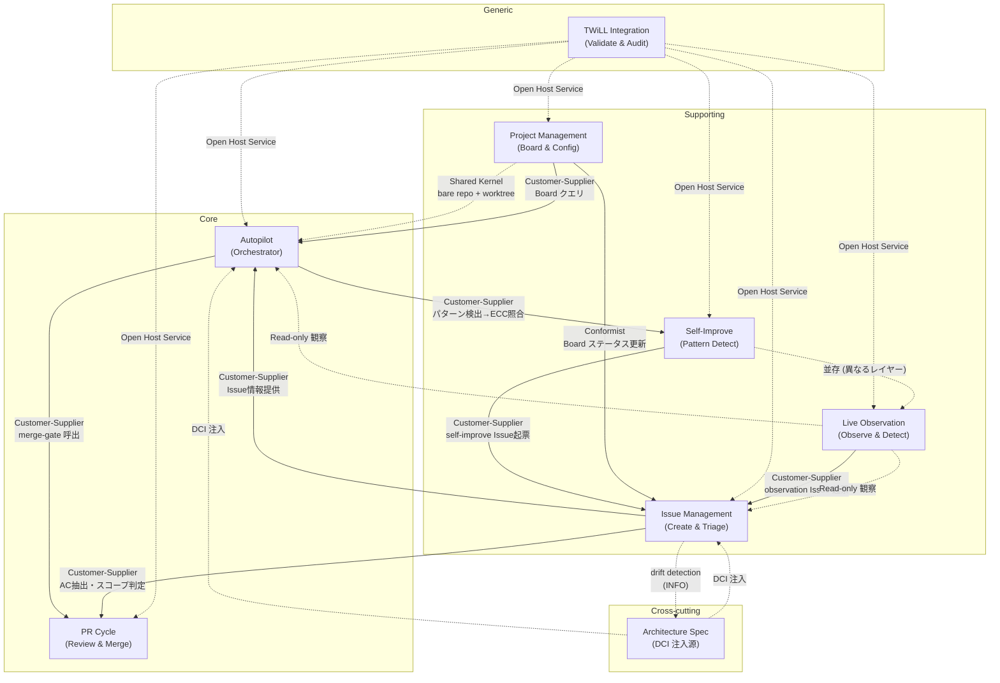
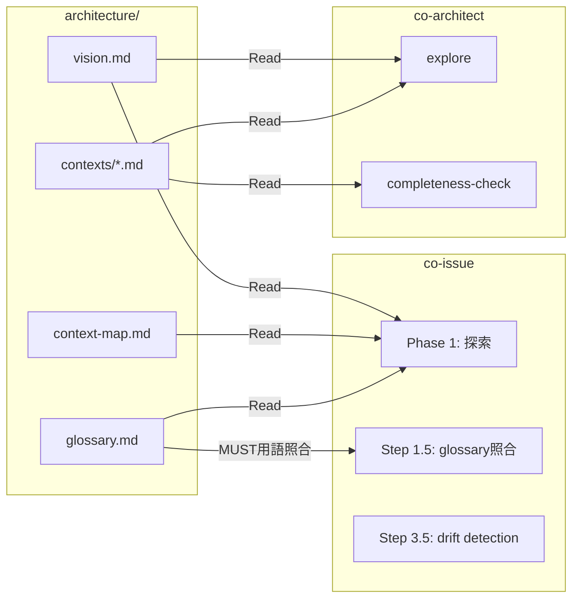

# Context Map

## 概要

7 Bounded Context 間の依存関係を定義する。

## Context 分類

| 種類 | Context | 役割 |
|------|---------|------|
| Core | Autopilot | セッション管理、Phase実行、計画生成のオーケストレーター |
| Core | PR Cycle | レビュー、テスト、マージの品質ゲート |
| Supporting | Issue Management | Issue作成、トリアージ、精緻化、クロスリポ分割 |
| Supporting | Project Management | プロジェクト作成、移行、Project Board 管理 |
| Supporting | Self-Improve | パターン検出、ECC照合、セッション監査 |
| Supporting | Live Observation | Observer/Observed セッション分離による能動的 self-improvement とテストプロジェクト管理 |
| Generic | TWiLL Integration | twl CLI連携、validate/audit/chain、CRG |

## 依存関係図

## 関係の詳細

| Upstream | Downstream | パターン | インターフェース |
|----------|-----------|---------|--------------|
| Autopilot | PR Cycle | Customer-Supplier | Contract: contracts/autopilot-pr-cycle.md |
| Autopilot | Self-Improve | Customer-Supplier | session.json patterns → ECC照合 |
| Issue Mgmt | Autopilot | Customer-Supplier | gh issue view による Issue 情報取得 |
| Issue Mgmt | PR Cycle | Customer-Supplier | ac-extract による AC 抽出 |
| Self-Improve | Issue Mgmt | Customer-Supplier | self-improve Issue 起票 |
| Project Mgmt | Issue Mgmt | Conformist | Board ステータス更新 |
| Project Mgmt | Autopilot | Customer-Supplier | Board クエリ（Status=Todo の Issue 選択） |
| Project Mgmt | Autopilot | Shared Kernel | bare repo + worktree 構造 |
| TWiLL Integration | 全 Context | Open Host Service | validate/audit/chain 結果 |
| Architecture Spec | Issue Mgmt | DCI | vision.md, context-map.md, glossary.md を Read |
| Issue Mgmt | Architecture Spec | Drift Detection | Step 3.5 で architecture 影響を検出し co-architect を提案（INFO） |
| Architecture Spec | Autopilot | DCI | co-architect 経由で設計意図参照 |
| Live Observation | Issue Mgmt | Customer-Supplier | observation Issue 起票（label: from-observation） |
| Live Observation | Autopilot | Read-only 観察 | tmux capture-pane による Worker 出力取得 |
| Live Observation | Issue Mgmt | Read-only 観察 | テストプロジェクト Issue の状態参照 |
| Self-Improve | Live Observation | 並存 | 受動 retrospective と能動 observation の補完関係（ADR-011） |

## Architecture Spec の DCI フロー

    S35 -.->|"INFO: arch影響検出"| V

**更新トリガー**: architecture spec の内容に影響する変更（新概念の追加、Context 境界の変更、設計判断の変更）が発生した場合、co-architect 経由で spec を更新する。co-issue の Step 3.5 drift detection がこのトリガーの早期検知を支援する。
