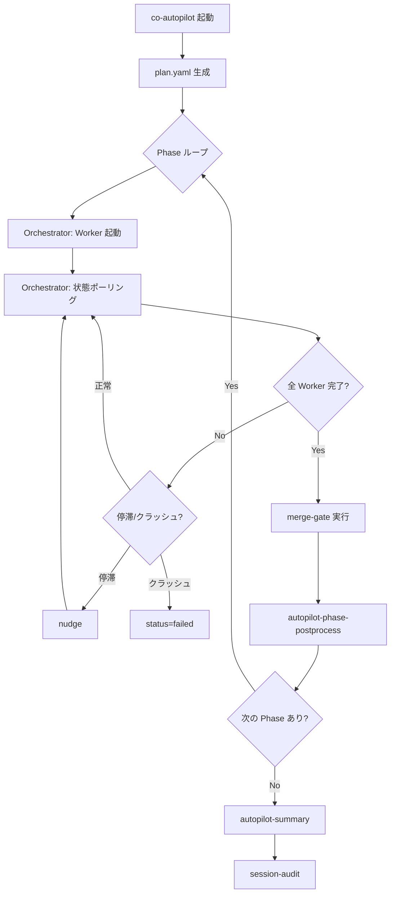
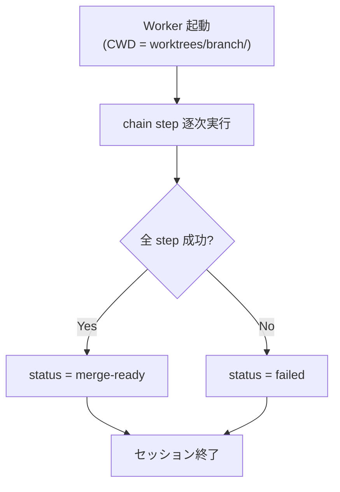
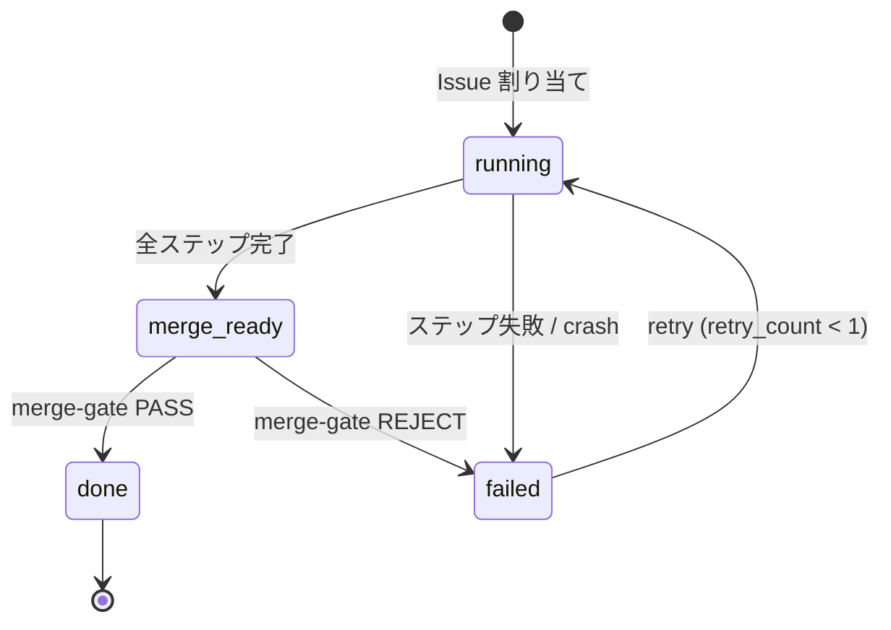

# Autopilot

## Responsibility

セッション管理、Phase 実行、計画生成、cross-issue 影響分析、パターン検出。
Issue の実装は常に co-autopilot 経由で行い（Autopilot-first 原則）、**Orchestrator** が Worker の起動・監視・マージ判定を統括する。

## Key Entities

### SessionState (session.json)
per-autopilot-run の状態ファイル。

| フィールド | 型 | 説明 |
|---|---|---|
| session_id | string | セッション一意識別子 |
| plan_path | string | plan.yaml のパス |
| current_phase | number | 現在の Phase 番号 |
| phase_count | number | 全 Phase 数 |
| cross_issue_warnings | { issue, target_issue, file, reason }[] | cross-issue 警告 |
| phase_insights | { phase, insight, timestamp }[] | Phase 完了時の知見 |
| patterns | { [name]: { count, last_seen } } | 検出パターン集約 |
| self_improve_issues | number[] | 自己改善で起票された Issue 番号 |

### IssueState (issue-{N}.json)
per-issue の状態ファイル。

| フィールド | 型 | 説明 |
|---|---|---|
| issue | number | GitHub Issue 番号 |
| status | `running` \| `merge-ready` \| `done` \| `failed` | 現在の状態 |
| branch | string | worktree のブランチ名 |
| pr | null \| number | PR 番号 |
| window | string | tmux ウィンドウ名（例: `ap-#42`） |
| started_at | string (ISO 8601) | 開始時刻 |
| current_step | string | chain の現在ステップ名 |
| retry_count | number (0-1) | merge-gate リトライ回数 |
| fix_instructions | null \| string | fix-phase 用修正指示テキスト |
| merged_at | null \| string (ISO 8601) | マージ完了時刻 |
| files_changed | string[] | 変更されたファイルパス配列 |
| failure | null \| { message, step, timestamp } | 失敗情報 |

### AutopilotPlan (plan.yaml)
autopilot セッションの実行計画。

### Phase
plan.yaml 内の実行単位。

| フィールド | 型 | 説明 |
|---|---|---|
| number | number | Phase 番号（1-indexed） |
| issues | number[] | この Phase で並行実行する Issue 番号リスト |
| status | `pending` \| `running` \| `completed` \| `failed` | Phase の状態 |

### Orchestrator
Pilot 内の Issue 実行ループ管理コンポーネント。

| 機能 | 実装 | 説明 |
|------|------|------|
| Worktree 事前作成 | worktree-create.sh | Worker 起動前に Pilot が worktree を作成（不変条件 B） |
| Worker 起動 | autopilot-launch.sh | worktree ディレクトリで cld セッション開始（`--worktree-dir`） |
| 状態ポーリング | state-read.sh (10秒間隔) | issue-{N}.json の status を監視 |
| クラッシュ検知 | crash-detect.sh | tmux window 消失を検出 → status=failed |
| ヘルスチェック | health-check.sh | chain_stall（長時間停止）を検出 |
| nudge | session:session-state | 停滞 Worker へのプロンプト再注入 |
| クリーンアップ | autopilot-orchestrator.sh | merge-gate 成功後に tmux → worktree → remote branch を順次削除 |

## Key Workflows

### Autopilot セッションフロー

### Worker 実行フロー

Worker は Pilot が事前作成した worktree ディレクトリで cld セッションとして起動される。CWD リセットはセッション起動ディレクトリに戻るため、リセット後も正しいブランチで動作し続ける。

### 状態遷移

## Constraints

### 不変条件（10件）

| ID | 不変条件 | 概要 |
|----|----------|------|
| **A** | 状態の一意性 | issue-{N}.json の `status` は常に定義された遷移パスのみ許可 |
| **B** | Worktree ライフサイクル Pilot 専任（作成・削除ともに Pilot） | Worktree の作成・削除は Pilot が行う。Worker は使用のみ（ADR-008） |
| **C** | Worker マージ禁止 | Worker は `merge-ready` を宣言するのみ。マージは Pilot が実行 |
| **D** | 依存先 fail 時の skip 伝播 | Phase N で fail した Issue に依存する Issue は自動 skip |
| **E** | merge-gate リトライ制限 | リトライは最大1回。2回目リジェクト = 確定失敗 |
| **F** | merge 失敗時 rebase 禁止 | squash merge 失敗時は停止のみ |
| **G** | クラッシュ検知保証 | Worker の crash/timeout は必ず検知される |
| **H** | deps.yaml 変更排他性 | 同一 Phase 内で deps.yaml を変更する複数 Issue は separate Phase |
| **I** | 循環依存拒否 | plan.yaml 生成時に循環依存を検出した場合、拒否 |
| **J** | merge 前 base drift 検知 | merge-gate 実行前に origin/main に対する silent deletion を検知し、検出時は merge を停止する |

### 並行性の制約

- 同一プロジェクトでの複数 autopilot セッションの同時実行は禁止（session.json 存在チェック）
- issue-{N}.json は per-issue のため同一セッション内の複数 Issue 並行処理は安全
- Pilot = read only, Worker = write

## Rules

### Pilot / Worker 役割分担

**Pilot (CWD = main/)**:
- Issue 選択（**Project Board クエリ: Status=Todo**）
- Worktree 事前作成 + Worker 起動（worktree ディレクトリで cld セッション開始）
- Orchestrator による Worker 監視（ポーリング + health-check + crash-detect）
- merge-gate 実行（PR レビュー・テスト・判定）
- クリーンアップ（tmux window → worktree → remote branch 削除）

**Worker (CWD = worktrees/{branch}/)**:
- 実装（chain ステップの逐次実行）
- テスト実行
- `merge-ready` 宣言（issue-{N}.json の status 更新）

※ Worktree の作成・削除は Pilot 専任（不変条件 B）。Worker は Pilot が作成した worktree 内で起動される。

### Worktree ライフサイクル安全ルール

**鉄則: Worktree の作成・削除は Pilot (main/) が行う。Worker は使用のみ。**（不変条件 B、ADR-008）

| フェーズ | 実行者 | 操作 | CWD |
|----------|--------|------|-----|
| 作成 | Pilot | worktree-create.sh | main/ |
| Worker 起動 | Pilot | autopilot-launch.sh --worktree-dir | main/ → Worker(worktrees/{branch}/) |
| 使用 | Worker | chain ステップ逐次実行 | worktrees/{branch}/ |
| merge-ready 宣言 | Worker | status 更新 | worktrees/{branch}/ |
| merge-gate | Pilot | PR レビュー → squash merge | main/ |
| クリーンアップ | Pilot | tmux kill → worktree-delete → remote branch delete | main/ |

### IS_AUTOPILOT 判定（CWD 非依存）

Worker/Pilot の役割判定は state file ベースで行う。`git branch --show-current` への依存は defense in depth のフォールバックのみ。

| 優先度 | 判定方法 | 条件 |
|--------|---------|------|
| 1 | State file スキャン | `$AUTOPILOT_DIR/issues/issue-*.json` に `status=running` が存在 |
| 2 | フォールバック | `git branch --show-current` が feature ブランチパターンに一致 |

- `resolve_issue_num()` 関数が統一的な Issue 番号解決を提供
- 複数 running issue 時は最小番号を採用
- 壊れた JSON はスキップ（stderr に警告）

### Emergency Bypass

co-autopilot 障害時のみ手動パスを許可する。
- **許可条件**: co-autopilot 自体の障害、SKILL.md 自体の修正（bootstrap 問題）
- **義務**: retrospective で理由を記録する

### Controller 操作カテゴリ

| カテゴリ | 定義 | 該当 Controller |
|---|---|---|
| Implementation | コード変更・PR 作成を伴う操作 | co-autopilot のみ |
| Non-implementation | Issue 作成・設計・プロジェクト管理 | co-issue, co-project, co-architect |

## Component Mapping

| 種別 | コンポーネント | 役割 |
|------|--------------|------|
| **controller** | co-autopilot | Issue 群の自律実装オーケストレーター |
| **workflow** | workflow-setup | OpenSpec 提案 + テスト準備（worktree は Pilot が事前作成済み） |
| **workflow** | workflow-test-ready | テスト生成 + 準備確認 |
| **workflow** | workflow-pr-cycle | verify → review → test → fix → report |
| **atomic** | autopilot-init | セッション初期化 |
| **atomic** | autopilot-launch | Worker tmux window 起動 |
| **atomic** | autopilot-poll | 状態ポーリング（Orchestrator の核） |
| **atomic** | autopilot-phase-execute | 1 Phase 分の Issue ループ処理 |
| **atomic** | autopilot-phase-postprocess | Phase 後処理チェーン |
| **atomic** | autopilot-collect | 完了 Issue の変更ファイル収集 |
| **atomic** | autopilot-retrospective | Phase 振り返り・知見生成 |
| **atomic** | autopilot-patterns | パターン検出・self-improve Issue 起票 |
| **atomic** | autopilot-cross-issue | Cross-issue 影響分析 |
| **atomic** | autopilot-summary | サマリー + session-archive |
| **atomic** | session-audit | セッション JSONL 事後分析 |
| **composite** | merge-gate | PR レビュー → 判定 → merge |
| **script** | autopilot-init.sh | .autopilot/ ディレクトリ初期化 |
| **script** | autopilot-launch.sh | Worker tmux window + cld 起動 |
| **script** | state-read.sh | JSON 読み取り |
| **script** | state-write.sh | JSON 書き込み（遷移バリデーション付き） |
| **script** | crash-detect.sh | tmux window 消失検知 |
| **script** | health-check.sh | chain_stall 検知 |
| **script** | session-create.sh | session.json 新規作成 |
| **script** | session-archive.sh | セッション完了時のアーカイブ |
| **script** | worktree-create.sh | worktree + ブランチ作成 |
| **script** | worktree-delete.sh | worktree + ブランチ削除 |

## Design Principles

| ID | 設計原則 | 概要 | enforcement |
|----|----------|------|-------------|
| **P1** | Pilot 能動評価の atomic 経由限定 | Pilot による PR diff / Issue body 能動評価は autopilot-pilot-* atomic を経由した場合のみ推奨。SKILL.md への直接記述による責務拡大は避ける | ADR-010 参照 + コードレビュー時の人手チェック |

## Dependencies

- **Downstream -> PR Cycle**: merge-gate を呼び出してマージ判定。Contract: contracts/autopilot-pr-cycle.md
- **Upstream <- Issue Management**: Issue 情報を取得（gh issue view）
- **Upstream <- Project Management**: Board クエリで Issue 選択、Board ステータス更新
- **Downstream -> Self-Improve**: パターン検出時に ECC 照合（session.json patterns）
- **Shared Kernel <- Project Management**: bare repo + worktree 構造を共有
