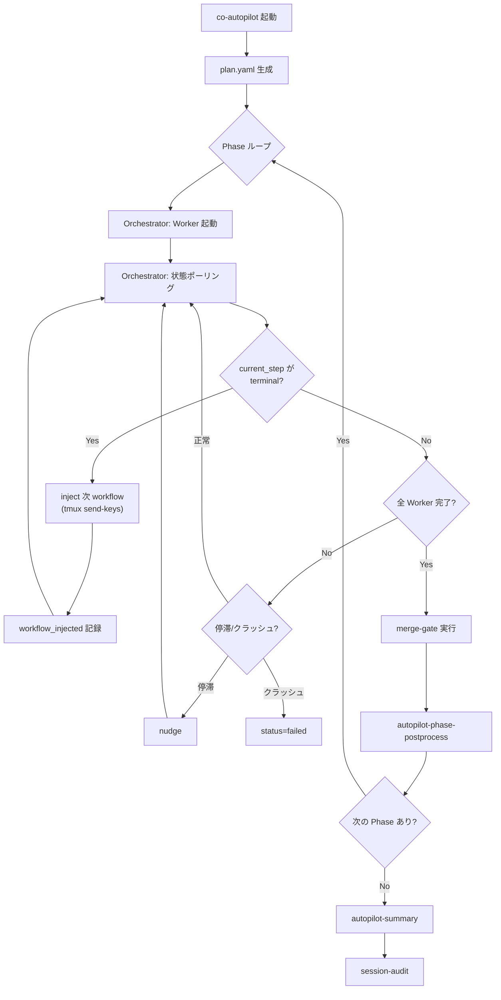
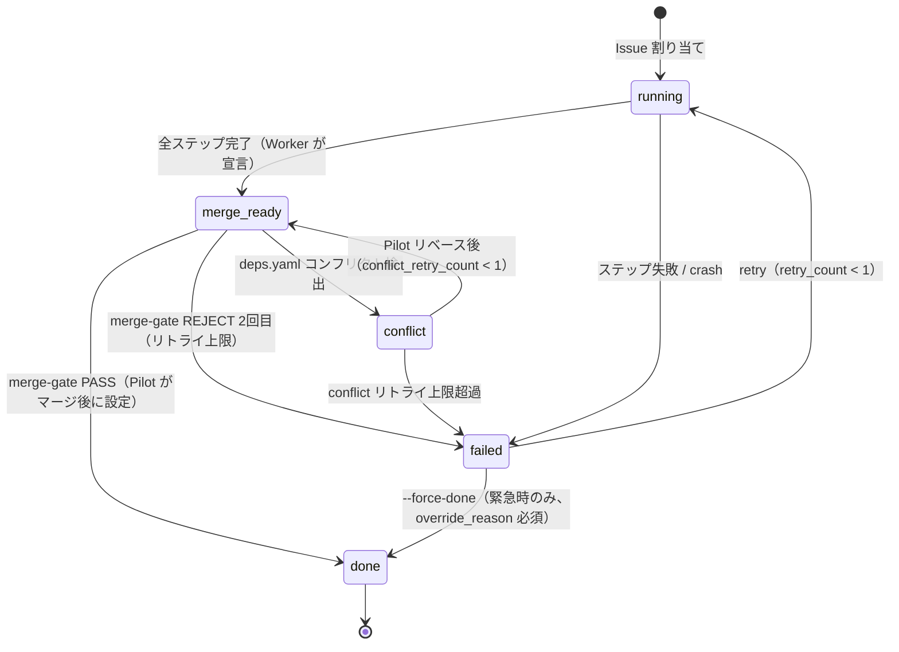

# Autopilot

## Responsibility

セッション管理、Phase 実行、計画生成、cross-issue 影響分析、パターン検出。
Issue の実装は常に co-autopilot 経由で行い（Autopilot-first 原則）、**Orchestrator** が Worker の起動・監視・マージ判定を統括する。

## Key Entities

### SessionState (session.json)
per-autopilot-run の状態ファイル。

| フィールド | 型 | 説明 |
|---|---|---|
| session_id | string | セッション一意識別子 |
| plan_path | string | plan.yaml のパス |
| current_phase | number | 現在の Phase 番号 |
| phase_count | number | 全 Phase 数 |
| cross_issue_warnings | { issue, target_issue, file, reason }[] | cross-issue 警告 |
| phase_insights | { phase, insight, timestamp }[] | Phase 完了時の知見 |
| patterns | { [name]: { count, last_seen } } | 検出パターン集約 |
| self_improve_issues | number[] | 自己改善で起票された Issue 番号 |

### IssueState (issue-{N}.json)
per-issue の状態ファイル。

| フィールド | 型 | 説明 |
|---|---|---|
| issue | number | GitHub Issue 番号 |
| status | `running` \| `merge-ready` \| `done` \| `failed` \| `conflict` | **SSOT**: 外部観察者（Monitor/su-observer）が参照する唯一の進捗フィールド |
| branch | string | worktree のブランチ名 |
| pr | null \| number | PR 番号 |
| window | string | tmux ウィンドウ名（例: `ap-#42`） |
| started_at | string (ISO 8601) | 開始時刻 |
| current_step | string | chain の現在ステップ名。Orchestrator が inject トリガー判定に使用（内部フィールド） |
| retry_count | number (0-1) | merge-gate リトライ回数 |
| fix_instructions | null \| string | fix-phase 用修正指示テキスト |
| merged_at | null \| string (ISO 8601) | マージ完了時刻 |
| files_changed | string[] | 変更されたファイルパス配列 |
| failure | null \| { message, step, timestamp } | 失敗情報 |

> **SSOT ルール（ADR-018）**: 外部観察者は `status` のみを参照する。`current_step` は orchestrator inject 機構の内部フィールド。Monitor は `jq -r '.status' issue-N.json` 単一クエリで進捗判定できる。

### AutopilotPlan (plan.yaml)
autopilot セッションの実行計画。

### Phase
plan.yaml 内の実行単位。

| フィールド | 型 | 説明 |
|---|---|---|
| number | number | Phase 番号（1-indexed） |
| issues | number[] | この Phase で並行実行する Issue 番号リスト |
| status | `pending` \| `running` \| `completed` \| `failed` | Phase の状態 |

### Orchestrator
Pilot 内の Issue 実行ループ管理コンポーネント。

| 機能 | 実装 | 説明 |
|------|------|------|
| Worktree 事前作成 | worktree-create.sh | Worker 起動前に Pilot が worktree を作成（不変条件 B） |
| Worker 起動 | autopilot-launch.sh | worktree ディレクトリで cld セッション開始（`--worktree-dir`） |
| 状態ポーリング | state-read.sh (10秒間隔) | issue-{N}.json の status を監視 |
| クラッシュ検知 | crash-detect.sh | tmux window 消失を検出 → status=failed |
| ヘルスチェック | health-check.sh | chain_stall（長時間停止）を検出 |
| nudge | session:session-state | 停滞 Worker へのプロンプト再注入 |
| クリーンアップ | autopilot-orchestrator.sh | merge-gate 成功後に tmux → worktree → remote branch を順次削除 |

## Key Workflows

### Autopilot セッションフロー



### Worker 実行フロー

```mermaid
flowchart TD

    subgraph setup["setup chain"]
        setup__init["init"]:::script
        setup__project_board_status_update["project-board-status-update"]:::script
        setup__crg_auto_build["crg-auto-build"]:::llm
        setup__arch_ref["arch-ref"]:::script
        setup__ac_extract["ac-extract"]:::script
    end

    subgraph test_ready["test-ready chain"]
        test_ready__test_scaffold["test-scaffold"]:::llm
        test_ready__check["check"]:::script
    end

    subgraph pr_verify["pr-verify chain"]
        pr_verify__prompt_compliance["prompt-compliance"]:::script
        pr_verify__ts_preflight["ts-preflight"]:::script
        pr_verify__phase_review["phase-review"]:::llm
        pr_verify__scope_judge["scope-judge"]:::llm
        pr_verify__pr_test["pr-test"]:::script
        pr_verify__ac_verify["ac-verify"]:::llm
    end

    subgraph pr_fix["pr-fix chain"]
        pr_fix__fix_phase["fix-phase"]:::llm
        pr_fix__post_fix_verify["post-fix-verify"]:::llm
        pr_fix__warning_fix["warning-fix"]:::llm
    end

    subgraph pr_merge["pr-merge chain"]
        pr_merge__e2e_screening["e2e-screening"]:::llm
        pr_merge__pr_cycle_report["pr-cycle-report"]:::script
        pr_merge__pr_cycle_analysis["pr-cycle-analysis"]:::llm
        pr_merge__all_pass_check["all-pass-check"]:::script
        pr_merge__merge_gate["merge-gate"]:::llm
        pr_merge__auto_merge["auto-merge"]:::script
    end

    setup__init --> setup__project_board_status_update
    setup__project_board_status_update --> setup__crg_auto_build
    setup__crg_auto_build --> setup__arch_ref
    setup__arch_ref --> setup__ac_extract
    test_ready__test_scaffold --> test_ready__check
    pr_verify__prompt_compliance --> pr_verify__ts_preflight
    pr_verify__ts_preflight --> pr_verify__phase_review
    pr_verify__phase_review --> pr_verify__scope_judge
    pr_verify__scope_judge --> pr_verify__pr_test
    pr_verify__pr_test --> pr_verify__ac_verify
    pr_fix__fix_phase --> pr_fix__post_fix_verify
    pr_fix__post_fix_verify --> pr_fix__warning_fix
    pr_merge__e2e_screening --> pr_merge__pr_cycle_report
    pr_merge__pr_cycle_report --> pr_merge__pr_cycle_analysis
    pr_merge__pr_cycle_analysis --> pr_merge__all_pass_check
    pr_merge__all_pass_check --> pr_merge__merge_gate
    pr_merge__merge_gate --> pr_merge__auto_merge

    setup__ac_extract -->|"Pilot inject"| test_ready__test_scaffold
    test_ready__check -->|"Pilot inject"| pr_verify__prompt_compliance
    pr_verify__ac_verify -->|"Pilot inject"| pr_fix__fix_phase
    pr_fix__warning_fix -->|"Pilot inject"| pr_merge__e2e_screening

    classDef script fill:#2e7d32,stroke:#1b5e20,color:#ffffff
    classDef llm fill:#1565c0,stroke:#0d47a1,color:#ffffff
    classDef composite fill:#7b1fa2,stroke:#4a148c,color:#ffffff
    classDef marker fill:#616161,stroke:#424242,color:#ffffff
```

<!-- CHAIN-FLOW:all START -->

<!-- CHAIN-FLOW:all END -->

Worker は Pilot が事前作成した worktree ディレクトリで cld セッションとして起動される。CWD リセットはセッション起動ディレクトリに戻るため、リセット後も正しいブランチで動作し続ける。

### 状態遷移

外部観察者は `status` フィールドを唯一の参照元として使用する（ADR-018）。



**status 値の意味:**

| status | 意味 | 書き込み責任者 |
|--------|------|--------------|
| `running` | Issue 実装中（Worker が chain を実行） | Worker（init 時）|
| `merge-ready` | PR 準備完了（merge-gate 待ち） | Worker（chain-runner.sh `step_all_pass_check`）|
| `done` | マージ完了 | Pilot（merge-gate 成功後）|
| `failed` | 失敗（ステップエラー / crash / merge-gate REJECT） | Worker または Pilot |
| `conflict` | deps.yaml コンフリクト検出（Pilot リベース待ち） | Pilot |

**Monitor での判定方法:**
```bash
status=$(jq -r '.status // "null"' issue-N.json)
# STAGNATE 抑制: merge-ready / done / conflict は正常待機または終端
[[ "$status" == "merge-ready" || "$status" == "done" || "$status" == "conflict" ]] && skip_stagnate=1
```

> **再発防止メモ（#744 修正済み）**: `inject_next_workflow()` が `pr-merge` を resolve した場合、inject をスキップして `merge-gate` に委譲する分岐が存在していたが、`status=merge-ready` が成立していない状態（Worker chain が `warning-fix` terminal で停止中）ではこのスキップが deadlock を引き起こしていた（#744）。この分岐は削除済み。`/twl:workflow-pr-merge` は通常の inject 経路（allow-list regex `^/twl:workflow-[a-z][a-z0-9-]*$`）を通じて inject される。`merge-ready` の書き込みは `chain-runner.sh` の `step_all_pass_check` PASS 分岐が行い、その後 orchestrator が `run_merge_gate` を起動する設計は変わらない。
>
> **ADR-018 相互参照**: `workflow_done` フィールドの廃止は ADR-018 で決定されたが、`chain-runner.sh:step_all_pass_check` の `workflow_done=pr-merge` 書き込みは本ドキュメント更新時点で未移行のまま残存している。orchestrator 側コメント（旧 L931「workflow_done クリア不要」）は ADR-018 後の状態を前提としているが、chain-runner 側は未移行。この不整合は #744 スコープ外として別途 Issue 化する。

## Constraints

### 不変条件（13件）

不変条件 A-M の正典定義は [`refs/ref-invariants.md`](../../refs/ref-invariants.md) を参照。

### 並行性の制約

- 同一プロジェクトでの複数 autopilot セッションの同時実行は禁止（session.json 存在チェック）
- issue-{N}.json は per-issue のため同一セッション内の複数 Issue 並行処理は安全
- Pilot = read only, Worker = write

### 実行制約

- **制約 AP-1**: plan.yaml を独自生成してはならない（SHALL）。`autopilot-plan.sh` に委譲すること
- **制約 AP-2**: Emergency Bypass 条件を除き、trivial change であっても co-autopilot を bypass してはならない（SHALL）

## Rules

### Pilot / Worker 役割分担

**Pilot (CWD = main/)**:
- Issue 選択（**Project Board クエリ: Status=Todo または Status=Refined**）。Phase B 以降は Status=Refined の Issue のみを選択予定（Phase 1 はクエリ据え置き、launcher gate で enforce）
- Worktree 事前作成 + Worker 起動（worktree ディレクトリで cld セッション開始）
- Orchestrator による Worker 監視（ポーリング + health-check + crash-detect）
- merge-gate 実行（PR レビュー・テスト・判定）
- クリーンアップ（tmux window → worktree → remote branch 削除）

**Worker (CWD = worktrees/{branch}/)**:
- 実装（chain ステップの逐次実行）
- テスト実行
- `merge-ready` 宣言（issue-{N}.json の status 更新）

※ Worktree の作成・削除は Pilot 専任（不変条件 B）。Worker は Pilot が作成した worktree 内で起動される。

### Worktree ライフサイクル安全ルール

**鉄則: Worktree の作成・削除は Pilot (main/) が行う。Worker は使用のみ。**（不変条件 B、ADR-008）

| フェーズ | 実行者 | 操作 | CWD |
|----------|--------|------|-----|
| 作成 | Pilot | worktree-create.sh | main/ |
| Worker 起動 | Pilot | autopilot-launch.sh --worktree-dir | main/ → Worker(worktrees/{branch}/) |
| 使用 | Worker | chain ステップ逐次実行 | worktrees/{branch}/ |
| merge-ready 宣言 | Worker | status 更新 | worktrees/{branch}/ |
| merge-gate | Pilot | PR レビュー → squash merge | main/ |
| クリーンアップ | Pilot | tmux kill → worktree-delete → remote branch delete | main/ |

### IS_AUTOPILOT 判定（CWD 非依存）

Worker/Pilot の役割判定は state file ベースで行う。`git branch --show-current` への依存は defense in depth のフォールバックのみ。

| 優先度 | 判定方法 | 条件 |
|--------|---------|------|
| 1 | State file スキャン | `$AUTOPILOT_DIR/issues/issue-*.json` に `status=running` が存在 |
| 2 | フォールバック | `git branch --show-current` が feature ブランチパターンに一致 |

- `resolve_issue_num()` 関数が統一的な Issue 番号解決を提供
- 複数 running issue 時は最小番号を採用
- 壊れた JSON はスキップ（stderr に警告）

### Emergency Bypass

co-autopilot 障害時のみ手動パスを許可する。
- **許可条件**: co-autopilot 自体の障害、SKILL.md 自体の修正（bootstrap 問題）
- **義務**: retrospective で理由を記録する

### Controller 操作カテゴリ

| カテゴリ | 定義 | 該当 Controller |
|---|---|---|
| Implementation | コード変更・PR 作成を伴う操作 | co-autopilot のみ |
| Non-implementation | Issue 作成・設計・プロジェクト管理 | co-issue, co-project |
| Spec Implementation | アーキテクチャドキュメント・ADR の直接 Write・コミット・PR 作成 | co-architect |

## State Management

### AUTOPILOT_DIR — state file ディレクトリの SSOT

`AUTOPILOT_DIR` は state file ディレクトリの Single Source of Truth（SSOT）。

**デフォルト値**: `$PROJECT_ROOT/.autopilot/`（`autopilot-init.sh` L9 で確立: `AUTOPILOT_DIR="${AUTOPILOT_DIR:-$PROJECT_ROOT/.autopilot}"`）

**MUST**: `AUTOPILOT_DIR` は orchestrator 起動前に必ず `export` すること。未設定のまま Pilot や Worker が `python3 -m twl.autopilot.state` を実行すると、bare sibling 構成（`twill/.autopilot/`）で main worktree 配下（`twill/main/.autopilot/`）を参照してしまい state file が見つからないエラーになる場合がある（Issue #470）。

**override 方法**: 起動前に `export AUTOPILOT_DIR=/custom/path` を設定する。test-target worktree での隔離実行（`AUTOPILOT_DIR=/tmp/test-autopilot`）など、main worktree の `.autopilot/` を汚染しない実行に使用する。

**Pilot→Worker env 継承経路**: `autopilot-launch.sh` が `--autopilot-dir DIR` を受け取り（L84）、`AUTOPILOT_ENV="AUTOPILOT_DIR=${QUOTED_AUTOPILOT_DIR}"`（L309）を構築して `env AUTOPILOT_DIR=... cld ...`（L365-366）として Worker プロセスに渡す。Worker は `AUTOPILOT_DIR` を直接 export された状態で起動するため、`state read/write` が同一ディレクトリを参照する。

**SSOT から導出されるパス**（`autopilot-init.sh` L10-12）:
```bash
ISSUES_DIR="$AUTOPILOT_DIR/issues"
ARCHIVE_DIR="$AUTOPILOT_DIR/archive"
SESSION_FILE="$AUTOPILOT_DIR/session.json"
```

#### Multi-instance support

Wave 並列実行のため、複数の AUTOPILOT_DIR を同時に使用できる（#1169）。

**命名規則**: `.autopilot-<suffix>` パターンを canonical とする。`<suffix>` は `[a-z0-9_-]{1,32}` の長さ制限付き。

**basename 検証 regex**: `^\.autopilot(-[a-z0-9_-]{1,32})?$`（`chain-runner.sh` L185-191）。`.autopilot`、`.autopilot-wave10`、`.autopilot-test_isolation` を許可。`.AUTOPILOT-WAVE10`（大文字）、`.autopilot-`（trailing hyphen）、`.autopilot-aaa...`（33 文字以上）を拒否。

**並列実行例（Wave N と Wave N+1 が同居）**:
```bash
export AUTOPILOT_DIR="${PROJECT_ROOT}/.autopilot-wave-10"
bash autopilot-init.sh  # .autopilot-wave-10/ を初期化

# 別ターミナルで Wave N+1
export AUTOPILOT_DIR="${PROJECT_ROOT}/.autopilot-wave-11"
bash autopilot-init.sh  # .autopilot-wave-11/ を独立初期化
```

**cleanup ライフサイクル**: Wave 完了後の `.autopilot-*/` は自動削除されない。手動 `rm -rf "${PROJECT_ROOT}/.autopilot-wave-10"` または archive 移動が必要。デフォルト `.autopilot/` が持つ `archive/<session_id>/` 自動 archive 機構（`autopilot-cleanup.sh`）は `.autopilot-*/` には適用されない（別 Issue で対応予定）。

### Orchestrator 環境変数

orchestrator（`inject-next-workflow.sh` 含む）の動作を制御する環境変数一覧:

| 変数 | デフォルト | 説明 |
|------|-----------|------|
| `AUTOPILOT_STAGNATE_SEC` | `1800` | stagnate 検知しきい値（秒）。RESOLVE_FAIL_COUNT が累積した経過時間がこれを超えると WARN を発出 |
| `AUTOPILOT_STAGNATE_WARN_INTERVAL_SEC` | `60` | stagnate WARN の rate limit 間隔（秒）。WARN を emit してからこの秒数が経過するまで次の WARN を suppress する。trace log は rate limit に関わらず常に記録される（Issue #1177） |
| `POLL_INTERVAL` | `10` | orchestrator ポーリング間隔（秒）|

## Recovery Procedures

orchestrator が停止して chain 遷移が行われない場合、以下の正規手順のみ許可される（不変条件 M）:

### 1. orchestrator 再起動

```bash
# trace ログで停止確認（session_id 付き命名規則: orchestrator-phase-${N}-${SESSION_ID}.log）
tail -20 "${AUTOPILOT_DIR}/trace/orchestrator-phase-${PHASE_NUM}"-*.log 2>/dev/null | tail -20

# orchestrator を nohup で再起動
mkdir -p "${AUTOPILOT_DIR}/trace"
SESSION_ID=$(jq -r '.session_id // "unknown"' "${AUTOPILOT_DIR}/session.json" 2>/dev/null || echo "unknown")
nohup bash "${CLAUDE_PLUGIN_ROOT}/scripts/autopilot-orchestrator.sh" \
  --plan "${AUTOPILOT_DIR}/plan.yaml" \
  --phase "$PHASE_NUM" \
  --session "${AUTOPILOT_DIR}/session.json" \
  --project-dir "$PROJECT_DIR" \
  --autopilot-dir "$AUTOPILOT_DIR" \
  >> "${AUTOPILOT_DIR}/trace/orchestrator-phase-${PHASE_NUM}-${SESSION_ID}.log" 2>&1 &
disown
```

### 2. Pilot 自動 inject（orchestrator unavailable 時のみ許可）

**[#1128 追加]** orchestrator unavailable 時（BUDGET-LOW kill 後等）に限り、Pilot が `pilot-fallback-monitor.sh` を介して Worker chain advancement を自動 inject することを許可する（不変条件 M の明文化）:

```bash
# orchestrator unavailable を確認してから起動
bash plugins/twl/scripts/pilot-fallback-monitor.sh &
# orchestrator 復活を検知して自動停止する
```

**許容範囲**:
- `session-comm.sh inject <window> "/twl:workflow-X"` による **chain 復旧** inject のみ
- `X` は `resolve_next_workflow --issue N` で決定（allow-list: `/twl:workflow-[a-z][a-z0-9-]*`）
- PR MERGED 後の Worker window `tmux kill-window`（SLA: 30s 以内）

**引き続き禁止（不変条件 M）**:
- Pilot が Worker に直接 nudge して PR 作成 → マージを実行すること
- chain を迂回した PR 作成（specialist review スキップ）

### 3. 手動 workflow inject（Pilot 自動化の最終 fallback）

`pilot-fallback-monitor.sh` が動作しない場合のみ、observer または Pilot が手動で inject する:

```bash
# Worker の current_step から次 workflow を解決（ADR-018: current_step terminal 検知ベース）
python3 -m twl.autopilot.resolve_next_workflow --issue <ISSUE_NUM>

# session-comm.sh で inject（推奨）
bash plugins/session/scripts/session-comm.sh inject "<WORKER_WINDOW>" "/twl:workflow-test-ready"

# tmux 直接 inject（session-comm.sh 不使用時のみ）
tmux send-keys -t "<WORKER_WINDOW>" "/twl:workflow-test-ready" Enter
```

**禁止**: Pilot が Worker に直接 nudge して PR 作成 → マージを実行すること（不変条件 M）。chain を迂回した PR 作成は specialist review スキップを引き起こす。

## Component Mapping

| 種別 | コンポーネント | 役割 |
|------|--------------|------|
| **controller** | co-autopilot | Issue 群の自律実装オーケストレーター |
| **workflow** | workflow-setup | 開発準備（AC 抽出・arch-ref まで）（worktree は Pilot が事前作成済み） |
| **workflow** | workflow-test-ready | テスト生成 + 準備確認 |
| **workflow** | workflow-pr-verify | PR 検証（preflight → review → scope → test） |
| **workflow** | workflow-pr-fix | PR 修正（fix → post-fix-verify → warning-fix） |
| **workflow** | workflow-pr-merge | PRマージ（e2e → report → analysis → check → merge） |
| **atomic** | autopilot-pilot-wakeup-bootstrap | orchestrator 起動 one-shot: nohup/disown + HOTFIX #732 絶対パス保持 |
| **atomic** | autopilot-pilot-wakeup-poll | PHASE_COMPLETE 検知ループ: ScheduleWakeup(300)・stagnation 検知・状況精査モード |
| **atomic** | autopilot-pilot-wakeup-heartbeat | Silence heartbeat: 5 分沈黙検知・input-waiting パターン検査・su-observer escalate |
| **atomic** | autopilot-init | セッション初期化 |
| **atomic** | autopilot-launch | Worker tmux window 起動 |
| **atomic** | autopilot-poll | 状態ポーリング（Orchestrator の核） |
| **atomic** | autopilot-phase-execute | 1 Phase 分の Issue ループ処理 |
| **atomic** | autopilot-phase-postprocess | Phase 後処理チェーン |
| **atomic** | autopilot-collect | 完了 Issue の変更ファイル収集 |
| **atomic** | autopilot-retrospective | Phase 振り返り・知見生成 |
| **atomic** | autopilot-patterns | パターン検出・self-improve Issue 起票 |
| **atomic** | autopilot-cross-issue | Cross-issue 影響分析 |
| **atomic** | autopilot-summary | サマリー + session-archive |
| **atomic** | session-audit | セッション JSONL 事後分析 |
| **composite** | merge-gate | PR レビュー → 判定 → merge |
| **script** | autopilot-init.sh | .autopilot/ ディレクトリ初期化 |
| **script** | autopilot-launch.sh | Worker tmux window + cld 起動 |
| **script** | state-read.sh | JSON 読み取り |
| **script** | state-write.sh | JSON 書き込み（遷移バリデーション付き） |
| **script** | crash-detect.sh | tmux window 消失検知 |
| **script** | health-check.sh | chain_stall 検知 |
| **script** | session-create.sh | session.json 新規作成 |
| **script** | session-archive.sh | セッション完了時のアーカイブ |
| **script** | worktree-create.sh | worktree + ブランチ作成 |
| **script** | worktree-delete.sh | worktree + ブランチ削除 |
| **script** | pseudo-pilot/pr-wait.sh | Pilot 手動ワークフロー支援: PR 待機 |
| **script** | pseudo-pilot/worker-done-wait.sh | Pilot 手動ワークフロー支援: Worker 完了待機 |

## Design Principles

| ID | 設計原則 | 概要 | enforcement |
|----|----------|------|-------------|
| **P1** | Pilot 能動評価の atomic 経由限定 | Pilot による PR diff / Issue body 能動評価は autopilot-pilot-* atomic を経由した場合のみ推奨。SKILL.md への直接記述による責務拡大は避ける | ADR-010 参照 + コードレビュー時の人手チェック |

## Operational Notes

### SESSION_STATE_CMD 解決経路の不変条件（#752）

`autopilot-orchestrator.sh`・`crash-detect.sh`・`health-check.sh` の 3 スクリプトは、
同一の SESSION_STATE_CMD 解決経路を共有する。

- **デフォルト**: `${SCRIPTS_ROOT}/session-state-wrapper.sh`（スクリプトと同ディレクトリの wrapper）
- **wrapper の実体**: `plugins/session/scripts/session-state.sh`（session プラグイン）
- **環境変数上書き可**: `export SESSION_STATE_CMD=/custom/path` で任意パスに変更可能
- **不変条件**: `$HOME/ubuntu-note-system/...` のような外部ハードコードパスをデフォルトに使ってはならない。fresh clone / CI 環境で存在せず `USE_SESSION_STATE=false` へ silent fallback するため（regression guard: `plugins/twl/tests/bats/scripts/autopilot-session-state-cmd.bats` AC-6）

### detect_input_waiting() 2 回検知デバウンスの設計意図（AC-3 / #752）

`autopilot-orchestrator.sh` の `detect_input_waiting()` は `INPUT_WAITING_SEEN_PATTERN` により
1 回目の検知では state を書き込まず、2 回目で確定する仕様になっている。

- **意図**: 一時的な TUI 表示ゆらぎ（approve/reject ダイアログ等の一過性の input-waiting）を
  誤検知しないための debounce。
- **inject トリガーとの関係**: `detect_input_waiting()` は `check_and_nudge()` 内（state 書き込み専用）で
  呼ばれる。`inject_next_workflow()` は `current_step` terminal 検知ルートから独立した
  input-waiting 検出ロジックを持つため、debounce は inject トリガーの直接原因ではない。
  状態の可観測性（state.json）を 1 サイクル遅延させるだけで、inject 自体は影響を受けない。

### co-issue v2 Orchestrator の DEBOUNCE_TRANSIENT_SEC 設計（#1087）

`issue-lifecycle-orchestrator.sh` の `DEBOUNCE_TRANSIENT_SEC` は `input-waiting` 状態の transient false-positive を排除するタイムスタンプ debounce 閾値。

- **デフォルト値**: 120s（Wave U incident #1087 で 30s から延長）
  - Sonnet 4.6 max effort の thinking time が実測 1m21s+ であり、旧 30s では thinking 中の Worker を `unclassified_input_waiting_confirmed` として誤 kill していた
  - `DEBOUNCE_TRANSIENT_SEC=30` のまま 5 Wave 連続（U-4/U-6/U-7/U-8/U-9）で同じ false positive kill が発生した systemic 問題の修正
- **thinking indicator 検出によるリセット（AC3）**: pane に LLM thinking indicator（`Marinating…`, `Brewing…` 等）が検出された場合、`.debounce_ts` を削除してタイマーをリセット。`cld-observe-any` の `LLM_INDICATORS` 配列と `detect_thinking()` 関数を SSOT 共有
- **past tense filter（AC4d）**: `Sautéed for 1m 30s` などの完了形 + "for N" パターンは thinking indicator とみなさず IDLE 扱い（cld-observe-any v18 準拠）
- **環境変数 override**: `DEBOUNCE_TRANSIENT_SEC=10` で CI 等の高速モードでの短縮が可能

### Detection Layer Regression ポストモーテム（#707 / #722 / #752 / #1087）

| Issue | PR | 内容 |
|-------|-----|------|
| #707 | #716 | orchestrator resolve ログ分離 + session-state.sh inject 検出（初期実装） |
| #722 | #733 | inject が input-waiting を見逃す問題修正（`USE_SESSION_STATE=true` ブランチの backoff 改善） |
| #752 | #760 | SESSION_STATE_CMD デフォルトパス (`$HOME/ubuntu-note-system/...`) が fresh clone 環境で不在 → 全 3 スクリプトで `USE_SESSION_STATE=false` に silent fallback。wrapper 参照に変更して解決 |
| #1087 | TBD | co-issue v2 orchestrator の `DEBOUNCE_TRANSIENT_SEC` 30s → 120s 延長 + thinking indicator 検出によるリセット（Sonnet 4.6 max effort thinking time 対応） |

**再発防止**: `autopilot-session-state-cmd.bats` の AC-6 tests が `ubuntu-note-system` ハードコードの
再導入を CI で検知する。

## Dependencies

- **Downstream -> PR Cycle**: merge-gate を呼び出してマージ判定。Contract: contracts/autopilot-pr-cycle.md
- **Upstream <- Issue Management**: Issue 情報を取得（gh issue view）
- **Upstream <- Project Management**: Board クエリで Issue 選択、Board ステータス更新
- **Downstream -> Self-Improve**: パターン検出時に ECC 照合（session.json patterns）
- **Shared Kernel <- Project Management**: bare repo + worktree 構造を共有
