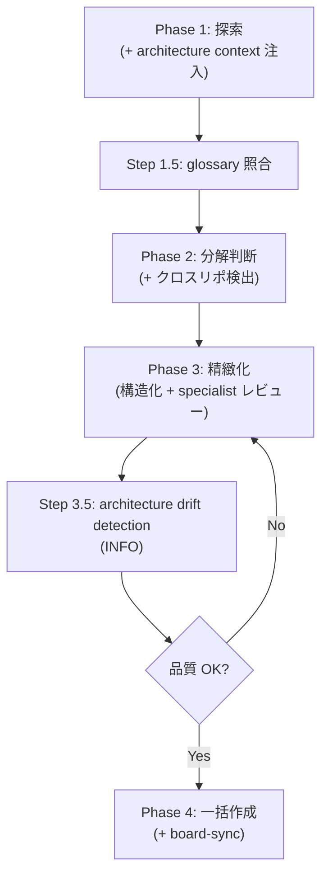
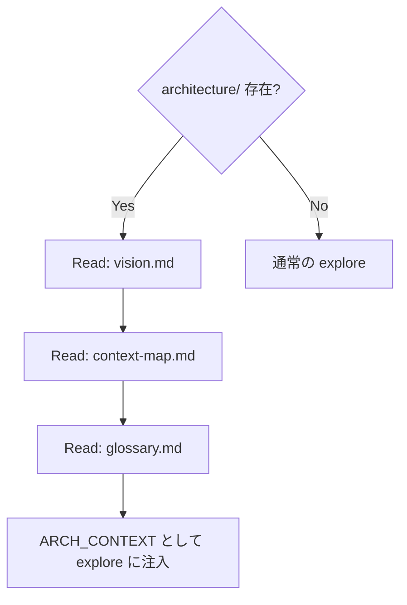
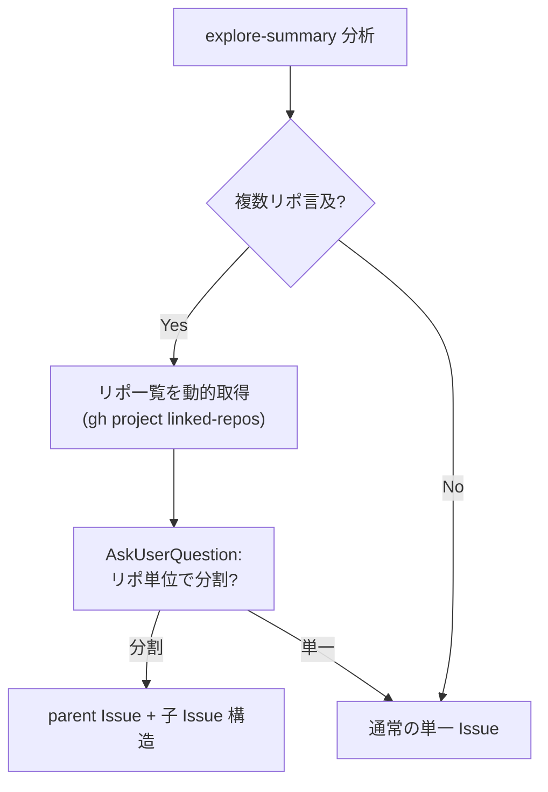
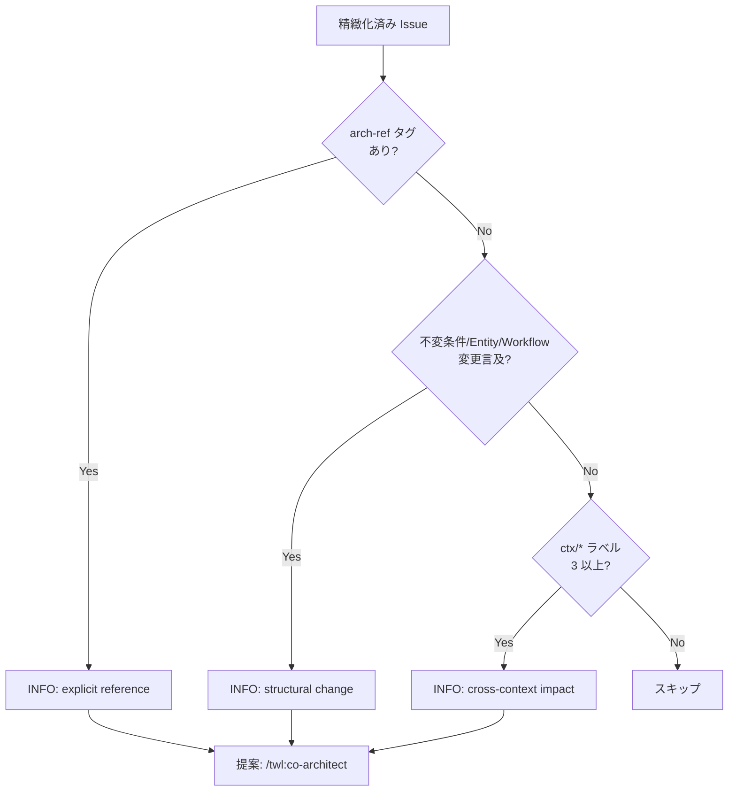

# Issue Management

## Responsibility

Issue の作成、トリアージ、精緻化、tech-debt 管理、**クロスリポ Issue 分割**。
要望を構造化 Issue に変換するワークフローを提供し、AC（Acceptance Criteria）の機械検証可能性を保証する。
**Architecture Spec を DCI で注入**し、設計意図に沿った Issue 品質を確保する。

## Key Entities

### Issue
GitHub Issue。プロジェクトの作業単位。

| フィールド | 型 | 説明 |
|---|---|---|
| number | number | GitHub Issue 番号 |
| title | string | タイトル |
| body | string | 本文（テンプレート準拠） |
| labels | string[] | ラベル（5軸ラベル体系: scope/* + ctx/*） |
| milestone | string \| null | マイルストーン |
| ac | AcceptanceCriteria[] | 受け入れ基準 |
| related_issues | number[] | 関連 Issue 番号 |

### AcceptanceCriteria
テスト可能な条件のリスト。機械検証可能であるべき。

### IssueTemplate
Issue 作成テンプレート。必須フィールドを定義する。

| テンプレート | 用途 |
|---|---|
| bug.md | バグ報告 |
| feature.md | 機能要望 |

### TechDebtCategory
tech-debt Issue のトリアージカテゴリ。

| カテゴリ | 意味 | 対応 |
|---|---|---|
| warning | 即時対応が必要 | 即時対応 |
| deferred-high | 計画的に対応 | 計画対応 |
| low | 任意で対応 | 任意 |
| obsolete | 不要になった | 除去 |

## Key Workflows

### Issue 作成フロー (co-issue)

### Architecture Context 注入（Phase 1 冒頭）

Architecture Spec が co-issue に注入されることで:
- 探索が既存の設計意図に沿って行われる
- 用語の一貫性が glossary 照合で検証される
- 新概念の検出が architecture drift として通知される

### Glossary 照合（Step 1.5）

explore-summary.md の用語と glossary.md の MUST 用語を照合。不一致は **INFO レベル**で通知（非ブロッキング）。完全一致のみ対象。

### クロスリポ Issue 分割（Step 2a）

**リポ一覧取得**: ハードコード禁止。GitHub Project のリンク済みリポジトリから動的取得。

### Architecture Drift Detection（Step 3.5）

精緻化完了後、Issue が architecture spec に影響するか検出し、ユーザーに co-architect を提案する。

**非ブロッキング**: glossary 照合（Step 1.5）と同レベル。Issue 作成フローを止めない。
**Contract**: contracts/architecture-spec-dci.md で詳細定義。

### Specialist 並列レビュー（Step 3b）

**co-issue v2（ADR-017）**: 1 Issue = 1 tmux window = 1 独立 cld セッション。`issue-lifecycle-orchestrator.sh` が N 個の `workflow-issue-lifecycle` Worker を並列 spawn し、各 Worker 内で 3 specialist を実行する。MAX_PARALLEL=3。CO_ISSUE_V2 feature flag で有効化。

各 Worker 内の specialist:
- **issue-critic**: 仮定・曖昧点・盲点・粒度・split・隠れた依存を検出
- **issue-feasibility**: 実コード読みで実装可能性・影響範囲を検証
- **worker-codex-reviewer**: 補完的レビュー（異なるモデル視点）

ブロック判定: `severity == CRITICAL && confidence >= 80 && finding_target == "issue_description"`

## Constraints

- Issue 作成前に specialist レビューを通過すること（`--quick` 時はスキップ可）
- tech-debt Issue は定期的にトリアージすること
- project-board-sync は Issue 作成成功後に自動実行。失敗時は警告のみ
- **プロンプトインジェクション対策**: Issue body を XML タグに注入する前にエスケープ必須（SHALL）
- **制約 IM-1**: ユーザー確認なしで Issue を作成してはならない（SHALL）。co-issue / workflow-issue-create / co-architect 共通制約
- **制約 IM-2**: Issue 番号を推測してはならない（SHALL）。`gh` コマンド出力から正確に取得すること（co-issue / workflow-issue-create / workflow-tech-debt-triage 共通制約）
- **制約 IM-3**: `.controller-issue/` ディレクトリを git にコミットしてはならない（SHALL）。`.gitignore` 対象（co-issue / workflow-issue-create 共通制約）
- **制約 IM-4**: 他セッションの `.controller-issue/<other-session-id>/` を削除してはならない（SHALL）。セッション間分離保証
- **制約 IM-5**: （親 controller から spawn された場合の制約として）lifecycle workflow セッション**内部**で specialist が実行中のまま aggregate step に進んではならない（SHALL）。co-issue v2 では parent co-issue は specialist を直接 spawn しないため、本制約は Worker セッション内のローカル不変量として機能する（ADR-017）
- **制約 IM-6**: ユーザー確認なしで Issue をクローズ・統合してはならない（SHALL）
- **制約 IM-7**: (a) N workers の全 dispatch 完了を parent co-issue controller が保証 + (b) 各 lifecycle workflow セッション内部で N=1 × 3 specialist の完了を `spec-review-session-init.sh 1` + PreToolUse gate で保証、の 2 層構造で維持しなければならない（SHALL）。層 (b) により全 Issue の `issue-spec-review` 完了前に `issue-review-aggregate` への forward progression を機械的にブロックする（ADR-017）
- **制約 IM-8**: Issue/PR の内容理解を目的とする `gh` 呼び出しは body + 全 comments を全件取得しなければならない（SHALL）。共通ヘルパー `gh_read_issue_full` / `gh_read_pr_full`（`scripts/lib/gh-read-content.sh`）経由を強制する。meta-only 読み込み（state/labels/number/id/mergeCommit/files/title）は対象外（Issue #499、`refs/ref-gh-read-policy.md` 参照）

## Rules

- **Non-implementation controller**: co-issue はコード変更を伴わない。chain-driven 不要
- **DeltaSpec 適用**: `quick` ラベルまたは `scope/direct` ラベル付き Issue は direct。それ以外は propose → apply（デフォルト）。`deltaspec/` の存在有無は判定条件に含まれない。詳細は autopilot.md の「DeltaSpec 適用ポリシー」を参照
- **AC の機械検証可能性**: AcceptanceCriteria は可能な限り機械的にテスト可能な条件として記述する
- **Architecture Spec の DCI 参照**: Phase 1 冒頭で architecture/ を Read。存在しない場合はスキップ（エラーにしない）
- **Glossary 照合は INFO**: merge-gate の WARNING（ブロッキング可）とは異なり、Issue 作成フローを止めない

## Component Mapping

| 種別 | コンポーネント | 役割 |
|------|--------------|------|
| **controller** | co-issue | 要望→Issue 変換ワークフロー |
| **atomic** | issue-create | GitHub Issue 作成 |
| **atomic** | issue-structure | Issue 内容の構造化（テンプレート適用） |
| **atomic** | issue-bulk-create | 親Issue + 子Issue 群の一括起票 |
| **atomic** | issue-tech-debt-absorb | tech-debt Issue の吸収提案 |
| **atomic** | ac-extract | AC（受け入れ基準）抽出 |
| **atomic** | ac-deploy-trigger | AC から deploy E2E 実行フラグ設定 |
| **atomic** | project-board-sync | Issue → Project V2 自動追加 |
| **atomic** | project-board-status-update | Board Status 更新 |
| **workflow** | workflow-issue-lifecycle | co-issue v2 Worker: 1 Issue の lifecycle（structure → spec-review → aggregate → create）を独立セッションで実行（ADR-017） |
| **specialist** | issue-critic | Issue の仮定・曖昧点・盲点検出 |
| **specialist** | issue-feasibility | 実装可能性・影響範囲検証 |
| **specialist** | worker-codex-reviewer | 補完的レビュー |
| **script** | issue-lifecycle-orchestrator.sh | co-issue v2 Pilot 側: N Worker の並列 spawn・完了検知・集約（ADR-017） |
| **reference** | ref-issue-template-bug | Bug Report テンプレート |
| **reference** | ref-issue-template-feature | Feature Request テンプレート |
| **reference** | ref-project-model | Issue 管理データモデル |
| **reference** | ref-issue-quality-criteria | severity 判定基準 |

## Dependencies

- **Downstream -> Autopilot**: Issue 情報を提供（gh issue view）
- **Downstream -> PR Cycle**: AC 情報を提供（ac-extract）
- **Upstream <- Self-Improve**: self-improve Issue を受け取る
- **Upstream <- Project Management**: Board ステータス更新
- **DCI <- Architecture Spec**: vision.md, context-map.md, glossary.md を Phase 1 で Read
- **Drift Detection -> Architecture Spec**: Step 3.5 で architecture 影響を検出し co-architect を提案（INFO）
