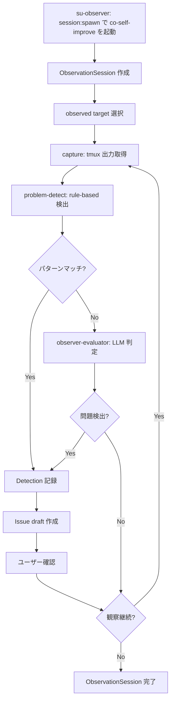
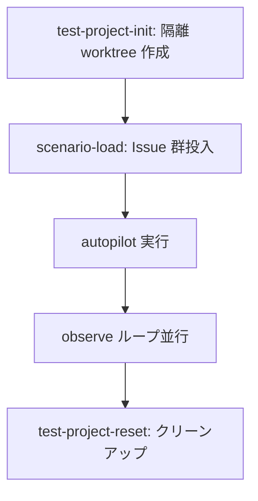
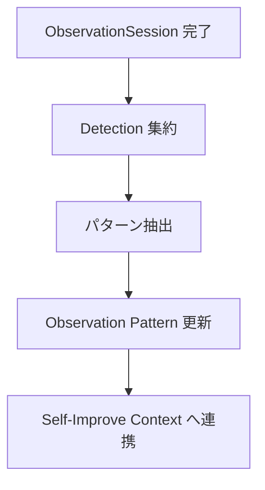

# Live Observation

## Responsibility

ライブセッション観察、問題検出、Issue 起票、テストプロジェクト管理。
co-self-improve が統括する独立 Bounded Context。既存 Self-Improve Context（受動的 retrospective）とは別レイヤー（ADR-011）。

## Key Entities

### ObservationSession
observer session の状態。

| フィールド | 型 | 説明 |
|---|---|---|
| session_id | string | 観察セッション一意識別子 |
| observed_targets | ObservedTarget[] | 観察対象のリスト |
| status | `observing` \| `paused` \| `completed` | セッション状態 |
| started_at | string (ISO 8601) | 開始時刻 |
| detections | Detection[] | 検出された問題のリスト |

### ObservedTarget
observed session の参照。

| フィールド | 型 | 説明 |
|---|---|---|
| window | string | tmux ウィンドウ名 |
| issue | number \| null | 対応する Issue 番号 |
| project | string | 対象プロジェクト名 |
| type | `autopilot` \| `manual` \| `test-project` | 対象セッションの種別 |

### Detection
検出された問題の単位。

| フィールド | 型 | 説明 |
|---|---|---|
| id | string | 検出一意識別子 |
| severity | `critical` \| `warning` \| `info` | 深刻度 |
| category | string | 問題カテゴリ（例: chain_stall, test_failure, pattern_match） |
| source | `rule-based` \| `llm-evaluated` | 検出手段 |
| capture_excerpt | string | 問題を示す出力の抜粋 |
| timestamp | string (ISO 8601) | 検出時刻 |

### InterventionRecord
Observer 介入ログの単位。

| フィールド | 型 | 説明 |
|---|---|---|
| id | string | 介入一意識別子 |
| intervention_type | `auto` \| `confirm` \| `escalate` | 介入種別（3 層プロトコルの層に対応） |
| layer | `1` \| `2` \| `3` | 介入レイヤー番号（Auto=1, Confirm=2, Escalate=3） |
| status | `pending` \| `approved` \| `rejected` \| `executed` | 介入状態 |
| user_confirmed | boolean | Layer 2 以上でのユーザー確認済みフラグ |
| target_session | string | 介入対象セッション識別子 |
| timestamp | string (ISO 8601) | 介入実行時刻 |

### TestProject
隔離 worktree の参照。

| フィールド | 型 | 説明 |
|---|---|---|
| branch | string | test-target ブランチ名 |
| scenario | string | ロードされたシナリオ名 |
| state | `initialized` \| `running` \| `completed` \| `failed` | プロジェクト状態 |
| worktree_path | string | worktree のパス |

### LoadScenario
負荷シナリオの定義。

| フィールド | 型 | 説明 |
|---|---|---|
| name | string | シナリオ名 |
| level | `smoke` \| `regression` \| `load` | テストレベル |
| issue_count | number | 投入する Issue 数 |
| expected_duration | string | 期待完了時間 |
| bug_target | number \| null | Bug 再現シナリオの場合、対象 Bug Issue 番号。null は汎用シナリオ |

## Key Workflows

### Observe ループ

### テストプロジェクト管理フロー

### Retrospective 抽出フロー

## Constraints

- observed session を**書き換えない**（read-only MUST）。observer は tmux capture-pane 等で出力を取得するのみ
- test target は実 twill main の git 履歴を**絶対に汚染しない**。隔離 worktree + 独立ブランチで管理
- observation Issue は本物の Issue とラベルで明確に区別する（`label: from-observation`）

### OB-* Constraints（co-self-improve ベース）

| 制約 ID | 内容 | 適用範囲 |
|---------|------|----------|
| OB-1 | 自 window を観察対象にしてはならない（SHALL）。自己観察によるコンテキスト汚染を防止 | both |
| OB-2 | 各サイクルの生 capture を context に retain してはならない（SHALL）。集約のみ保持 | both |
| OB-3 | ループ中に observed session に inject / send-keys してはならない（SHALL） | **co-self-improve only** |
| OB-4 | 検出結果をユーザー確認なしで自動起票してはならない（SHALL）。Issue draft はユーザー確認必須 | both |
| OB-5 | 同時 3 observed session を超えて観察してはならない（SHALL）。context budget 維持 | **co-self-improve only** |

> **OB-3 適用範囲注記**: su-observer は介入権限を持つ Supervisor レイヤー（ADR-014）のため OB-3 適用外。介入ルールは SU-7 で定義（supervision.md）。  
> **OB-5 適用範囲注記**: co-self-improve の observed session 上限。su-observer の supervised controller 上限は SU-4 で定義（supervision.md）（対象エンティティが異なる別概念）。

### Observer Constraints (OBS-*)（廃止 / Superseded by SU-*）

> **Superseded**: OBS-1〜OBS-5 は supervision.md の SU-* に置き換えられました（ADR-014）。OBS-1〜OBS-4 は SU-1〜SU-4 に対応し、OBS-5 は SU-7 に対応。SU-5・SU-6 は新規追加。

| 制約 ID | 内容 | 適用範囲 |
|---------|------|----------|
| OBS-1 | 介入は 3 層プロトコル（Auto / Confirm / Escalate）に従わなければならない（SHALL） | co-observer only |
| OBS-2 | Layer 2（Escalate）の介入はユーザー確認が MUST。確認なしの Escalate 介入を実行してはならない（SHALL） | co-observer only |
| OBS-3 | Observer 自身が Issue の実装（コード変更）を行ってはならない（SHALL）。実装権限は Worker が保持（不変条件 K の Observer 版） | co-observer only |
| OBS-4 | 同時に supervise できる controller session は 3 を超えてはならない（SHALL）。context budget 維持（OB-5 の Observer 版） | co-observer only |
| OBS-5 | Observer は InterventionRecord を observed session の context に inject してはならない（SHALL）。介入ログは Observer 自身のコンテキストのみで保持（OB-2 の Observer 版） | co-observer only |

## Rules

- 問題検出は rule-based（problem-detect atomic）を first-pass、specialist（observer-evaluator）を second-pass で実行する
- Issue draft はユーザー確認 MUST。自動起票禁止
- 並列 observe 上限: 同時 3 observed session まで
- **Self-Improve Context との関係**: workflow-self-improve は autopilot 後処理として動く受動側、co-self-improve はユーザートリガーで動く能動側。両者は ADR-011 で並存が明示されている
- **Bug 再現シナリオ**: 既知 Bug の再現条件を test-scenario-catalog に定義し、対応する検出パターン（`bug-` プレフィックス）を observation-pattern-catalog に追加する。シナリオの `bug_target` と検出パターンの `related_issue` で Bug Issue 番号を紐付ける

## Component Mapping

| 種別 | コンポーネント | 役割 |
|------|--------------|------|
| **controller** | co-self-improve | Live Observation 統括。テストプロジェクト管理も担う。OB-3 適用（observed session への inject 禁止） |
| **workflow** | workflow-observe-loop | observe ループ + 問題検出 + Issue draft |
| **atomic** | test-project-init | 隔離 worktree 作成 |
| **atomic** | test-project-reset | テストプロジェクト クリーンアップ |
| **atomic** | test-project-scenario-load | Issue 群のテストプロジェクトへの投入 |
| **atomic** | observe-once | 単一キャプチャの取得と解析 |
| **atomic** | problem-detect | rule-based で capture から既知パターンを検出 |
| **atomic** | issue-draft-from-observation | 検出結果から Issue draft を生成 |
| **atomic** | observe-retrospective | 過去の observation 結果を集約・パターン抽出 |
| **specialist** | observer-evaluator | LLM 判定で微妙な問題を検出 |
| **reference** | test-scenario-catalog | テストシナリオの一覧と定義 |
| **reference** | observation-pattern-catalog | 検出パターンのカタログ |
| **reference** | load-test-baselines | 負荷テスト level (smoke/regression/load) の定量基準 |

## Dependencies

- **Downstream -> Issue Management**: observation Issue 起票（label: from-observation）
- **Downstream -> Autopilot**: tmux capture-pane による Worker 出力の read-only 観察
- **Downstream -> session plugin**: session:observe / session-state.sh でセッション出力を取得
- **並存 -> Self-Improve**: 異なるレイヤー（受動 retrospective と能動 observation の補完関係）
