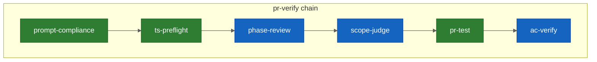
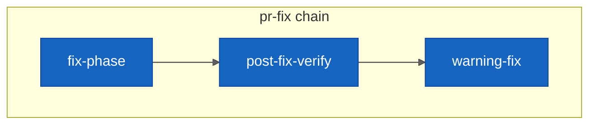
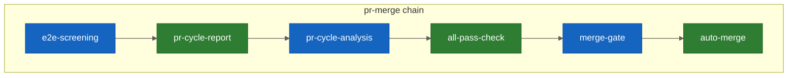

# PR Cycle

## Responsibility

PR のレビュー、テスト、修正、マージの一連のサイクルを管理する。
動的レビュアー構築による並列 specialist レビュー、merge-gate 判定、修正ループを統括する。

## Key Entities

### PullRequest
GitHub PR。Issue ブランチからの変更をレビュー・マージする単位。

### Finding
specialist が検出した問題。

| フィールド | 型 | 説明 |
|---|---|---|
| severity | `CRITICAL` \| `WARNING` \| `INFO` | 深刻度（3段階統一） |
| confidence | number (0-100) | 確信度 |
| file | string | 対象ファイルパス |
| line | number | 対象行番号 |
| message | string | 問題の説明 |
| category | `vulnerability` \| `bug` \| `coding-convention` \| `structure` \| `principles` \| `architecture-quality` | 分類 |

### MergeGateDecision
merge-gate の判定結果。

| 値 | 条件 |
|---|---|
| **PASS** | `severity == CRITICAL && confidence >= 80` の Finding が 0 件 |
| **REJECT** | `severity == CRITICAL && confidence >= 80` の Finding が 1 件以上 |

### SpecialistOutput
各 specialist の共通出力スキーマ。

```json
{
  "status": "PASS|WARN|FAIL",
  "findings": [{
    "severity": "CRITICAL|WARNING|INFO",
    "confidence": 80,
    "file": "src/module.ts",
    "line": 42,
    "message": "...",
    "category": "vulnerability|bug|coding-convention|structure|principles|architecture-quality"
  }]
}
```

全 specialist はこの共通出力スキーマに準拠する（Context 横断でもスキーマ統一）。

## Key Workflows

### PR-cycle chain フロー

#### pr-verify chain

<!-- CHAIN-FLOW:pr-verify START -->

<!-- CHAIN-FLOW:pr-verify END -->

#### pr-fix chain

<!-- CHAIN-FLOW:pr-fix START -->

<!-- CHAIN-FLOW:pr-fix END -->

### pr-merge chain（merge-gate を含む）

<!-- CHAIN-FLOW:pr-merge START -->

<!-- CHAIN-FLOW:pr-merge END -->

### 動的レビュアー構築ルール

| 条件 | 追加される specialist |
|------|----------------------|
| deps.yaml 変更あり | worker-structure（twl audit/check 統合）+ worker-principles |
| コード変更あり | worker-code-reviewer + worker-security-reviewer |
| Tech-stack 該当あり | conditional specialist（Tech-stack 検出ロジックで決定） |

全 specialist は並列 Task spawn。worktree 分離により逐次実行不要。

### Tech-stack 検出ロジック

- 変更ファイルの拡張子・パスから tech-stack を判定し、該当する conditional specialist を追加する
- 判定ロジックは `script` 型コンポーネントとして実装（merge-gate workflow の chain step から呼び出し）
- 具体的なスクリプト名・判定ルールの詳細は実装時に決定（B-5 スコープ）

## Constraints

- **merge-gate リトライ制限**: merge-gate リジェクト後のリトライは最大1回（不変条件 E）。2回目リジェクト = 確定失敗。Pilot に報告し、手動介入を要求
- **rebase 禁止**: merge 失敗時に rebase は試みない（停止のみ、不変条件 F）
- **Tech-stack 検出**: 変更ファイルの拡張子・パスから specialist を選択。script 型コンポーネントで実装

## Rules

- **動的レビュアー構築**: 旧 standard/plugin 2パスを廃止。変更内容に応じてレビュアーリストを動的構築する
- **共通出力スキーマ準拠**: 全 specialist は SpecialistOutput スキーマに準拠。merge-gate は `severity == CRITICAL && confidence >= 80` で機械的フィルタ
- **deps.yaml 変更時の追加レビュー**: deps.yaml が変更されている場合、worker-structure と worker-principles が必ず追加される
- **並列実行**: 全 specialist は並列 Task spawn。逐次実行は行わない

### 出力標準化ルール

**Specialist 共通出力スキーマ**（全 specialist 必須）:
- status: `PASS` | `WARN` | `FAIL`
- severity: `CRITICAL` | `WARNING` | `INFO`（3段階統一）
- findings 必須フィールド: severity, confidence (0-100), file, line, message, category
- few-shot 例（1例）をプロンプトに含めて準拠率を担保

**消費側（phase-review / merge-gate）の標準化**:
- サマリー行パース: 正規表現 `status: (PASS|WARN|FAIL)` で機械的取得
- ブロック判定: `severity == CRITICAL && confidence >= 80` のみ。AI 推論に依存しない
- パース失敗時: 出力全文を WARNING 扱いとし、手動レビューを要求

**AI 裁量の排除**:
- severity 分類: prompt 内のルールで決定（AI 判断ではない）
- confidence 値: specialist が算出し出力に含める（消費側で推定しない）
- 結果統合: specialist 出力のパースのみ。AI による自由形式の変換は禁止

## Component Mapping

| 種別 | コンポーネント | 役割 |
|------|--------------|------|
| **workflow** | workflow-pr-verify | PR 検証（preflight → review → scope → test） |
| **workflow** | workflow-pr-fix | PR 修正（fix → post-fix-verify → warning-fix） |
| **workflow** | workflow-pr-merge | PRマージ（e2e → report → analysis → check → merge） |
| **composite** | merge-gate | PR レビュー → テスト → 判定 → merge |
| **composite** | phase-review | 並列 specialist レビュー（動的レビュアー構築） |
| **composite** | fix-phase | 自動修正ループ + E2E 修復 |
| **composite** | e2e-screening | Visual 検証（Screening + Heal） |
| **atomic** | ts-preflight | TypeScript 機械的検証（型チェック・lint） |
| **atomic** | pr-test | テスト実行 |
| **atomic** | pr-cycle-report | PRサイクル結果のフォーマット・投稿 |
| **atomic** | pr-cycle-analysis | PR-cycle 結果からパターン分析し self-improve Issue 起票 |
| **atomic** | scope-judge | スコープ判定 + Deferred Issue 作成 |
| **atomic** | post-fix-verify | fix 後の軽量コードレビュー |
| **atomic** | warning-fix | Warning のベストエフォート修正 |
| **atomic** | all-pass-check | 全パス判定 |
| **atomic** | ac-verify | AC 検証（テスト結果と AC の照合） |
| **atomic** | auto-merge | squash マージ → archive → cleanup |
| **specialist** | worker-code-reviewer | コード品質レビュー |
| **specialist** | worker-security-reviewer | セキュリティ脆弱性検出 |
| **specialist** | worker-structure | twl audit/check 統合 |
| **specialist** | worker-principles | 5原則 + controller 品質検証 |
| **specialist** | worker-architecture | アーキテクチャパターン検証 |
| **script** | tech-stack-detect | 変更ファイルから tech-stack を判定 |
| **script** | specialist-output-parse | specialist 出力の機械的パース |
| **command** | prompt-compliance | refined_by ハッシュ整合性チェック |

## Dependencies

- **Upstream <- Autopilot**: autopilot から merge-gate として呼び出される。Contract: autopilot-pr-cycle.md
- **Upstream <- Issue Management**: AC 情報を取得（ac-extract）。スコープ判定で Issue 情報を参照
- **Upstream <- TWiLL Integration**: merge-gate の plugin gate で twl validate 結果を消費
- **Downstream -> Self-Improve**: pr-cycle-analysis でパターン検出、self-improve Issue 起票
