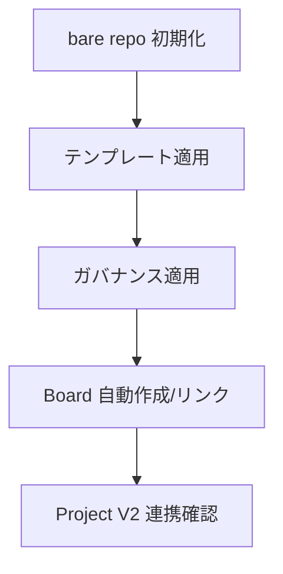
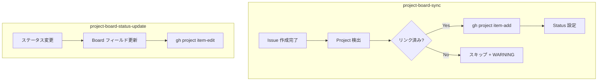
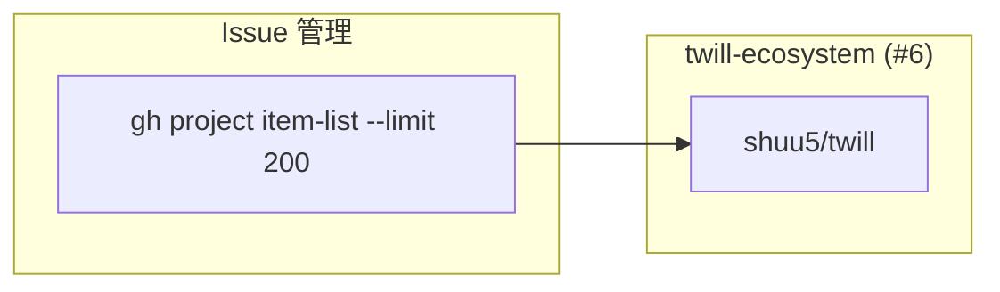

# Project Management

## Responsibility

プロジェクトの作成、移行、スナップショット、プラグイン管理、**Project Board の統合管理**。
bare repo + worktree 構造の初期化・検証、テンプレートとガバナンスの適用、**クロスリポジトリ Project Board** の管理を担う。

## Key Entities

### Project
管理対象プロジェクト。bare repo + worktree 構造で管理される。

### Template
プロジェクトテンプレート。種類（webapp, omics, plugin 等）と Tier 分類を持つ。

| フィールド | 型 | 説明 |
|---|---|---|
| name | string | テンプレート名 |
| type | string | 種類（webapp, omics, plugin 等） |
| tier | string | Tier 分類（AI 分析 -> ユーザー確認で決定） |

### Manifest (manifest.yaml)
テンプレートメタデータ。スタック、ガバナンスルールを定義する。

### ProjectBoard
GitHub Projects V2 のボード。**プロジェクトの Issue ステータスを管理する SSOT**。

| フィールド | 型 | 説明 |
|---|---|---|
| project_number | number | GitHub Project 番号 |
| owner | string | Project オーナー（user or org） |
| linked_repos | string[] | リンク済みリポジトリ一覧 |

### Governance
プロジェクトのガバナンスルールセット。

| 構成要素 | 説明 |
|---|---|
| Hooks | PostToolUse 等のフック定義 |
| Schema scaffold | スキーマの初期構造 |
| CLAUDE.md 拡張 | プロジェクト固有の CLAUDE.md ルール |

## Key Workflows

### project-create フロー



### Project Board 統合フロー



**Project 検出ロジック**:
```bash
REPO=$(gh repo view --json nameWithOwner -q '.nameWithOwner')
OWNER="${REPO%%/*}"
# user → organization フォールバックで Project を検索
# Project のリンク済みリポジトリに現在のリポが含まれるか確認
```

### クロスリポジトリ管理



**クロスリポ Issue クエリ**: `gh issue list` は単一リポ専用のため、`gh project item-list` を使用（CLAUDE.md に定義）。

## Constraints

### Bare repo 正規構造

全プロジェクトで bare repo 必須。

```
project-name/
  .bare/                 # git データ
  main/                  # main worktree（セッション起動場所）
    .git (file)          # -> .bare を指す
  worktrees/{feat,fix,docs}/
  autopilot-plan.yaml
```

### 検証条件（セッション開始時チェック）

| # | 条件 | 失敗時の対処 |
|---|------|-------------|
| 1 | `.bare/` が存在する | co-project migrate で変換 |
| 2 | `main/.git` がファイルで `.bare` を指す | 構造破損。手動修復が必要 |
| 3 | CWD が `main/` 配下である | Pilot に警告し、main/ への移動を要求 |

### Project Board = SSOT（ADR-006）

- 全プロジェクトで一律有効。autopilot が Status=Todo をクエリして対象選択
- project-create が自動で Project V2 作成+リンク
- 二層構造: ローカル状態ファイル（即時性）+ Project Board（永続化・可視化）

### 同期ルール

- **同期タイミング**: issue-{N}.json の status が `done` に遷移した時点でローカル -> Board 同期
- **同期失敗時**: WARNING ログ出力。Board 同期失敗は autopilot をブロックしない
- **実装の分散先**:
  - co-project: create 時の Board 自動作成
  - co-autopilot: Issue 選択時の Board クエリ、完了時の Board 更新
  - co-issue: Issue 作成後の project-board-sync
- **制約 PM-1**: ガバナンス適用をスキップしてはならない（SHALL）。create / migrate 共通
- **制約 PM-2**: snapshot モードでソースプロジェクトを変更してはならない（SHALL）。read-only

## Rules

- **Non-implementation controller**: co-project はコード変更を伴わない場合がある。chain-driven 不要
- **co-project 引数ルーティング**: create / migrate / snapshot の 3 モード
- **plugin は co-project のテンプレートの一種**: 保守は通常ワークフロー + twl CLI
- **クロスリポ Issue リスト取得**: `gh project item-list` 必須（`gh issue list` は単一リポ専用）
- **--limit 200 必須**: Project Board クエリ時のデフォルト件数は不足するため明示指定

## Component Mapping

| 種別 | コンポーネント | 役割 |
|------|--------------|------|
| **controller** | co-project | プロジェクト管理（create / migrate / snapshot） |
| **atomic** | project-create | bare repo + worktree + テンプレート + Board 初期化 |
| **atomic** | project-migrate | 最新テンプレート移行 + ガバナンス再適用 |
| **atomic** | project-governance | Hooks + スキーマ scaffold + CLAUDE.md 拡張 |
| **atomic** | container-dependency-check | コンテナ依存と実状態の照合 |
| **atomic** | snapshot-analyze | ファイルスキャン + スタック自動検出 |
| **atomic** | snapshot-classify | AI Tier 分類 + ユーザー確認 |
| **atomic** | snapshot-generate | manifest.yaml + テンプレートファイル生成 |
| **atomic** | setup-crg | CRG (Code Review Graph) MCP セットアップ |
| **atomic** | crg-auto-build | CRG グラフ自動ビルド |
| **atomic** | project-board-sync | Issue → Project V2 自動追加 + Status 設定 |
| **atomic** | project-board-status-update | Board Status 更新 |

## Dependencies

- **Shared Kernel -> Autopilot**: bare repo + worktree 構造を共有
- **Customer-Supplier -> Autopilot**: Board クエリ（Issue 選択元）
- **Conformist -> Issue Management**: Board ステータス更新
