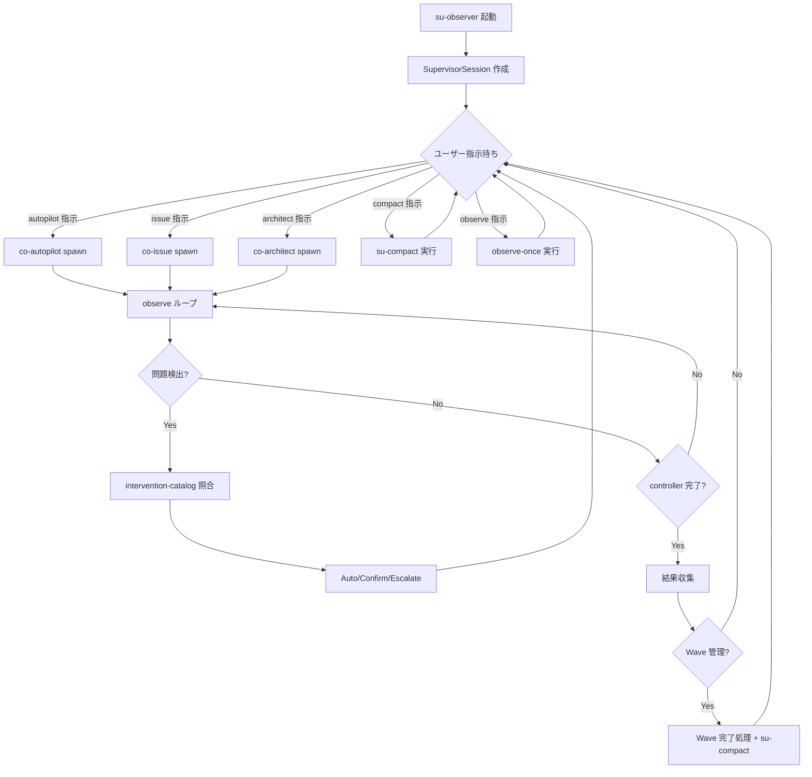
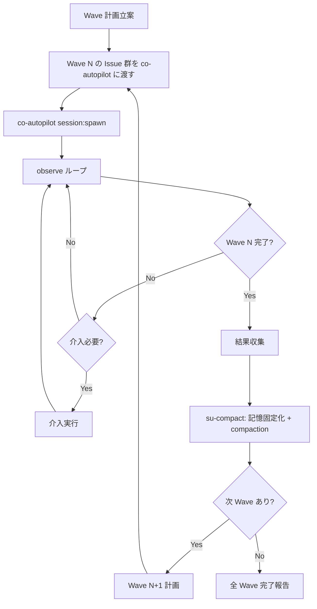

# Supervision

## Responsibility

プロジェクト常駐のメタ認知レイヤー。全 controller セッションの監視・調整・知識管理を担う。
Live Observation Context（co-self-improve）の上位に位置し、observer → supervisor への昇格を反映（ADR-014）。

ADR-013 の Observer Context を supersede する。

## Key Entities

### SupervisorSession

su-observer のプロジェクト常駐セッション。

| フィールド | 型 | 説明 |
|---|---|---|
| session_id | string | supervisor セッション一意識別子 |
| project | string | 対象プロジェクト名 |
| main_dir | string | bare repo の main ディレクトリパス |
| status | `active` \| `compacting` \| `paused` \| `ended` | セッション状態 |
| started_at | string (ISO 8601) | 開始時刻 |
| supervised_controllers | SupervisedController[] | 監視中の controller リスト |
| current_wave | WaveState \| null | 現在の Wave 状態（autopilot 実行時） |
| memory_budget | MemoryBudget | 三層記憶の消費量追跡 |

### SupervisedController

監視対象の controller セッション。

| フィールド | 型 | 説明 |
|---|---|---|
| controller_name | string | controller 名（例: `co-autopilot`） |
| window | string | tmux ウィンドウ名 |
| spawned_at | string (ISO 8601) | spawn 時刻 |
| status | `running` \| `idle` \| `completed` \| `crashed` | controller の状態 |
| last_observed | string (ISO 8601) | 最終観察時刻 |

### WaveState

Wave 管理の状態。

| フィールド | 型 | 説明 |
|---|---|---|
| wave_number | number | 現在の Wave 番号 |
| total_waves | number | 全 Wave 数 |
| issues | number[] | 現 Wave の Issue 番号リスト |
| autopilot_session_id | string \| null | co-autopilot セッション ID |
| status | `planning` \| `running` \| `completed` \| `failed` | Wave 状態 |
| started_at | string (ISO 8601) | Wave 開始時刻 |
| completed_at | string (ISO 8601) \| null | Wave 完了時刻 |

### MemoryBudget

三層記憶の消費量追跡。

| フィールド | 型 | 説明 |
|---|---|---|
| working_pct | number | context window 消費率（0-100） |
| externalized_count | number | 外部化されたメモリファイル数 |
| last_compaction | string (ISO 8601) \| null | 最終 compaction 時刻 |
| auto_compact_threshold | number | 自動 compaction 閾値（default: 50） |

### ExternalizationRecord

知識外部化の記録。

| フィールド | 型 | 説明 |
|---|---|---|
| id | string | 外部化一意識別子 |
| trigger | `auto` \| `manual` \| `wave_complete` | 外部化のトリガー |
| target_layer | `long_term` \| `working_memory` | 外部化先の記憶層 |
| files_written | string[] | 書き出されたファイルパス（Working Memory Externalization） |
| mcp_hashes | string[] | Memory MCP に保存されたメモリ hash（Long-term Memory） |
| timestamp | string (ISO 8601) | 外部化時刻 |

### 三層記憶の特性

| 層 | 固定性 | 持続性 | 変容 |
|----|--------|--------|------|
| **Long-term Memory** | sharp/fixed | 永続 | 書き込み後不変。削除するまで残る |
| **Working Memory Ext.** | sharp/fixed | 一時的 | PreCompact→ファイル→PostCompact。復帰後破棄 |
| **Compressed Memory** | dynamic/fuzzy | セッション内 | compaction ごとに変容。Long-term の手がかり |

### InterventionRecord

Observer 介入ログの単位（ADR-013 から継承）。

| フィールド | 型 | 説明 |
|---|---|---|
| intervention_id | string | 介入一意識別子 |
| supervisor | string | Supervisor 名（`su-observer`） |
| target_controller | string | 対象 controller 名 |
| layer | `auto` \| `confirm` \| `escalate` | 介入レイヤー（3 層プロトコル） |
| status | `detected` \| `intervening` \| `resolved` | 介入状態 |
| detected_at | string (ISO 8601) | 検出時刻 |
| resolved_at | string (ISO 8601) \| null | 解決時刻 |
| reason | string | 介入理由 |

## Key Workflows

### Supervisor 常駐ループ



### Wave 管理フロー



### 知識外部化フロー

```mermaid
flowchart TD
    A{トリガー} -->|自動: 50%到達| B[状況判定]
    A -->|手動: /su-compact| B
    A -->|Wave完了| B
    B --> C{状況分類}
    C -->|タスク途中| D[構造化ファイル書出し]
    C -->|Wave完了後| E[サマリ + doobidoo 保存]
    C -->|設計議論後| F[ADR 的記録]
    C -->|障害対応後| G[intervention-catalog 更新候補]
    D --> H[PreCompact hook: 外部化完了確認]
    E --> H
    F --> H
    G --> H
    H --> I[/compact 実行]
    I --> J[PostCompact hook: 外部化ファイル再読み込み]
    J --> K[Compressed Memory として復帰]
```

## Constraints

### SU-* Constraints（su-observer 専用）

| 制約 ID | 内容 | 備考 |
|---------|------|------|
| SU-1 | 介入は 3 層プロトコル（Auto/Confirm/Escalate）に従わなければならない（SHALL） | OBS-1 継承 |
| SU-2 | Layer 2（Escalate）の介入はユーザー確認が MUST | OBS-2 継承 |
| SU-3 | Supervisor 自身が Issue の直接実装を行ってはならない（SHALL） | OBS-3 継承 |
| SU-4 | 同時に supervise できる controller session は 5 を超えてはならない（SHALL） | OBS-4 拡張（3→5） |
| SU-5 | context 消費量 50% 到達時に知識外部化を開始しなければならない（SHALL） | 新規 |
| SU-6 | Wave 完了時に結果収集と su-compact を実行しなければならない（SHALL） | 新規 |
| SU-7 | observed session への inject/send-keys は介入プロトコルに従う場合に許可（MAY） | OB-3 廃止に対応 |

### OB-* Constraints との関係

| 旧制約 | su-observer での扱い |
|--------|---------------------|
| OB-1 (自己観察禁止) | 継続。SU には暗黙適用 |
| OB-2 (生 capture 非保持) | 継続。SU には暗黙適用 |
| OB-3 (inject 禁止) | **su-observer には適用しない**。co-self-improve には引き続き適用 |
| OB-4 (自動起票禁止) | 継続。SU-2 に統合 |
| OB-5 (同時3セッション上限) | co-self-improve にのみ適用。su-observer は SU-4（上限5）に従う |

## Component Mapping

| 種別 | コンポーネント | 役割 |
|------|--------------|------|
| **supervisor** | su-observer | プロジェクト常駐メタ認知。controller spawn + observe + 知識外部化 |
| **workflow** | su-compact | 知識外部化 + compaction ワークフロー |
| **atomic** | observe-once | 単一キャプチャの取得と解析（既存継承） |
| **atomic** | problem-detect | rule-based で capture から既知パターンを検出（既存継承） |
| **atomic** | wave-collect | Wave 完了時の結果収集 |
| **atomic** | externalize-state | 状態の外部ファイル書き出し |
| **specialist** | observer-evaluator | LLM 判定で微妙な問題を検出（既存継承） |
| **reference** | intervention-catalog | 6 介入パターンの 3 層分類（既存継承） |
| **reference** | externalization-schema | 外部化ファイルのスキーマ定義 |
| **script** | su-precompact | PreCompact hook で実行される外部化スクリプト |
| **script** | su-postcompact | PostCompact hook で実行される復元スクリプト |

## co-self-improve との境界

su-observer と co-self-improve は異なるレイヤーで補完関係にある。

| 観点 | su-observer (supervisor) | co-self-improve (controller) |
|------|--------------------------|------------------------------|
| 型 | supervisor | controller |
| ライフサイクル | プロジェクト常駐 | タスク単位（spawn → 完了 → 終了） |
| 起動者 | user（main session） | su-observer または user |
| 主な責務 | メタ認知・Wave 管理・知識外部化・介入 | テスト実行・ライブ観察・Issue 起票 |
| inject 権限 | あり（SU-7: 介入プロトコルに従う場合） | なし（OB-3: read-only 観察のみ） |
| 直接実装 | 禁止（SU-3） | 禁止（不変条件 K） |
| compaction | su-compact で自律的に知識外部化 | chain-driven でテンプレート的に外部化 |

**委譲関係**: su-observer はテストシナリオ実行を co-self-improve に委譲する（ADR-011 継続）。
co-self-improve の観察結果は su-observer に報告され、su-observer が介入判断を行う。

**observation.md の OB-* 制約との関係**:
- OB-1〜OB-5 は co-self-improve にのみ適用される
- su-observer には SU-1〜SU-7 が適用される
- OBS-1〜OBS-5（旧 co-observer 専用）は SU-1〜SU-7 に統合され廃止

## su-observer 非起動時のフォールバック

su-observer はプロジェクト作業の開始時に起動されることを前提とするが、
起動せずに直接 controller を使う場合のフォールバックパスも定義する。

| 状況 | 動作 |
|------|------|
| su-observer 起動済み | ユーザー → su-observer → controller spawn → observe |
| su-observer 未起動 + controller 直接呼出 | ユーザー → controller（通常動作）。監視・Wave 管理・知識外部化は利用不可 |
| su-observer 未起動 + autopilot 実行 | ユーザー → co-autopilot 直接起動。Wave 管理なし、compaction 自動化なし |

**設計方針**: su-observer は **推奨** であり **必須** ではない。
既存の controller は su-observer なしでも独立して動作する（後方互換）。
ただし、大量 Issue の Wave 管理や長時間セッションの知識外部化は su-observer 経由でのみ利用可能。

## Dependencies

- **Downstream → Autopilot**: co-autopilot を spawn し、Wave 管理・observe を行う
- **Downstream → Issue Management**: フロー逸脱検知時の Issue 起票要求
- **Downstream → Live Observation**: co-self-improve へのテスト委譲
- **Downstream → All Controllers**: 全 controller を supervise（spawn + observe + intervene）
- **Downstream → session plugin**: session:spawn / session:observe でセッション管理
- **Cross-cutting → Memory MCP (pluggable)**: Long-term Memory の保存・検索。現在は doobidoo。refs/memory-mcp-config.md で切替
- **Cross-cutting → Claude Code hooks**: PreCompact（WM退避）/ PostCompact（WM復帰）/ SessionStart(compact)（ambient hints）の 3 hook で知識外部化を実現
