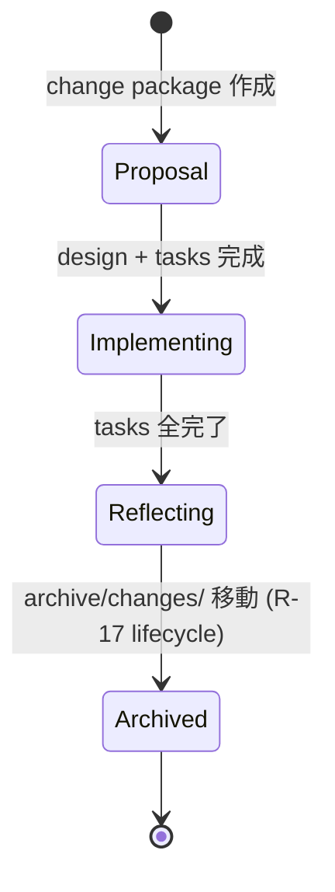

# spec-management-rules.md

tool-architect が `architecture/spec/` を管理する規律 ref doc。R-1〜R-9 + checklist + HTML template + CI gate 一覧。

[tool-architect SKILL.md](../SKILL.md) からの参照 doc。

## R-1: index 追加 MUST

新 file 追加時に `architecture/spec/README.html` の index table に entry を追加すること。

### rationale
- README は spec の entry point。新 file は必ず README から到達可能であること
- 浮いたページ (orphan) を作らない (R-3 と連携)
- 読み手 (人間 + 将来 tool-architect 自身) が新 file の存在を発見できる

### 違反例
- 新 file `spec/foo.html` を作成、README に何も追記せず PR → R-1 違反
- 補助 file (例: changelog.html、本来 section F) を「新 architecture」section (C) の table に置く → 不適切 placement

### 適用方法 (2 段 flow: dir 選択 → spec/ 内 sub-category)

**step 1: dir 選択**
- `spec/` — 新 twill architecture 仕様 (HTML のみ、common.css 例外)
- `migration/` — 旧→新 移行計画 (HTML)
- `research/` — 調査・実験 (HTML)
- `archive/` — 旧資産 (新規追加なし、move のみ)
- `decisions/` — 新 architecture ADR (MD のみ)

**step 2: spec/ 内 sub-category** (spec/ を選んだ場合のみ)
- `orientation` — 最初に読む (overview / failure-analysis 等)
- `core` — 新 architecture 詳細 (boundary / crash / spawn / gate-hook / monitor / hooks-mcp 等)
- `policy` — 既存接続 (twl-mcp / ssot 等)
- `auxiliary` — navigation / 用語 / 履歴 (glossary / changelog / architecture-graph 等)

**step 3: README.html の該当 section table に entry 追加**
- spec/ : 4 sub-category h3 table のうち適切なもの
- 他 dir: 単一 table (flat)
- entry format: `<tr><td><a href="foo.html"><code>foo.html</code></a></td><td><span class="badge ...">status</span></td><td>説明</td></tr>`

**step 4: badge 選択**: done / outline / archive / proposed / superseded のいずれか

詳細な decision tree は [R-10](#r-10-新-file-の-dir--sub-category-decision-tree) 参照。

## R-2: architecture-graph 追加 MUST

新 file 追加時に `architecture/spec/architecture-graph.html` に node + edge を追加すること。

### rationale
- architecture-graph は spec の link 関係を可視化する hub
- 新 file が他 file との関係性を持つことを明示
- リファクタリング時に影響範囲を把握しやすくする
- **graph 内 `<a xlink:href>` は inbound link としてカウントされるため、R-2 適用は R-3 (orphan 禁止) の機械的保証の一翼を担う**

### 違反例
- 新 file を作成、README には追加したが graph に node なし → R-2 違反
- node label が file 名と不一致 → click navigation 後に混乱

### 適用方法

実 graph 構造 (`architecture/spec/architecture-graph.html`) は以下 pattern を使用する。実例は graph file 内 node section + edge section を参照のこと。

```html
<!-- 該当 category 列に node 追加 -->
<a xlink:href="foo.html">
  <title>foo.html — short desc</title>
  <g class="node">
    <circle class="cat-{a|b|c|d|e|f|g}" cx="{col-x}" cy="{次の row-y}" r="22" />
    <text x="{col-x}" y="{cy+3}">label (短縮形)</text>
  </g>
</a>

<!-- 関連 file への edge -->
<line class="edge" x1="..." y1="..." x2="..." y2="..." />
<!-- hub 強調が必要なら class="edge hub" -->
```

## R-3: orphan 禁止 (inbound link ≥1)

新 file は少なくとも 1 つの inbound link を持つこと。entry point (README.html) は除外。

### rationale
- 浮いたページは存在を発見できない、リファクタリング時に取り残される
- spec の連結性を機械的に保証

### 違反例
- 新 file 作成、どこからも link されていない → R-3 違反

### 機械検証

`python3 scripts/spec-anchor-link-check.py --check-orphan --output text`

orphan 検出時は exit 1。

### 機械検証の limitation
- 検証 scope: spec_dir 内 (`architecture/spec/`) の file 間 link のみ
- 外部 dir (`research/`, `archive/` 等) からの inbound link は spec_dir 内 file としては自動カウントされない
- `external_relative` (`../research/foo.html`) は spec_dir 外を指すため inbound カウント対象外
- `./foo.html` (same-dir relative) は cross_file_html として inbound カウント対象 (Phase 1B fix)
- spec_dir 外 file の orphan は本 check の scope 外

### entry point の扱い
- `README.html` は spec entry point として inbound 0 で OK (`--entry-points README.html` で default 除外)
- 他 entry を追加する場合 `--entry-points README.html,other.html` で comma-separated

## R-4: 削除/rename 時の link 全更新 MUST

file を削除または rename する際、その file への inbound link をすべて更新すること。

### rationale
- broken link 0 の維持 (CI gate R-8 と連携)
- リファクタリング時に取り残し防止

### 違反例
- `foo.html` を削除、他 file からの `<a href="foo.html">` が残存 → broken link 検出 (CI fail)

### 適用方法
1. `grep -r "foo.html" architecture/spec/` で inbound 全特定
2. 削除の場合: 各 inbound link を削除 (他 file から `<a>` タグ削除) または後継 file への redirect 化
3. rename の場合: 各 inbound href を新 path に更新
4. README + graph entry も同期更新 (R-1 + R-2)
5. 機械検証 (R-8) で broken 0 確認

## R-5: badge=outline merge 禁止

`<span class="badge todo">outline</span>` 状態の file を merge してはならない。content 化完了 (`<span class="badge done">done</span>`) 後に merge。

### rationale
- spec の品質保証
- outline 状態 (骨格のみ、決定事項を欠く) の file は読み手に誤解を与える

### 違反例
- `<span class="badge todo">outline</span>` のまま PR merge → R-5 違反

### badge 識別基準 (merge 可否の根拠)
- `<span class="badge done">done</span>`: content 完成、決定済、merge 可
- `<span class="badge todo">outline</span>`: 骨格のみ、決定事項を欠く (merge 不可、R-5)
- `<span class="badge archive">archive</span>`: 過去仕様、rollback 用に保持 (廃止予定 not yet) — merge 可 (内容は完成、現役でないだけ)
- `<span class="badge proposed">proposed</span>`: 将来仕様、内容は完成しているが採用未確定 — merge 可 (内容は決定済、status のみ pending)
- `<span class="badge superseded">superseded</span>`: 廃止済、後継あり、参照のみ可 — merge 可

「outline」は「内容未完成」、「proposed / archive / superseded」は「内容完成 + status 区別」。merge 可否は内容完成度で決まる。

## R-6: HTML 以外は research/archive 限定

`architecture/spec/` 配下には HTML のみ。MD / 画像 / その他 file は `architecture/research/` または `architecture/archive/` に置く。

### rationale
- spec/ 配下 = 新 twill の純粋 HTML 仕様
- 調査レポート (MD) は research/、過去資産は archive/

### 違反例
- `architecture/spec/dig-report-2026-05-15.md` 作成 → R-6 違反、`architecture/research/` に置くべき

### 例外
- `architecture/spec/common.css` (spec 用 stylesheet) は OK
- 画像 file は spec/ 配下に置かない、必要なら research/ 等の別 dir に
- 既存 dig-report MD (`dig-report-*.md`) は現 spec_dir 内に共存しているが、後続作業で `architecture/research/` に move 予定 (transient state)

## R-7: caller marker MUST

`architecture/spec/` 配下 (sub-dir 全 nest 含む) を Edit/Write/NotebookEdit する前に `export TWL_TOOL_CONTEXT=tool-architect`。編集後 `unset`。

### rationale
- spec edit author を機械的に limit (tool-architect 専任)
- 他 caller (phaser / admin / tool-project 等) からの誤編集を hook で deny
- env unset = user manual edit として allow (人間が直接編集する場合)
- **unset し忘れによる leak risk**:
  - 同 shell で後続 spawn される他 caller が `tool-architect` 扱いで spec を誤編集
  - sub-process は env を継承するため、unset しないと sub-shell 経由でも leak

### 機械検証
`plugins/twl/scripts/hooks/pre-tool-use-spec-write-boundary.sh` が PreToolUse で発火、env unset (user manual) or `TWL_TOOL_CONTEXT=tool-architect` のみ allow、その他 (phaser-* / admin / 等) なら JSON `permissionDecision: deny` を返す。**hook の path match は `*architecture/spec/*` で sub-dir 全 nest を包含**。

### 適用方法
```bash
export TWL_TOOL_CONTEXT=tool-architect
# (Edit/Write spec file 群)
unset TWL_TOOL_CONTEXT
```

## R-8: PR broken link 0 + orphan 0 MUST

PR merge gate として CI で broken link 0 + orphan 0 を強制。

### rationale
- spec の整合性 invariant を maintain
- ローカル開発で見逃しても CI で確実に block

### 機械検証
`.github/workflows/spec-link-check.yml` が PR trigger で `python3 scripts/spec-anchor-link-check.py --check-orphan --output json` を実行 (JSON parse で堅牢化)、broken または orphan > 0 で exit 1 → PR block。

CI trigger paths: `architecture/spec/**` / `scripts/spec-anchor-link-check.py` / `.github/workflows/spec-link-check.yml` 自身 (script 改修も CI 自検対象)。

## R-9: architecture-graph 手動 maintenance

architecture-graph.html の node + edge は手動 maintenance。

### rationale
- 手動 maintenance は drift risk あり (R-2 強制で軽減)
- 典型的な drift パターン:
  - 新 file 追加時に graph node 追加忘れ → graph で表示されない
  - file rename 後 graph label 更新忘れ → click navigation で 404
  - file 削除後 edge 削除忘れ → broken link 表示

## R-10: 新 file の dir + sub-category decision tree

新 file 追加時、以下 decision tree で dir + sub-category を機械的に決定する。R-1 の section 配置と R-2 の cluster 色に直結。

```
Q1: 新 twill 設計仕様か?
  YES → Q2 へ
  NO  → Q3 へ

Q2: spec/ 内の何の仕様か?
  「なぜ rebuild か / 全体像 / 失敗分析」 → spec/orientation
  「role 責務 / invariant / lifecycle / protocol / policy (Monitor/Hooks 等)」 → spec/core
  「既存資産接続 (旧 MCP / 旧 SSoT)」 → spec/policy
  「用語 / changelog / navigation (graph) / CSS」 → spec/auxiliary

Q3: 移行・既存資産関連 (旧→新) か?
  YES → Q4 へ
  NO  → Q5 へ

Q4: audit (旧資産評価) か plan (実行計画) か?
  audit (ADR fate / invariant fate / pitfalls 等) → archive/migration/ (旧 migration/、change 001-spec-purify C14 で archive 統合)
  plan (deletion / rebuild / regression / dual-stack 等) → archive/migration/ (同上)

Q5: 調査・実験関連か?
  YES → research/ (dig-report / experiment / findings 等)
  NO  → Q6 へ

Q6: 過去バージョン保存 / rollback 用 か?
  YES → archive/ (新規追加なし、既存 file の維持のみ)
  NO  → Q7 へ

Q7: ADR (新 architecture decision record) か?
  YES → decisions/ (MD のみ、ADR template 規約)
  NO  → Q8 へ

Q8: project-wide 規約 (product vision / 技術選択 / dir 構造) か?
  YES → steering/ (MD のみ、3 文書 product.md/tech.md/structure.md、change 001-spec-purify C5 で新設、GitHub Spec Kit transposition)
  NO  → Q9 へ

Q9: 進行中の structural change package か?
  YES → changes/<NNN>-<slug>/ (proposal.md/design.md/tasks.md/spec-delta/ の 4 文書、OpenSpec lifecycle、change 001-spec-purify C1 で新設、R-17 で archive 移動規律)
  NO  → 上記いずれにも該当しない → tool-architect 責務外 (user 判断)
```

### 拡張性 scenario walkthrough

**Scenario 1: 新 ADR (例: ADR-0013-phaser-spawn-invariant.md)**
- Q1: NO → Q3: NO → Q5: NO → Q6: NO → Q7: YES → `decisions/` 配置
- 作業: ADR-template に従って MD 作成 → README の decisions/ section に entry 追加 → architecture-graph に node 追加 (cat-dec class)

**Scenario 2: 新 spec file (例: phaser-lifecycle.html — phaser lifecycle 詳細)**
- Q1: YES → Q2: 「role 責務 / lifecycle」 → `spec/core` 配置
- 作業: `export TWL_TOOL_CONTEXT=tool-architect` → HTML template から起こす → README の spec/core sub-section table に entry → architecture-graph spec/core cluster (cx=210) に node + edge 追加 (cat-spec-core class)

**Scenario 3: 新 research file (例: dig-report-XXX-2026-06-01.html)**
- Q1: NO → Q3: NO → Q5: YES → `research/` 配置
- 作業: HTML 作成 (research/ なので caller marker 不要) → README の research/ section table に entry 追加 → architecture-graph research/ cluster (cx=490) に node 追加 (cat-res class)

### research/ 追加時の R-1 適用 (補足)

`architecture/research/` に HTML を追加する場合も R-1 を適用する。R-7 caller marker は research/ 自体は対象外だが、README (spec/) に entry 追加するため caller marker MUST。

### 現状の制約
- 編集者は R-2 適用時に SVG 構造 (上記 R-2 適用方法参照) を手動更新
- 漏れは PR review or CI gate (broken link 0 / orphan 0) で検出

## file 操作 checklist

### 新規追加
- [ ] R-7: caller marker set (`export TWL_TOOL_CONTEXT=tool-architect`)
- [ ] R-6: 拡張子確認 (HTML のみ spec/ 配下、common.css 例外)
- [ ] HTML template から起こす (本 doc 末尾参照)
- [ ] R-1: README.html index table に entry 追加
- [ ] R-2: architecture-graph.html に node + edge 追加 (R-3 にも貢献)
- [ ] R-5: badge 適切 (done / proposed / etc.)
- [ ] 機械検証 (`spec-anchor-link-check --check-orphan`): broken 0 + orphan 0
- [ ] caller marker unset (`unset TWL_TOOL_CONTEXT`)
- [ ] commit + push

### 編集
- [ ] R-7: caller marker set
- [ ] 内容変更
- [ ] (badge 変更時) R-5 確認
- [ ] (link 変更時) R-4 確認
- [ ] 機械検証
- [ ] caller marker unset
- [ ] commit + push

### 削除
- [ ] R-7: caller marker set
- [ ] R-4: inbound link 全特定 (`grep -r "file.html" architecture/spec/`)
- [ ] R-4: inbound link 全更新 (link の削除 or 後継 file への redirect)
- [ ] R-1: README から entry 削除
- [ ] R-2: graph から node + edge 削除
- [ ] 機械検証
- [ ] caller marker unset
- [ ] commit + push

### rename
- [ ] R-7: caller marker set
- [ ] `git mv old.html new.html`
- [ ] R-4: inbound href 全更新
- [ ] R-1: README entry の path 更新
- [ ] R-2: graph node + edge 更新
- [ ] 機械検証
- [ ] caller marker unset
- [ ] commit + push

### move (dir 間、例: spec/ → research/)
- [ ] R-7: caller marker set (spec/ 外の dir なら不要、ただし spec/ 関連 link 更新があるなら必要)
- [ ] R-6: 移動先 dir の妥当性確認 (HTML/MD の区別)
- [ ] `git mv`
- [ ] R-4: inbound href 全更新 (相対 path `../research/file.html` 等)
- [ ] R-1: README で section を移動 entry
- [ ] R-2: graph で node の category 色を変更 (or 別 cluster へ移動)
- [ ] 機械検証
- [ ] caller marker unset
- [ ] commit + push

## HTML template (R-18 ReSpec semantic markup 必須、2026-05-16 update)

新 spec file の standard template。ReSpec markup を全面採用、新規 section は **必ず** `<section class="normative">` / `<section class="informative">` で囲む。

```html
<!DOCTYPE html>
<html lang="ja">
<head>
<meta charset="UTF-8">
<title>twill plugin spec — {file-name}</title>
<link rel="stylesheet" href="common.css">
<style>
  /* file-specific accent (optional) */
  header.doc-header { border-bottom: 3px solid var(--brand); }
</style>
</head>
<body>

<header class="doc-header">
  <h1>{file-title}</h1>
  <div class="meta">draft-vN ({YYYY-MM-DD}) &middot; {short-description}</div>
  <!-- meta 内の draft-vN 日付は R-14 例外 (structural metadata) -->
</header>

<div class="info">
  <strong>目的</strong>: {file purpose} <br>
  <strong>status</strong>: <span class="badge done">done</span> (または outline / proposed / archive / superseded) <br>
  <strong>関連</strong>: <a href="{related1}.html">{related1}</a> / <a href="{related2}.html">{related2}</a>
</div>

<!-- ===== Normative section (規範的要件、MUST/SHALL/MUST NOT を含む) ===== -->
<section class="normative" id="s1">
  <h2>セクション 1 (規範)</h2>
  <p>...現在形 declarative 記述 (R-14 準拠)。「MUST/SHALL」等 RFC 2119 keyword を normative 区分で使用。</p>

  <!-- Code block (R-15 準拠: schema/table/ABNF/mermaid のみ) -->
  <pre data-status="verified" data-experiment="experiment-index.html#exp-NNN"><code>
  {
    "field": "value",
    "type": "json-schema"
  }
  </code></pre>

  <!-- mermaid diagram (R-15 推奨形式) -->
  <pre class="mermaid" data-status="deduced"><code>
  sequenceDiagram
    actor User
    User->>Tool: invoke
    Tool-->>User: response
  </code></pre>
</section>

<!-- ===== Informative section (参考情報、命令禁止) ===== -->
<section class="informative" id="s2">
  <h2>セクション 2 (参考、informative)</h2>
  <p>背景説明 / rationale / example。命令 (MUST/SHALL) を含まない。</p>

  <!-- Example code (illustrative、normative 扱いではない) -->
  <aside class="example">
    <p><strong>例</strong>: 以下の bash snippet は説明用。実装は <a href="../research/experiment-index.html#exp-NNN">EXP-NNN</a> を参照。</p>
    <pre data-status="inferred"><code>
    # 説明用 pseudocode、実コードと一致しない可能性あり
    export TWL_TOOL_CONTEXT=tool-architect
    </code></pre>
  </aside>

  <!-- Editor note (現状の決定保留事項) -->
  <aside class="ednote">
    <p><strong>Editor note</strong>: 本 section の 〇〇 は <a href="../decisions/ADR-XXXX-...">ADR-XXXX</a> で議論中。</p>
  </aside>
</section>

<!-- ===== Table 例 (HTML table、R-15 許容形式) ===== -->
<section class="normative" id="s3">
  <h2>セクション 3 (table)</h2>
  <table>
    <thead>
      <tr><th>field</th><th>type</th><th>required</th><th>desc</th></tr>
    </thead>
    <tbody>
      <tr><td><code>foo</code></td><td>string</td><td>MUST</td><td>...</td></tr>
    </tbody>
  </table>
</section>

</body>
</html>
```

### ReSpec semantic markup 規約 (R-18 詳細)

| element / attribute | 用途 | 適用範囲 |
|---|---|---|
| `<section class="normative">` | 規範的内容 (MUST/SHALL/MUST NOT を含む) | 新規 section MUST |
| `<section class="informative">` | 参考情報 (例示・背景説明) | 新規 section MUST |
| `<aside class="example">` | 具体例 (実行可能 code / 設定例) | R-15 実行可能コード囲み MUST |
| `<aside class="ednote">` | 編集者注 (現状の決定保留 / TODO) | 未確定事項の明示に RECOMMENDED |
| `<pre data-status="verified">` | 信頼度 label: 実機検証済 | 既存 `<span class="vs verified">` と整合 |
| `<pre data-status="experiment-verified">` | 信頼度 label: EXP 経由実機検証済 | `data-experiment` 属性 MUST 併用 |
| `<pre data-status="deduced">` | 信頼度 label: 型/docs から推論 | mermaid / 型定義に適用 |
| `<pre data-status="inferred">` | 信頼度 label: 推測のみ | 例示 pseudocode に限定 |
| `<pre data-experiment="experiment-index.html#exp-NNN">` | EXP 参照 (experiment-verified 時) | experiment-verified 時 MUST |

### 既存 section の grandfather (R-18 例外)

既存 18 file の既存 section は遡及適用なし。**新規追加 section のみ MUST**。本 change 001-spec-purify では C11/C12/C13 の refactor で新規 section に markup を付与、既存 section は content quality (R-14/R-15) のみ修正。

### badge convention
R-5 の「badge 識別基準」section 参照。badge は ReSpec markup と独立 (twill 独自の status label)。

## R-11: agent file 配置・命名規約 (Phase 1 PoC、2026-05-16 追加)

tool-architect 7-phase multi-agent PR cycle (architecture/spec/tool-architecture.html §3.3) で使用する specialist agent は `plugins/twl/agents/specialist-spec-*.md` 命名規約に従い、`agents/` 配下に配置すること。

### rationale
- registry.yaml の `integrity_rules.prefix_role_match` が file prefix と role field の整合性を機械的に audit (CRITICAL)
- `specialist-spec-*` prefix で「spec edit 専用 specialist」と他 specialist を機械的に区別 (search 効率、命名 ambiguity 解消)
- agents/ directory への配置は公式 subagent 仕様に準拠 (変更不可)
- registry.yaml glossary.specialist.examples に `specialist-spec-*` 6 件全列挙

### 違反例
- `plugins/twl/agents/spec-review.md` (`specialist-` prefix なし) → prefix_role_match 違反
- `plugins/twl/skills/specialist-spec-review-vocabulary.md` (agents/ 外配置) → 公式仕様違反
- `plugins/twl/agents/spec-review-vocabulary.md` (`specialist-spec-` prefix 短縮) → 命名規約違反

### 対象 agent (Phase 1 PoC で作成)

| agent file | Phase | 役割 | model |
|---|---|---|---|
| `agents/specialist-spec-explorer.md` | B | spec cross-ref 探索、2-3 並列 | sonnet |
| `agents/specialist-spec-architect.md` | D | spec section design 3 案、2-3 並列 (optional) | sonnet |
| `agents/specialist-spec-review-vocabulary.md` | F 軸 1 | 用語整合性 (vocabulary forbidden synonym) | opus |
| `agents/specialist-spec-review-structure.md` | F 軸 2 | 構造整合性 (cross-ref + R-1/R-2) | opus |
| `agents/specialist-spec-review-ssot.md` | F 軸 3 | SSoT 整合性 (ADR + 不変条件 + EXP) | opus |
| `agents/specialist-spec-review-temporal.md` | F 軸 4 | 時間軸整合性 (R-14 過去日付 + R-15 demo code + R-17 changes lifecycle) | opus |

### 機械検証
- registry.yaml `integrity_rules.prefix_role_match` (`twl audit --registry`)
- `tests/bats/structure/registry-yaml-specialists.bats` (6 entry 存在確認)
- `tests/bats/integration/tool-architect-deployment.bats` (6 agent file 全存在確認 + name と file path 一致)

## R-12: 7-phase Phase C / Phase F は MUST NOT SKIP (2026-05-16 追加)

tool-architecture.html §3.3 7-phase multi-agent PR cycle の Phase C (Clarifying Questions) と Phase F (Quality Review) は edit scope に関わらず skip 禁止。

### rationale
- **Phase C skip リスク**: 設計分岐を user 確認せず実装 → 後から revert 必要、spec 意図不一致 drift 発生 (2026-05-15 Q3 実績で確認)
- **Phase F skip リスク**: deep drift (用語 forbidden / SSoT 不整合 / orphan / R-1/R-2 違反) を見落としたまま merge → CI gate (broken/orphan 0) は mechanical check のみで semantic drift を検出できない
- Phase D は structural change なし時のみ optional (architect 案選択不要なため)

### 違反例
- edit request が「1 行の誤字修正」でも Phase F 4 並列 specialist を skip → R-12 違反 (small scope でも用語 forbidden は発生しうる)
- Phase C で user が "whatever you think is best" と回答した場合に AskUserQuestion なしで進む → R-12 違反 (推奨案を明示 + approve 取得 MUST)

### MUST NOT SKIP の実装ルール
- **Phase C**: AskUserQuestion で曖昧点を listing、user 回答必須 (回答が "whatever you think is best" でも推奨案提示 + approve 取得 MUST)
- **Phase F**: 4 agent (specialist-spec-review-vocabulary / -structure / -ssot / -temporal) を並列 spawn、findings 0 件 (全 PASS) でも実行証跡を Phase G Summary に記録

### 機械検証
- SKILL.md 本文記述 (LLM 規律、`tests/bats/skills/tool-architect-7phase.bats` で Phase C/F 記述存在 grep)
- PR review: Phase C/F の実行証跡 (findings or PASS 記録) が Summary に含まれるか目視確認
- 将来 CI: changelog.html entry に Phase F 実行日時 + findings 件数記録の機械検証

## R-13: Phase F specialist は model: opus 固定 (2026-05-16 追加)

specialist-spec-review-vocabulary / -structure / -ssot / -temporal の 4 agent は `model: opus` を MUST、sonnet / haiku へ downgrade 禁止。

### rationale
- **実績根拠**: 2026-05-15 Q3 refactoring (8 file / 100+ 行) で 3 並列 opus reviewer が CRITICAL 14 件検出。sonnet では深部 drift (語彙境界の微妙な violation / ADR 未反映 / cross-file SSoT ずれ) を見落とすレベルの問題が含まれていた
- spec の semantic correctness は code の syntax correctness より model の文脈理解深度に依存、deep audit には opus 必須
- cross-AI bias 低減: specialist は caller と独立 context window、かつ opus により召喚 session の model と異なる場合 complementary perspective が生まれる
- specialist-exp-reviewer.md (verified) も既に `model: opus` 採用済、本規律は実態と整合

### 違反例
- `specialist-spec-review-vocabulary.md` の frontmatter に `model: sonnet` を記述 → R-13 違反 (cost 削減目的でも不可)
- Phase F を 1 agent の sonnet で実行して「Quality Review 完了」と宣言 → R-13 違反 (4 並列固定 + opus 固定の両方違反)

### 機械検証
- agent frontmatter: `model: opus` MUST (`tests/bats/agents/specialist-spec-review-{vocabulary,structure,ssot,temporal}.bats` で model=opus grep 検証)
- registry.yaml components entry に `model: opus` assertion (Phase 2 以降の `twl audit --registry` で enforce)
- `tests/bats/integration/tool-architect-deployment.bats` test 7: 4 review agent 全て model=opus 確認

### 参照
- `ref-specialist-output-schema.md` Model 割り当て表 (2026-05-16 update: opus = deep audit specialist 用途を明記)
- `architecture/spec/tool-architecture.html` §3.7.3 (opus 採用の Q3 実績根拠詳述)

## R-14: spec/ content 現在形 declarative MUST (2026-05-16 追加、change 001-spec-purify)

`architecture/spec/*.html` の散文は現在形 declarative ("〜する" / "〜である" / "MUST" / "MUST NOT") のみで記述。過去 narration ("〜した" / "〜だった" / "確認した" / "(YYYY-MM-DD) に追加した" 等) は禁止。

### rationale
- **Living document 化** (Martin Fowler / Cyrille Martraire 2019): spec は「現在の設計」を宣言、過去は git history と ADR / changelog に委ねる
- 過去メモが散在すると現状仕様の判別が困難、読み手 (人間 + AI agent) が「これは現在か過去か」を判定するコストが増大
- AI agent (tool-architect) が新規編集時、既存の過去メモ混在を model にして drift を増幅する負の feedback loop
- Agent A audit (Phase 2、2026-05-16) で worst 5 file (registry-schema 74 件 / glossary 56 件 / tool-architecture 55 件 / changelog 35 件 / README 33 件) の過去メモ密集を確認

### 例外
- `changelog.html` 自身 (history 専用 file、Diátaxis 外コンテンツ)
- `<div class="meta">` 内の draft date (structural metadata、build-time stamp)
- `<aside class="ednote">` 内 (editor note は historical 記述 OK、ReSpec 慣行)
- ADR 内の Status 履歴 (Proposed / Accepted / Superseded の lifecycle 記録、ADR は decision history を扱う)

### 違反例
- `architecture/spec/registry-schema.html` 内に `(2026-05-13) 新規追加` というメモ → R-14 違反
- `architecture/spec/tool-architecture.html` 内に `Phase 5 で確定した` という過去確定記述 → R-14 違反
- `architecture/spec/spawn-protocol.html` 内に `以前は $ARGUMENTS[session] を使用していた` という過去比較 → R-14 違反 (旧記法 backtick + 「旧」明示なし)

### 機械検証
- L3 PreToolUse hook: `pre-tool-use-spec-write-boundary.sh` に時系列パターン検出 logic 追加 (regex: `\d{4}-\d{2}-\d{2}` / `Phase \d+ で` / `以前は` / `未作成` / `stub` / `TODO`)、deny ではなく `additionalContext` で warning 通知
- L4 pre-commit (OPTIONAL): Vale `Twill.PastTense` rule + `Twill.DeclarativeOnly` rule (`existence` rule type で日本語・ISO 両対応 regex pattern、developer 個別 install judgement、L3 MCP tool で同等カバー)
- Phase F 4 軸目 (specialist-spec-review-temporal、Step 2: 時系列マーカー検出)
- 新規 bats: `tests/bats/skills/tool-architect-temporal.bats` (R-14 grep 検証)

### 業界 BP 参照
- Living Documentation (Cyrille Martraire, 2019, Pearson)
- ionocom.com "Writing Technical Specifications in Present Tense"
- Diátaxis Reference (https://diataxis.fr/reference/): "describe, don't instruct"

## R-15: spec/ code block は schema/table/ABNF/mermaid のみ (2026-05-16 追加、change 001-spec-purify)

`architecture/spec/*.html` の `<pre>` / `<code>` block には以下のみ許容:

- JSON Schema (`{`, `"$schema": "..."` 等)
- ABNF (RFC 5234) 文法定義
- mermaid 図 (sequence / state machine / flowchart)
- HTML table (inline、spec 内表現)
- 型定義 (TypeScript / Python type hint 等の宣言型)

**禁止**:
- bash/python/js 実行可能コード (shebang `#!/`、prompt `$ `、`npm install`、`pip install`、`apt-get` 等)
- インストール手順、設定具体例
- pseudocode (実装詳細の illustrative)

**許容例外**:
- `<aside class="example">` で囲まれた illustrative code (ReSpec informative 区分)
- `<pre data-status="experiment-verified" data-experiment="experiment-index.html#exp-NNN">` 属性付きの verified code block (EXP 経由で実機検証済み)

### rationale
- **デモコード drift**: spec/ 内の実行可能コードは実装と乖離しやすい。Agent A audit (2026-05-16) で 57 件中 19 件が **架空コード** (実コード照合不能、phase-gate.sh / twl_phase_gate_check / administrator/SKILL.md 等の不在 file を参照)
- **論理表現優位**: table / schema / mermaid は機械検証可能 (bats mmdc syntax check)、code sample より drift しにくい
- **SSoT 一元化**: 実行可能 code は `architecture/research/experiment-index.html` の EXP として実機検証 + link で参照、spec/ 内で重複定義しない

### 適用方法
- pseudocode が必要な場合: `<aside class="example">` で囲み、`<pre data-status="inferred">` 属性付きで informative 扱いとする
- howto 例示が必要な場合: `architecture/research/howto-*.html` (新設候補) または既存 EXP page に move し、spec/ からは link only
- bash 動作説明: mermaid sequence diagram に置換 (実コードと独立した論理表現)
- HTTP/protocol 文法: ABNF (RFC 5234) で declarative 記述

### 違反例
- `architecture/spec/gate-hook.html` 内に `#!/bin/bash` で始まる phase-gate.sh 実装 (40 行) → R-15 違反 (架空コード + 実装乖離)
- `architecture/spec/spawn-protocol.html` 内に `spawn-tmux.sh` の bash pseudocode (100 行) → R-15 違反 (実装詳細を spec で重複)
- `architecture/spec/monitor-policy.html` 内に `administrator/SKILL.md` の完全な内容 (50 行) → R-15 違反 (架空 SKILL.md content の重複定義)

### 機械検証
- L3 MCP tool: `twl_spec_content_check` の `demo_code` check (HTML parse + content 種別判定)
- L2 bats: `<pre>` grep + content 種別判定 (`tool-architect-temporal.bats` 内)
- Phase F 4 軸目 (specialist-spec-review-temporal、Step 3: code block 正当性検証)
- L4 pre-commit (OPTIONAL): Vale `Twill.CodeBlock` rule (`<pre>` タグ警告、developer 個別 install judgement、L3 MCP tool `demo_code` check で同等カバー)

### 業界 BP 参照
- W3C QA Framework Good Practice 6 "include examples for each behavior" — verified examples must link to test
- IETF code traceability (RFC 6982 Implementation Status section)
- TypeSpec 1.0 `@example` decorator (declarative example、verified URL: https://typespec.io/docs/language-basics/documentation/)
- Diátaxis Reference: "describe, don't instruct" (https://diataxis.fr/reference/)

## R-16: 過去 narration は archive/ or changes/archive/ へ (2026-05-16 追加、change 001-spec-purify)

spec/ に蓄積された過去 narration (デモコード、メモ、時系列記述) は spec/ から削除し、`architecture/archive/` または `architecture/changes/archive/` に移動すること。R-4 (link 全更新) と連動。

### rationale
- **物理分離による drift 防止**: 移動先が物理的に違えば、新規編集時に「ここは過去」と一目で判別可能
- **rollback 参照保持**: 削除ではなく archive 移動で、必要な場合の rollback / 過去経緯確認を可能に
- **migration/ → archive/migration/ 統合**: D3 / Z1 確定 (change package 001-spec-purify C14 で実装)

### 適用方法

**case 1: spec/*.html 内の過去 section 移動**
1. `architecture/archive/spec-historical/` 新設 (必要な場合、case-by-case)
2. 過去 section 抜き出し → archive 配下に file 作成
3. spec/ 内の該当 section 削除
4. R-4: 他 file からの該当 section anchor link を archive 配下 file に更新
5. R-1: README に archive entry 追加 (該当する section table、archive/ section 拡張時)

**case 2: 過去 dir 全体の移動 (D3 / Z1 実装、change 001-spec-purify C14)**
1. `git mv architecture/migration/ architecture/archive/migration/`
2. R-4: 全 inbound link (23 箇所、Agent A audit verified) を `../migration/` → `../archive/migration/` に更新
3. R-1: README の migration/ section table を archive/ section に統合
4. R-2: architecture-graph.html の migration/ cluster を archive cluster に統合
5. 機械検証: `spec-anchor-link-check.py --check-orphan` で broken 0 + orphan 0

### 違反例
- spec/*.html 内の過去 narration を削除のみ (移動なし) → 過去経緯が失われ rollback 不可
- migration/ 7 file を削除のみ (archive 不在) → R-16 違反 (必要な過去資産の物理削除)
- archive/ 配下に新規追加 (本来 spec/ に置くべき content を misplace) → R-16 violation (archive は move only)

### 機械検証
- L2 bats: migration/ 相対 path 残存 grep (`grep -r '\.\./migration/' architecture/spec/` で hit 0 件)
- 機械検証 (R-8): broken 0 + orphan 0 で link 整合性確認
- Phase F 4 軸目 (specialist-spec-review-temporal、Step 4: archive 移動確認)

### 業界 BP 参照
- OpenSpec `archive/` pattern (`changes/archive/` for completed change packages、verified URL: https://openspec.dev/)
- Living Documentation: "git history is the source of past changes" (Martraire 2019)
- Diátaxis: archive ≠ deprecated reference (Diátaxis 4 象限外コンテンツとして独立扱い)

## R-17: changes/ lifecycle (proposal → spec → archive) MUST (2026-05-16 追加、change 001-spec-purify)

spec 変更は `architecture/changes/<NNN>-<slug>/` change package として管理。lifecycle: proposal.md 作成 → spec/ 反映 → `archive/changes/YYYY-MM-DD-NNN-<slug>/` 移動 の 3 段階を経る。

各 change package は以下を必須:

- `proposal.md`: scope 宣言 (what / why / acceptance criteria)
- `design.md`: 技術選択根拠 + trade-off
- `tasks.md`: 実装 checklist
- `spec-delta/`: ADDED/MODIFIED/REMOVED セクション別差分 (任意、scope 大なら推奨)

### rationale
- **変更の証跡永続化**: 「何をなぜ変えたか」が git log + change package で 2 重保証
- **review unit**: 1 change package = 1 logical PR review unit (cross-file refactor の atomic 性)
- **lifecycle clear**: 進行中 (`changes/`) vs 完了 (`archive/changes/`) が物理的に分離、混在不可能

### 命名規則
- `NNN`: 3 桁連番 (001, 002, ...)、global 連番 (twill モノリポ全体で一意、`architecture/changes/` + `architecture/archive/changes/` で共通)
- `<slug>`: kebab-case 20 文字以内、scope を簡潔に表現 (例: `spec-purify`, `adr-migration`, `phaser-spawn-fix`)
- archive 時 prefix: `YYYY-MM-DD-` (実装完了日、PR merge 日)

### 違反例
- spec/ 直接 edit で proposal.md なし → R-17 違反 (証跡 missing、small fix 例外なし)
- changes/ に proposal.md のみ (design/tasks.md なし) → R-17 違反 (incomplete package)
- 完了後 archive 移動せず changes/ に残存 → R-17 違反 (lifecycle 不履行)
- `changes/001-spec-purify/` と `changes/001-adr-migration/` の番号衝突 → R-17 違反 (連番 unique 不履行)

### 機械検証
- L3 MCP tool: `twl_spec_content_check` の `changes_lifecycle` check (changes/ dir 構造確認)
- L2 bats: `tests/bats/structure/changes-dir-structure.bats` (新規、3 文書揃い確認 + NNN unique + slug format)
- Phase F 4 軸目 (specialist-spec-review-temporal、Step 5: changes/ lifecycle 整合確認)

### Lifecycle 図 (mermaid)



### 業界 BP 参照
- OpenSpec native lifecycle (verified URL: https://openspec.dev/) — `changes/` (進行中) と `changes/archive/` (完了) の 2 階層
- GitHub Spec Kit `.specify/specs/NNN-feature/` 構造 (verified URL: https://github.com/github/spec-kit)
- AWS Kiro requirements/design/tasks 3 文書分離 (verified URL: https://kiro.dev/docs/specs/)

## R-18: ReSpec semantic markup 必須 (新規 section、2026-05-16 追加、change 001-spec-purify)

`architecture/spec/*.html` に新規 section を追加する場合、ReSpec semantic markup を付与 MUST:

- `<section class="normative">` または `<section class="informative">`
- `<aside class="example">` for example code (illustrative、informative 扱い)
- `<aside class="ednote">` for editor notes
- `<pre data-status="verified|deduced|inferred|experiment-verified">` for code blocks
- `<pre data-experiment="experiment-index.html#exp-NNN">` for experiment-verified code

**Grandfather**: 既存 section の遡及適用なし、新規追加 section のみ MUST (PR scope 肥大化回避、漸進改善)。

### rationale
- W3C/ReSpec 標準慣行に準拠、normative vs informative の機械的識別
- HTML semantic validator + ReSpec CLI build check で structural correctness 保証
- 既存 18 file の遡及適用は別 task として後続 Wave に defer (本 task は新規 section のみ)

### 違反例
- 新規 section に `<section>` (class なし) → R-18 違反
- example code を `<pre>` 直書き、`<aside class="example">` なし → R-18 違反
- experiment-verified code に `data-experiment` 属性なし → R-18 違反 (EXP 参照欠落で SSoT trace 不可)

### 機械検証
- L2 bats: 新規 section markup grep (`tests/bats/skills/tool-architect-temporal.bats`、`<section class="normative\|informative">` パターン)
- L3 MCP tool: `twl_spec_content_check` の `respec_markup` check
- L5 CI: `.github/workflows/spec-respec-build.yml` で ReSpec CLI build success

### 業界 BP 参照
- ReSpec docs (verified URL: https://respec.org/docs/)
- W3C Manual of Style (verified URL: https://w3c.github.io/manual-of-style/、updated Nov 2024)
- Bikeshed `informativeClasses` config pattern (CSS WG / WHATWG 採用)

## R-19: 多層 hook chain (L1-L5) 義務 (2026-05-16 追加、change 001-spec-purify)

tool-architect による spec/ 編集は L1 (skill) + L2 (bats) + L3 (hook+MCP) + L5 (CI) の必須 4 層を通過 MUST。L4 (pre-commit) は OPTIONAL (developer judgement、L3+L5 で機能カバー)。

| Layer | 実装 | 検出 timing | 必須/OPTIONAL |
|---|---|---|---|
| L1 skill | SKILL.md + spec-management-rules.md (本 file) | LLM 編集中 (セルフチェック) | MUST |
| L2 bats | `tests/bats/skills/tool-architect-*.bats` 等 | local test run | MUST |
| L3 hook + MCP | `pre-tool-use-spec-write-boundary.sh` (PreToolUse deny) + `post-tool-use-verify-coverage.sh` (PostToolUse warn) + `twl_spec_content_check` (MCP) | AI write 前/後 | MUST |
| L4 pre-commit | Vale + textlint via `.pre-commit-config.yaml` | git commit 前 | **OPTIONAL** (rapid feedback 用、L3+L5 で機能カバー、developer 個別 install judgement) |
| L5 CI | `.github/workflows/spec-{link,content,respec-build}-check.yml` (push:main + pull_request 両方 trigger) | main push / PR merge 前 | MUST |

### rationale
- defense-in-depth: 単層 enforce は必ず穴がある (LLM 教育は無視可、Vale はバイパス可、hook は手動編集で迂回可)
- 多層で冗長性確保、いずれか 1 層の無効化は他層でカバー
- L4 (pre-commit) は OPTIONAL: R-14/R-15/R-17/R-18 は L3 (MCP tool) が完全カバー、L5 (CI) で merge gate を構成するため、L4 の独自価値は「commit 直前の rapid feedback」のみ。tool-architect 動作検証 (2026-05-17) で L3+L5 で機能カバー確認済、developer 個別 install で judgement

### Emergency override

L3/L4 を `--no-verify` 等で bypass する場合は `architecture/changes/active/intervention-log.md` に記録 MUST:
- 日時 (UTC ISO 8601)
- bypass 理由 (1 行)
- commit SHA (post-commit で update)
- resolve plan (次 commit までに修正の予定)

bypass は **architectural decision** であり、tool-architect の autonomy 範囲外。user 確認 MUST。

### 違反例
- spec/ 編集後 bats 実行せず commit → R-19 違反 (L2 skip)
- `git commit --no-verify` を intervention-log 記録なしで実行 → R-19 違反 (audit trail missing)
- L5 CI が warning mode で skip 容認状態のまま放置 → R-19 違反 (CI gate 形骸化)

### 機械検証
- Phase G Summary で各層 pass/fail を changelog.html entry に記録 (本 change package C16 で実施例)
- 将来 CI: intervention-log.md の entry と各 commit の bypass flag (`--no-verify`) を相関 audit (Phase 3 roadmap)

### 業界 BP 参照
- Brian Douglas "pre-commit hooks are back thanks to AI" (verified URL: https://briandouglas.me/posts/2025/08/27/pre-commit-hooks-are-back-thanks-to-ai/)
- Endor Labs "Agent Governance with Hooks" (verified URL: https://www.endorlabs.com/learn/introducing-agent-governance-using-hooks-to-bring-visibility-to-ai-coding-agents)

## R-20: twl_spec_content_check MCP tool 統合 MUST (2026-05-16 追加、change 001-spec-purify)

tool-architect Phase E (Implementation) 機械検証 step に `twl_spec_content_check` MCP tool 実行を追加 MUST。出力 JSON で CRITICAL/WARNING 検出時は Phase F 開始前に修正。

### Tool 仕様

- Tool name: `twl_spec_content_check`
- Handler: `cli/twl/src/twl/mcp_server/tools_spec.py` (Python、`html.parser` 標準ライブラリ + regex)
- Input: `{"file_path": str, "check_types": list[str]}`
- check_types enum: `past_narration` / `demo_code` / `declarative` / `changes_lifecycle` / `respec_markup`
- Output: `{"ok": bool, "findings": [{"severity": "CRITICAL|WARNING|INFO", "line": int, "message": str, "category": "spec-temporal"}], "exit_code": 0|1}`

### rationale
- regex hook より深い HTML 構造解析 (semantic 判定可能、例: `<pre>` 内 vs 散文の区別)
- false-positive 削減 (`<aside class="ednote">` 内の historical 記述は除外、HTML parse で context 把握)
- Phase F specialist の事前 audit として機能、Phase F 入力 quality 向上 (Phase E で潰せる drift は Phase F に持ち込まない)

### 違反例
- Phase E で `twl_spec_content_check` skip し Phase F へ直行 → R-20 違反
- check_types を全 enum 並列実行 (Phase E では選択的実行が想定) → R-20 不適切使用 (過剰 audit)
- Phase E で CRITICAL 検出を無視し Phase F 起動 → R-20 違反 (修正後再 audit MUST)

### 機械検証
- L5 CI: `.github/workflows/spec-content-check.yml` で PR trigger 実行 (新規 workflow、C15)
- L2 bats: `tests/bats/scripts/twl-spec-content-check.bats` (handler 単体テスト + 統合テスト、C10)
- SKILL.md Phase E section に invoke 記述 grep (`tool-architect-7phase.bats` 内、C10)

### 業界 BP 参照
- Claude Code Hooks + MCP tool 統合 (Endor Labs、verified URL 上記)
- Zenflow committee approach: 複数 LLM 相互検証 (verified URL: https://zencoder.ai/zenflow)
- MCP protocol (Anthropic、tools as agent capability extension)

## R-21: shell command 手順書系 code block は aside class="example" wrap MUST (2026-05-17 追加)

shell command 手順書系 (caller marker `export TWL_TOOL_CONTEXT=tool-architect; ...; unset TWL_TOOL_CONTEXT` / `tmux send-keys` 等の操作手順) を `<pre>` で記述する場合、`<aside class="example">` で wrap + `<pre data-status="inferred|verified">` 属性付与 MUST。

### rationale
- R-15 文言 ambiguity 解消 (agent 3 finding 2026-05-17): caller marker 手順書 / bash 起動例 / log 収集 path listing 等は schema/table/ABNF/mermaid のいずれでもなく、aside wrap が legitimate
- R-18 ReSpec markup と整合: `<aside class="example">` は informative 区分の正式 markup
- MCP tool `twl_spec_content_check` の `demo_code` check で aside 外 `<pre>` を WARNING (confidence ≥80) として検出

### 違反例
- `<pre><code>export TWL_TOOL_CONTEXT=...</code></pre>` (aside なし、data-status なし) → R-21 違反
- `<aside class="example"><pre>...</pre></aside>` (data-status なし) → R-21 違反 (data-status 必須)

### 機械検証
- L3 MCP tool: `twl_spec_content_check` の `demo_code` check で aside 外 `<pre>` を flag
- L2 bats: `tests/bats/skills/tool-architect-temporal.bats` (R-21 追加)
- Phase F 4 軸目 (specialist-spec-review-temporal)

### 業界 BP 参照
- W3C ReSpec `<aside class="example">` (verified URL: https://respec.org/docs/)
- Diátaxis Reference informative-only example pattern (https://diataxis.fr/reference/)

## R-22: 日付 annotation `(YYYY-MM-DD)` 禁止 (changelog/meta/ednote/ADR Status 以外) (2026-05-17 追加)

`architecture/spec/*.html` 本文中で日付 annotation `(YYYY-MM-DD)` 形式は禁止。change identifier 参照は `change 001-spec-purify` 等のテキスト形式のみ (日付括弧なし)。

### 例外
- `architecture/spec/changelog.html` 全文 (history 専用 file)
- `<div class="meta">draft-vN (YYYY-MM-DD)</div>` (structural metadata、build-time stamp)
- `<aside class="ednote">` 内 (editor note は historical 記述 OK、ReSpec 慣行)
- ADR file の Status 履歴 (Proposed / Accepted / Superseded の lifecycle date)

### rationale
- R-14 (現在形 declarative) の例外定義精密化: change identifier に日付括弧を付ける慣習は `change YYYY-MM-DD-NNN-slug` パッケージ名 (dir 命名規約) と衝突、本文中の日付は git log + changelog.html で参照可能なため重複
- MCP tool `twl_spec_content_check` の date annotation pattern を再有効化、L3 hook と整合性確保 (agent 3 finding: 3 者 (MCP tool / hook / temporal agent) 不整合解消)

### 違反例
- `change 001-spec-purify (2026-05-16) で実装完遂` → R-22 違反
- 「(2026-05-13) Round 6 で廃止確定」(deprecated table cells) → R-22 違反 (ednote 内なら例外)
- `<a href="changes/2026-05-16-001-spec-purify/">` (path 内日付は OK、annotation ではない)

### 機械検証
- L3 MCP tool: `twl_spec_content_check` PAST_NARRATION_PATTERNS に date annotation pattern 追加 (現状 exempt されているが、本 wave 後に MCP tool source code 修正)
- L2 bats: date annotation grep (changelog.html 除外)、 `tests/bats/skills/tool-architect-temporal.bats` (R-22 追加)
- Phase F 4 軸目 (specialist-spec-review-temporal、Step 2: 時系列マーカー検出)

## R-23: 未完了マーカー禁止 (R-14 から独立、2026-05-17 追加)

`architecture/spec/*.html` 配下で未完了マーカー (TODO / FIXME / WIP / XXX / stub / pending / 未作成 / 未完了 / 未実装) は禁止。R-14 (現在形 declarative) の sub-bullet から独立 rule 化。

### 例外
- `<aside class="ednote">` 内 (editor note は defer item 記述 OK)
- registry.yaml schema 内 field 名 (例: `stub:` field) を backtick + code 化 (例: `<code>stub-flag</code>` field) する場合、ただし MCP tool が false positive 化する場合は phrasing 工夫
- 「placeholder」「未到達」「フォローアップ」等の synonym 表現は推奨

### rationale
- 未完了マーカーが spec/ に残ると「現在の設計」を represent していない、ambiguity 増加
- changes/<NNN>-<slug>/tasks.md の checklist で管理すべき。spec/ は「確定した現在の設計」のみ記述
- MCP tool UNCOMPLETED_PATTERNS で機械検出可能、現状 R-14 注釈 sub-bullet として言及あるが独立 rule 化で重要度明示

### 違反例
- 「実装ファイル未完了のため後続 Wave で fix」(spec 本文中) → R-23 違反
- `<td>5 warning stub、stub field</td>` (table cell text 内) → R-23 違反 (placeholder / `stub-flag` field に書き換え)
- 「TODO Issue」(技術用語と誤読 risk) → R-23 違反 (フォローアップ Issue 等の synonym 推奨)

### 機械検証
- L3 MCP tool: `twl_spec_content_check` check_declarative の UNCOMPLETED_PATTERNS で検出 (現状実装、severity WARNING confidence 85)
- L2 bats: 未完了マーカー grep、`tests/bats/skills/tool-architect-temporal.bats` (R-23 追加)
- Phase F 4 軸目 (specialist-spec-review-temporal)

### 業界 BP 参照
- Living Documentation (Martraire 2019): "TODO in spec = pending decision = anti-pattern"
- Diátaxis Reference: "describe what is, not what should be"

## R-24: verify status 昇格は evidence commit と同時 MUST (2026-05-17 追加)

`<span class="vs ...">` の verify status 昇格 (例: `deduced → verified`、`verified → experiment-verified`) は、対応する evidence (bats PASS / verify_source URL / EXP page log_hash + verify_checks) を含む commit と同時に実施 MUST。evidence なしの手動 upgrade は禁止。

### 例外
- `inferred → deduced` 昇格は spec / docs / Issue 読みの推論で OK (deduced criteria 達成、別 evidence 不要)
- multi-stage upgrade (registry-schema.html §10.2.1 で許容) は 1 commit 内で各段階の evidence を全て明示する場合に例外

### rationale
- verify status 4-state (inferred / deduced / verified / experiment-verified) の defining criteria は registry-schema.html §10.1 で SSoT 化済
- evidence なし手動 upgrade = AI 自己申告 false positive のリスク (agent 2 finding: tool-architecture.html L156 EXP-039 誤参照のような cross-file SSoT drift)
- changelog.html entry に昇格 finding listing MUST (Phase G Summary)

### 違反例
- `<span class="vs verified">` に upgrade、verify_source URL なし → R-24 違反
- `<span class="vs experiment-verified">` に upgrade、smoke pass=true なし → R-24 違反
- multi-stage upgrade `inferred → experiment-verified` で evidence 1 段階分のみ → R-24 違反

### 機械検証
- L1 規律 (本 rule)
- L5 CI: 将来 `experiments/audit-status-log.py` で delta>=1 の experiment-verified 化を CRITICAL 記録、commit message に EXP-NNN anchor 必須化

## R-25: EXP 参照 semantic correctness MUST (2026-05-17 追加)

`architecture/spec/*.html` から `experiment-index.html#EXP-NNN` を参照する場合、参照先 EXP の verify 対象と参照元 spec の claim が意味的に一致 MUST。

### rationale
- agent 2 finding (2026-05-17): tool-architecture.html L156 が EXP-039 を「実機 MCP server invoke smoke」として参照していたが、EXP-039 は実は「hook 順序保証」concern。完全に異なる EXP → cross-file SSoT drift
- 機械検証 (`spec-anchor-link-check.py`) は anchor 存在のみ確認、verify 対象 text と claim text の semantic 一致は未検証
- Phase F ssot agent (specialist-spec-review-ssot) で目視確認

### 違反例
- `EXP-039 で experiment-verified 化` と書きつつ、EXP-039 は別 concern (hook 順序保証) → R-25 違反
- 専用 EXP が存在しない claim を既存 EXP に紐付ける → R-25 違反 (新 EXP 起票 MUST、本 wave で EXP-044 追加例)

### 機械検証
- 現状 L1 規律 + Phase F ssot agent 目視確認
- 将来: `spec-anchor-link-check.py` 拡張で EXP block 内 verify 対象 text と参照元 spec claim text の semantic match audit

### 業界 BP 参照
- IETF code traceability (RFC 6982): claim → implementation evidence の名指し参照 MUST
- W3C QA Framework Good Practice 6: example link MUST point to verified test

## CI gate 一覧

### 実装済み CI gate (機械的強制)

| CI gate | tool | 強制 R |
|---|---|---|
| broken link 0 | `scripts/spec-anchor-link-check.py` (default mode) | R-8 (broken 部分), R-4 |
| orphan 0 | `scripts/spec-anchor-link-check.py --check-orphan` | R-3, R-8 (orphan 部分) |
| caller marker enforce | `pre-tool-use-spec-write-boundary.sh` (PreToolUse hook) | R-7 |
| agent file 配置検証 | `tests/bats/structure/registry-yaml-specialists.bats` + `tests/bats/integration/tool-architect-deployment.bats` (bats) | R-11 |
| 7-phase section 存在 | `tests/bats/skills/tool-architect-7phase.bats` (bats、Phase A-G grep) | R-12 |
| Phase F opus 固定 | `tests/bats/agents/specialist-spec-review-{vocabulary,structure,ssot,temporal}.bats` (bats、model=opus grep) | R-13 |

### 実装中 / 予定 CI gate (本 change 001-spec-purify で実装)

| CI gate | tool | 強制 R | 実装 commit |
|---|---|---|---|
| past_narration 検出 | Vale `Twill.PastTense` (L4) + `twl_spec_content_check` (L3 MCP, L5 CI) | R-14 | C8, C9, C15 |
| code block 種別検証 | Vale `Twill.CodeBlock` + `twl_spec_content_check` `demo_code` | R-15 | C8, C9, C15 |
| migration/ 旧 path 残存検証 | bats grep (`tool-architect-temporal.bats`) | R-16 | C10, C14 |
| changes/ lifecycle 検証 | `twl_spec_content_check` `changes_lifecycle` + `changes-dir-structure.bats` | R-17 | C9, C10 |
| ReSpec markup 検証 | `tests/bats/skills/tool-architect-temporal.bats` + `twl_spec_content_check` `respec_markup` + ReSpec CLI build (L5) | R-18 | C9, C10, C15 |
| 多層 hook chain pass/fail 記録 | Phase G Summary で changelog 記録 | R-19 | C16 (G1) |
| twl_spec_content_check 統合検証 | `spec-content-check.yml` workflow (CI) | R-20 | C15 |

### PR review 依存 (機械化されていない、reviewer 目視)

| Gate | 強制 R | 検出方法 |
|---|---|---|
| README entry 追加確認 | R-1 | reviewer 目視 |
| graph node 追加確認 | R-2 | reviewer 目視 |
| badge=outline merge 禁止 | R-5 | reviewer 目視 |
| HTML/MD 配置 boundary | R-6 | reviewer 目視 |
| dir + sub-category 整合 (R-10) | R-10 | reviewer 目視 + decision tree 適用確認 |
| Phase C/F 実行証跡 | R-12 | reviewer 目視 (changelog entry の Phase F findings 記載確認、将来 CI 機械化) |
| Emergency override 記録 | R-19 | reviewer 目視 (intervention-log.md 確認) |

## CI automation roadmap (将来 task、別 phase)

現状機械化済: R-3 (orphan) / R-8 (broken link) / R-7 (caller marker hook)。残 R-1/R-2/R-5/R-6 は PR review 依存だが、以下の機械化 roadmap で段階的に強制可能。

### Phase 2 推奨 (未実装、別 phase で着手)

- **R-1 README entry 自動検証** (`scripts/spec-readme-check.py`):
  - 実装方針: README.html parse → spec/ 配下 .html file との突合 → entry 不在 file を listing
  - CI trigger: `architecture/spec/**` 変更時
  - exit 1 で PR block

- **R-2 graph node 存在確認** (`scripts/spec-graph-check.py`):
  - 実装方針: architecture-graph.html の `<a xlink:href>` 全抽出 → 全 architecture/* .html と突合 → node 不在 file listing
  - CI trigger: 同上
  - exit 1 で PR block

- **R-5 badge=outline merge 禁止** (`scripts/spec-badge-check.py`):
  - 実装方針: 変更された HTML file の `.badge.todo` 存在 grep → 検出時 PR block
  - exception: PR title に `[WIP]` 含む場合 skip

### Phase 3 長期 (auto-generation、別 phase)

- **R-9 architecture-graph auto-gen** (`scripts/spec-graph-gen.py`):
  - 実装方針: README.html の table を読み spec dir 構造を SVG として再生成
  - drift 完全排除、手動 maintenance overhead 解消
  - CI で diff 検出 → out-of-date 警告

## 関連

- [tool-architect SKILL.md](../SKILL.md) (本 doc の親 SKILL)
- `architecture/spec/tool-architecture.html` (tool-* 3 件 spec、本 doc の規律が適用される対象 spec page、§3.6 で Clean redesign 整合性宣言)
- `architecture/spec/README.html` (spec index、R-1 強制 target)
- `architecture/spec/architecture-graph.html` (link graph、R-2 強制 target)
- `architecture/decisions/ADR-0012-administrator-rebrand.md` (administrator rebrand、Proposed)
- `scripts/spec-anchor-link-check.py` (link integrity tool、R-3 / R-8 機械検証)
- `.github/workflows/spec-link-check.yml` (CI gate、R-8 強制)
- `plugins/twl/scripts/hooks/pre-tool-use-spec-write-boundary.sh` (caller marker hook、R-7 強制)
